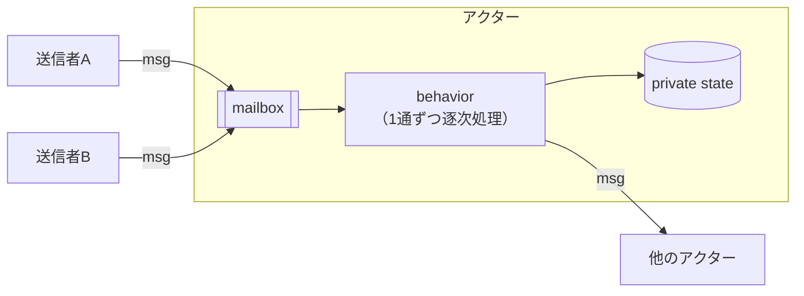

# アクターモデル

並行計算のモデルの1つ。「アクター」という独立した実体が、**非同期メッセージだけ**でやりとりする。アクターの内部状態は他のアクターからは一切見えない。1973年に、Carl Hewitt、Peter Bishop、Richard Steigerの論文 "A Universal Modular ACTOR Formalism for Artificial Intelligence"（IJCAI-73）で提案された。

## 基本構造

アクターが持っているもの（Akkaのドキュメントの整理）:

- **mailbox**: 届いたメッセージが並ぶキュー
- **behavior**: 状態と、メッセージへの反応の仕方
- **messages**: シグナルを表すデータ。メソッド呼び出しとその引数に相当する
- **実行環境**: 処理すべきメッセージがあるアクターを、スレッドプールに割り当てて動かす仕組み
- **address**: メッセージの送り先を指定するための識別子

メッセージを受け取ったときの流れ:

1. メッセージがmailboxの末尾に積まれる
2. アクターが実行待ちでなければ、実行可能としてマークされる
3. スケジューラがアクターを取り出して実行を始める
4. アクターがmailboxの先頭からメッセージを1つ取り出す
5. 内部状態を更新したり、他のアクターにメッセージを送ったりする
6. 実行が終わり、スケジューラの手を離れる

## 嬉しいところ

- **ロックが要らない**: 1つのアクターが同時に処理するメッセージは最大1つ。内部状態はメッセージ経由でしか変えられないので、同期プリミティブを使わなくても不変条件が守られる
- **送信側がブロックしない**: メッセージを送っても実行スレッドは移らないので、送った側はそのまま処理を続けられる。メソッド呼び出しと違って戻り値はなく、結果は返信メッセージとして届く
- **カプセル化が保たれる**: 複数スレッドが同じオブジェクトの内部状態に入り込んで壊す、ということが構造的に起こらない
- **分散にそのまま広げられる**: 状態はアクターのローカルにあって共有されず、変更はメッセージで伝わる。この形は、ネットワーク越しにパケットでやりとりするリモート通信にもそのまま当てはまる
- 異なるアクター同士は並行に動くので、数百万のアクターを十数本のスレッドでスケジューリングできる

## 主な実装

- **Erlang / Elixir**: 言語レベルでアクター（プロセス）を持つ。`spawn` で作るとpidが返り、`Pid ! Msg` で送って `receive` で受け取る
- **Akka**: JVM（Scala/Java）向けのアクターフレームワーク
- **Microsoft Orleans**: .NET向け。**Virtual Actor**（仮想アクター）という抽象を発明した。アクター（grain）は論理的に「常に存在する」ものとして扱われ、明示的に作ったり破棄したりしない。サーバーが落ちても仮想的な存在は失われない。呼ばれるとランタイムが必要に応じてメモリ上に実体化し、しばらく使われないと自動でメモリから外す。IDが安定しているので、呼び出し側はどのサーバーにあるか、メモリにロード済みかを気にせずに呼べる
- **[[cloudflare-durable-objects]]**: 公式ドキュメント自身がアクターモデルの文脈で説明している。1オブジェクト = 1アクターで、HTTP/RPCリクエストを受けてシングルスレッドで処理し、外にリクエストを送る。初回アクセスで暗黙的に作られ、アイドルになるとハイバネートする。この点で、Orleansの仮想アクターにかなり近い

## 出典

- [A Universal Modular ACTOR Formalism for Artificial Intelligence - IJCAI'73 (ACM DL)](https://dl.acm.org/doi/10.5555/1624775.1624804)
- [How the Actor Model Meets the Needs of Modern, Distributed Systems - Akka Documentation](https://github.com/akka/akka/blob/main/akka-docs/src/main/paradox/typed/guide/actors-intro.md)
- [Microsoft Orleans overview - Microsoft Learn](https://learn.microsoft.com/en-us/dotnet/orleans/overview)
- [Concurrent Programming - Erlang/OTP Getting Started](https://www.erlang.org/doc/system/conc_prog.html)
- [What are Durable Objects? · Cloudflare Durable Objects docs](https://developers.cloudflare.com/durable-objects/concepts/what-are-durable-objects/)

#concurrency #distributed-systems #actor-model
