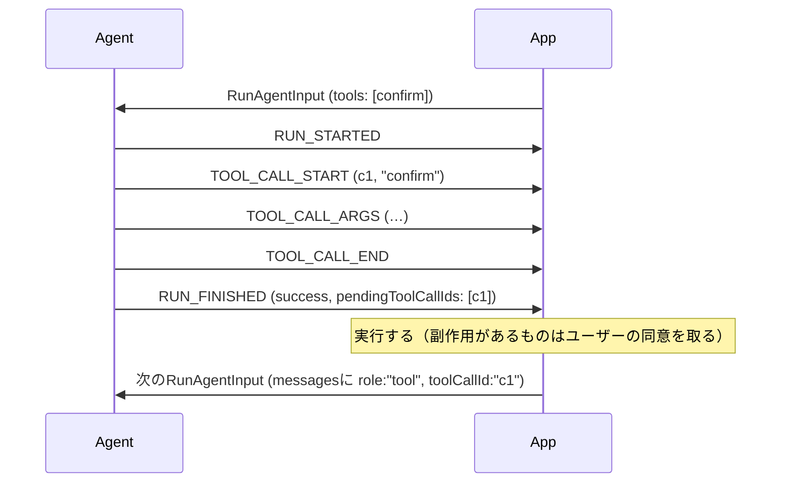

# AG-UIのフロントエンドツール

[[ag-ui]]のツール呼び出しには2種類ある。

- バックエンドツール: エージェントが自分で実行する。事前の宣言は不要で、同じラン内で`TOOL_CALL_RESULT`を返して完結する
- フロントエンドツール: アプリが`RunAgentInput.tools`で渡す。実行するのはアプリ側

AG-UIにはランの途中でクライアントからエージェントへ送る経路がない。そのため、フロントエンドツールの往復は必ず2つのランにまたがる。

## 往復の流れ



1. エージェントは`TOOL_CALL_START/ARGS/END`を出す。`TOOL_CALL_RESULT`や偽のtoolメッセージを出してはいけない（MUST NOT）。結果を作るのはアプリ
2. ランは`RUN_FINISHED`（success、またはoutcome省略）で終える。interruptにしてはいけない。`outcome.pendingToolCallIds`に、未回答の呼び出しを呼び出し順に並べるのがSHOULD
3. アプリが実行するか拒否する
4. 会話を続ける場合は、すべての未回答呼び出しに`role:"tool"`のメッセージ（`toolCallId`付き）で答えてから、次のランを送る（MUST）
   - 失敗も回答のうち（`error`を設定）
   - 拒否したなら「拒否した」と書く
   - `content`は`string | ContentPart[]`。スクリーンショットなどは画像パートで返せる
   - 会話自体をやめる場合は、何も答えなくても違反ではない

`pendingToolCallIds`が無い・空でも、「保留中のものは無い」と読んではいけない。ストリームから導出する（STARTしたのに`TOOL_CALL_RESULT`が来ていない呼び出し）。

## なぜinterruptではなくsuccessなのか

フロントエンドツールは、グラフ描画・画面遷移・ハイライトのように、それ自体で完結する操作であることが多い。結果を受けて次のランを始めるかどうかはアプリが決めることで、エージェントには「待っている」のかどうかが分からない。そこでエージェントは、分かっていることだけを言う。「ランは完了した。この呼び出しは未回答」。これをsuccess outcomeの付加情報として載せる設計になっている。古いconsumerがフィールドを取り除いても、成功したランとして読め、保留中の呼び出しは従来どおりストリームから導出できる。

エージェントが明示的に止まって尋ねる経路は、別物として[[ag-ui-interrupt-resume]]がある。

## TOOL_CALL_RESULT

```json
{"type":"TOOL_CALL_RESULT","messageId":"m2","toolCallId":"c1","content":"3 results"}
```

- 呼び出しを再び開くのではなく、独立したtoolメッセージ（自分の`messageId`を持つ）になる
- `content`は1.0から`string | ContentPart[]`。PDFや画像も返せる。構造化データはJSON文字列か`text`パートにする（JSONパートは無い）
- モデルが受け取れないパートは落としてよい。ただし必ず回答する。全部落ちたら空文字で答える（未回答のツール呼び出しは多くのモデルが拒否するため）

## セキュリティ

- 引数はモデルが生成した、信頼できない入力として扱う。宣言したパラメータスキーマで検証し、シェル・SQL・HTMLに埋め込まない
- 副作用のあるツールは、実行前にユーザーの同意を取る（SHOULD）。同意していないものを同意済みとして見せてはいけない（MUST NOT）
- 結果に含まれるテキストを、プロトコルの素材やユーザー権限の指示として扱わない
- 宣言していないツール名の呼び出しは違反ではないが、新しいツールと同じだけ精査する

## バージョンについて

本ノートの内容はAG-UI 1.0（2026年9月30日リリース）を前提にしている。`pendingToolCallIds`と、マルチモーダルなツール結果は1.0での追加。

## 出典

- [ag-ui-protocol/ag-ui (GitHub)](https://github.com/ag-ui-protocol/ag-ui) — `docs/spec/1.0/events/tool-calls.mdx`、`docs/spec/1.0/basic/run-input.mdx`

#ag-ui #ai-agent #protocol #human-in-the-loop
