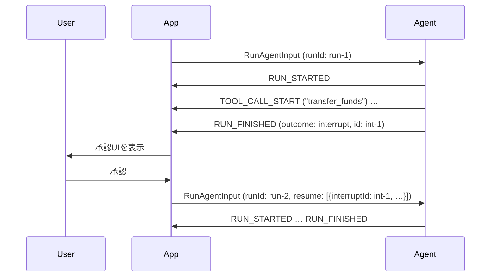

# AG-UIのInterrupt/Resume

[[ag-ui]]で、ランが承認・認証情報・選択など外部からの入力を必要としたときの正式な経路。ランの途中でクライアントから送る経路がないので、ランは待たずに「何を待っているか」を言って終わる。続きのランが回答を運ぶ。

## 流れ



```json
// ラン1の終わり
{"type":"RUN_FINISHED","threadId":"t","runId":"r1",
 "outcome":{"type":"interrupt","interrupts":[
   {"id":"int-1","reason":"approval","message":"送金しますか？",
    "toolCallId":"c9","responseSchema":{},"expiresAt":"2026-10-01T12:00:00Z"}]}}

// ラン2の入力
{"threadId":"t","runId":"r2","messages":[],
 "resume":[{"interruptId":"int-1","status":"resolved","payload":{"approved":true}}]}
```

## Interrupt

- `interrupts`は1件以上。`id`はラン内で一意
- `reason`は自由な文字列（分類は仕様で決めていない）。`message`は人に見せる問いかけ。`toolCallId`は承認対象のツール呼び出し。`responseSchema`は回答の形で、consumerがフォームを組み立てるのに使う。`expiresAt`は形式を縛っていない（慣例でISO 8601）
- 割り込まれたランは「閉じたラン」なので、続けるには新しいランを送る

## Resume

- `ResumeEntry {interruptId, status: "resolved" | "cancelled", payload?, metadata?}`
- 直前の割り込まれたランの割り込みを、すべてカバーする必要がある。回答（resolved）か放棄（cancelled）のどちらか。省略は放棄の意味にならない
- カバーしているかのチェックはconsumerの義務。足りなければ、送信前に拒否する（MUST）
- 期限切れの割り込みは回答できず、放棄するしかない
- producerは前回の割り込みを覚えておかなくても準拠（ステートレスでよい）。ただし、未回答だと分かっている割り込みについて、勝手に実行したり放棄扱いにしたりしてはいけない。入力を拒否するか、もう一度interruptで終えるかのどちらかにする
- 知らない`interruptId`が来たら、警告を出して無視する
- token usageは引き継がない。resumeしたランは、自分が行った呼び出しの分だけを報告する

## フロントエンドツールとの違い

| | interrupt | [[ag-ui-frontend-tools]] |
|---|---|---|
| 意味 | エージェントが明示的に止まって尋ねる | 通常のメッセージループで、ツール実行をアプリに任せる |
| RUN_FINISHED.outcome | `interrupt` | `success`（+`pendingToolCallIds`） |
| 回答の経路 | 次の入力の`resume` | 次の入力の`messages`内のtoolメッセージ |

なお、ユーザーに止められたランはどちらでもなく、`cancelled`（[[ag-ui-run-lifecycle]]）で終える。

サブエージェント内で割り込みが起きた場合は、`subagentRunId`を付けられる。そのサブエージェントは`SUBAGENT_FINISHED`の`outcome: {type:"suspended", interruptIds}`で一時停止する。

## バージョンについて

本ノートの内容はAG-UI 1.0（2026年9月30日リリース）を前提にしている。outcome、Interrupt、resumeは、0.x ではドラフトだったものが1.0で正式化された。

## 出典

- [ag-ui-protocol/ag-ui (GitHub)](https://github.com/ag-ui-protocol/ag-ui) — `docs/spec/1.0/basic/patterns/interrupt-resume.mdx`、`docs/concepts/interrupts.mdx`

#ag-ui #ai-agent #protocol #human-in-the-loop
