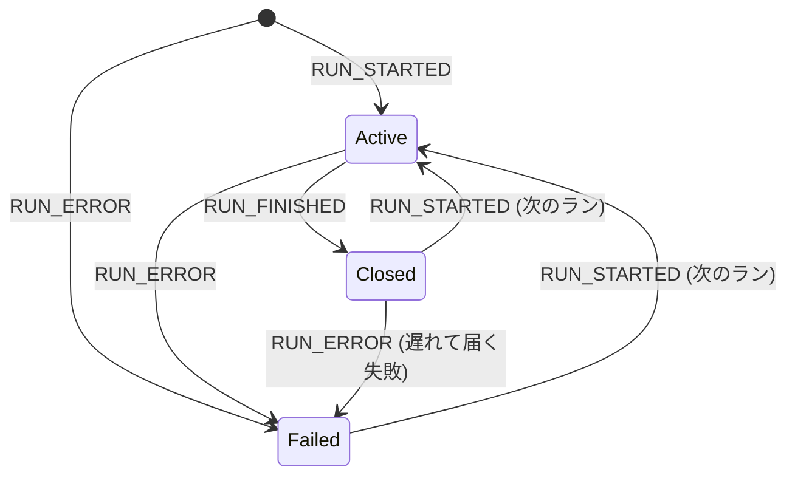

# AG-UIのランのライフサイクル

[[ag-ui]]で、1回のリクエストに対してエージェントが動く単位が「ラン（run）」。入力の`RunAgentInput`と、ランの始まりと終わりのルール。

## RunAgentInput

```ts
{
  threadId: string          // 必須: 会話ID
  runId: string             // 必須: このランのID
  messages: Message[]       // 必須: これまでの会話全部。唯一の履歴の入口
  protocolVersion?: "1.0"   // 1.0準拠のconsumerはMUSTで送る
  parentRunId?: string      // 別ランとして起動された子エージェントの場合
  state?: object            // 前回合意したstate。省略時は {}
  tools?: Tool[]            // フロントエンドツール。省略と [] は同じ意味
  context?: {description, value}[]  // モデルに見せたい情報。SHOULDで注入する
  forwardedProps?: any      // アプリ独自の値をそのまま通す口。中継者は変更MUST NOT
  resume?: ResumeEntry[]    // 割り込みへの回答
}
```

- サーバーはステートレスでよい設計。producerは`messages`を「見せられた完全な履歴」として扱う（MUST）
- `role`は`developer | system | assistant | user | tool | activity | reasoning`のいずれか。`activity`メッセージは、クライアントが送信前に取り除く（MUST）
- `UserMessage`/`ToolMessage`の`content`は`string | ContentPart[]`。パートは`text/image/audio/video/document`の5種類。メディアの`source`は次の3種類
  - `data`: インライン
  - `url`
  - `file`: プロバイダが発行したファイルハンドル。1.0で新設。中身は不透明として扱い、fetchやパースはしない
- モデルが扱えないパート（ビジョン非対応モデルへの画像など）が来ても、ランを失敗させてはいけない。スキップして続行する
- 入力が壊れている場合は、`RUN_STARTED`より前にトランスポートのエラー経路で拒否する。HTTPならエラーステータスを返し、ストリームは始めない

`tools`の使い方は[[ag-ui-frontend-tools]]、`resume`は[[ag-ui-interrupt-resume]]、`state`は[[ag-ui-state-sync]]を参照。

## 状態機械



- ストリームは`RUN_STARTED`か`RUN_ERROR`で始まらなければならない（MUST）。`RUN_ERROR`で始まってよいのは、エージェントに到達できなかった場合など、ランが始まる前の失敗があるため
- `RUN_FINISHED`の前に、そのランで開いたもの（メッセージ・ツール呼び出し・ステップ・サブエージェント）をすべて閉じる（MUST）。開いたまま終わると致命的エラー
- ランが閉じた後に許されるのは、`RUN_STARTED`（次のラン）と、`RUN_FINISHED`の後の`RUN_ERROR`だけ
- 1本のストリームに複数のランを順に載せてよい（スレッド履歴のリプレイなど）。その場合、履歴は`MESSAGES_SNAPSHOT`/`STATE_SNAPSHOT`で言い直す。ストリーミングの3点セットで流し直すと、既存メッセージに追記されてしまうため
- `RUN_STARTED.protocolVersion`には、producer自身のバージョンを載せる（入力のオウム返しではない）

## RUN_FINISHED.outcome

| outcome | 意味 |
|---|---|
| 省略 / `{type:"success", pendingToolCallIds?}` | 正常完了。フロントエンドツールで止まった場合もこれ |
| `{type:"interrupt", interrupts:[...]}` | 外部入力待ちで停止 |
| `{type:"cancelled"}` | 意図的な中断。失敗ではなく、待ってもいない |

- 止めたランをsuccessとして報告してはいけない。consumerもcancelledを「成功」とも「失敗」とも表示しない（ユーザーが頼んだ停止はエラーではない）
- `cancelled`をわざわざ1.0で入れたのには理由がある。後から追加すると、知らないoutcomeは取り除かれて「省略＝success」と読まれ、1.0のconsumerにはキャンセルが成功に見えてしまうため
- 止め方が雑で、開いたものを順に閉じられない場合は`RUN_ERROR`にする

## RUN_ERROR とストリーム拒否は別物

- `RUN_ERROR {message, code?}`: producerが自分の失敗を報告しているだけで、ストリームとしては正常
- プロトコル違反（`RUN_STARTED`の前に何か来た、開いたまま終わった、閉じた後に何か来た）: consumerがストリームを拒否する

両者を同じものとして見せてはいけない。どちらの場合も、それまでに届いたイベントは有効なまま。TSクライアントは、`RUN_ERROR`を受けても`runAgent()`をrejectしない（`onRunErrorEvent`で拾う）。

## truncated

終端イベントが来ないまま接続が切れた場合はtruncated runになる。consumerが`RUN_FINISHED`を合成してはいけないし、成功扱いもしない。やり直すときは新しい`runId`の新しいランを送る。

## ステップ

`STEP_STARTED`/`STEP_FINISHED`は`stepName`で対応づける。同じ名前のステップを二重に開くこと、開いていないステップを閉じることは禁止。ステップは入れ子のコンテナではなく、ストリーム上の区間に付ける「ラベル」なので、重なってもよい。

## Token usage

`RUN_FINISHED`/`RUN_ERROR`には`usage: TokenUsage[]`（provider・modelごとに1件）を付けられる。

- `inputTokens`/`outputTokens`は合計値。`cachedInputTokens`/`cacheWriteInputTokens`/`reasoningTokens`はその内数で、足し算しない
- 値が無いことと0は別。データが無いのに0を出してはいけない
- サブエージェントの分は含める。`parentRunId`で別ランとして起動した子エージェントの分と、resume元のランの分は含めない

## バージョンについて

本ノートの内容はAG-UI 1.0（2026年9月30日リリース）を前提にしている。

## 出典

- [ag-ui-protocol/ag-ui (GitHub)](https://github.com/ag-ui-protocol/ag-ui) — `docs/spec/1.0/basic/run-input.mdx`、`docs/spec/1.0/events/lifecycle.mdx`
- [Release 2026-09-30 · ag-ui-protocol/ag-ui](https://github.com/ag-ui-protocol/ag-ui/releases/tag/release/2026-09-30)

#ag-ui #ai-agent #protocol
