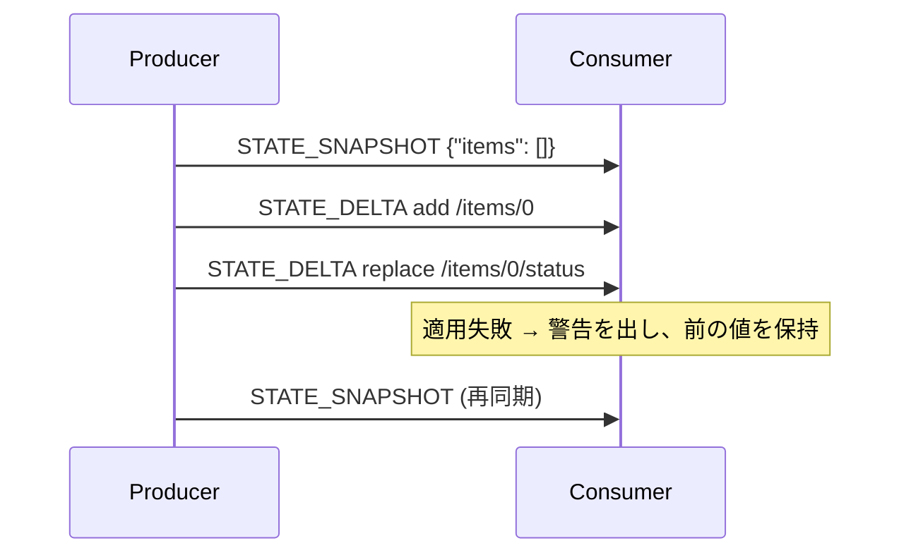

# AG-UIの状態同期

[[ag-ui]]で、変化していく値（エージェントのstate、activityの中身、会話そのもの）をsnapshotとdeltaで同期する仕組み。

- snapshot: 値を丸ごと置き換える。マージではない
- delta: RFC 6902のJSON Patchで差分を当てる

## State

```json
{"type":"STATE_SNAPSHOT","snapshot":{"items":[]}}
{"type":"STATE_DELTA","delta":[{"op":"add","path":"/items/0","value":{"title":"x","status":"todo"}}]}
{"type":"STATE_DELTA","delta":[{"op":"replace","path":"/items/0/status","value":"done"}]}
```

- deltaの適用先は、直近のsnapshotにその後のdeltaをすべて当てた値
- ラン開始時の基準値は入力の`state`（無ければ`{}`）。producerは、自分が最初のsnapshotを出すまでこの値を基準にdeltaを計算する（MUST）
- 複数のランをまたいでstateは持ち越され、次のランの入力の`state`としてクライアントから戻ってくる。そのためシークレットは入れない（SHOULD NOT）
- サブエージェントが出したstateイベントの帰属は「誰が出したか」の記録にすぎず、所有を意味しない。サブエージェントごとのstateは無い

## パッチが当たらないとき



- パッチはアトミックに当てる。途中まで当たった結果を残してはいけない
- 当たらなかったら警告を出す。前の値のまま続行してよい。`test`操作の失敗も同じ扱い
- consumerは、次に来たsnapshotを必ず採用する。これで復旧できる
- producerは、ずれた可能性があるとき（エラーの後、古いスレッドの続きを始めるときなど）にsnapshotを送るのがSHOULD
- パッチ自体が不正（配列でない、必須メンバーが無い）な場合は致命的。RFC 6902に無い`op`は未知の要素として扱い、警告を出してその要素だけ落とす（[[ag-ui-processing-model]]）

## MESSAGES_SNAPSHOT

会話全体のスナップショット。IDで突き合わせて整合させる。`activity`/`reasoning`ロールは「全部入れるか、全く入れないか」。そのロールが1件でも入っていれば完全なセットとみなし、入っていない既存分は削除する。1件も無ければ、そのロールについては何も言っていないものとして扱い、既存分を残す。

## Activity

チャットメッセージの合間に出す、構造化された進捗（計画、検索中など）。

- `ACTIVITY_SNAPSHOT {messageId, activityType:"PLAN", content:{...}, replace?}` — `replace:false`なら、既に存在する場合は無視する
- `ACTIVITY_DELTA {messageId, activityType, patch:[...]}` — 最初のsnapshotより前に送ってはいけない
- `content`がオブジェクトの`role:"activity"`メッセージとして会話に残る。ただしエージェントには送り返さない
- `messageId`はテキストや推論メッセージと同じID空間なので、使い回さない

## バージョンについて

本ノートの内容はAG-UI 1.0（2026年9月30日リリース）を前提にしている。

## 出典

- [ag-ui-protocol/ag-ui (GitHub)](https://github.com/ag-ui-protocol/ag-ui) — `docs/spec/1.0/basic/patterns/snapshots.mdx`、`docs/spec/1.0/events/state.mdx`、`docs/spec/1.0/events/activity.mdx`
- [RFC 6902 - JavaScript Object Notation (JSON) Patch](https://datatracker.ietf.org/doc/html/rfc6902)

#ag-ui #ai-agent #protocol #json-patch
