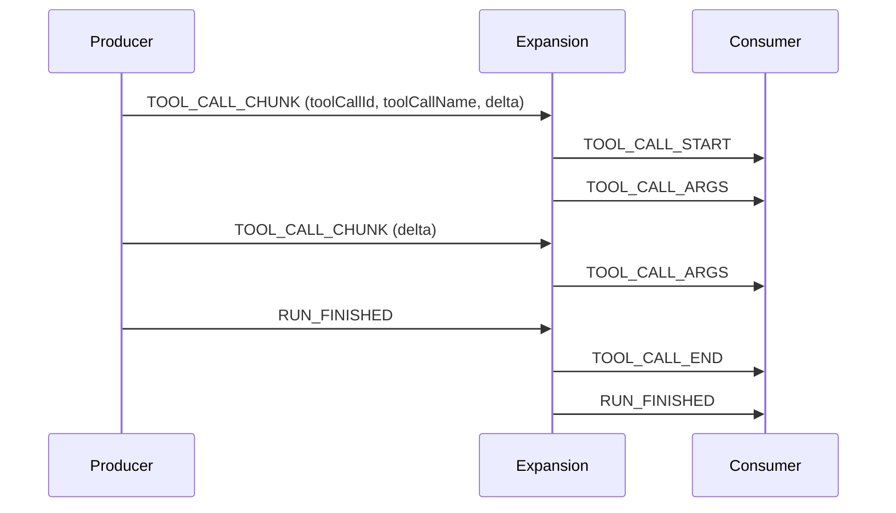

# AG-UIのストリーミングイベント

[[ag-ui]]で長い値を少しずつ流す3つのファミリー（テキストメッセージ・ツール呼び出しの引数・推論メッセージ）に共通するパターン。書き方は2通りある。明示的な Start→Content→End と、短縮形の`*_CHUNK`。

## Start / Content / End

```
TEXT_MESSAGE_START   {messageId:"m1", role:"assistant"}
TEXT_MESSAGE_CONTENT {messageId:"m1", delta:"Hello, "}   ← deltaは空文字禁止
TEXT_MESSAGE_CONTENT {messageId:"m1", delta:"world."}
TEXT_MESSAGE_END     {messageId:"m1"}
```

- 対応づけに使うIDは、メッセージなら`messageId`、ツールなら`toolCallId`
- 開いているIDを再びSTARTしない。開いていないIDにCONTENT/ENDを送らない。開いたものはランの終了までに必ず閉じる
- STARTが項目の属性（role、toolCallNameなど）を運び、CONTENTはIDと`delta`だけを運ぶ。`delta`は届いた順に連結する
- 種類の違う項目は自由にインターリーブしてよい（テキストのストリーム中にツール呼び出しを開くなど）
- 単発イベント（`STATE_*`、`MESSAGES_SNAPSHOT`、`ACTIVITY_*`、`CUSTOM`、`RAW`、`REASONING_ENCRYPTED_VALUE`）は、ラン内のどこに出してもよい

## Chunk形式

`TEXT_MESSAGE_CHUNK`/`TOOL_CALL_CHUNK`/`REASONING_MESSAGE_CHUNK`。producerがバッファしたくないときに使う短縮形。consumerは、検証の前に3点セットへ展開する（MUST）。



- 最初のチャンクには、開くのに必要なものを入れる
  - テキスト: `messageId`（`role`を省略するとassistant）
  - ツール: `toolCallId`と`toolCallName`
  - 推論: `messageId`
  - 欠けていたらプロトコル違反。consumerがIDを勝手に作ってはいけない
- 後続のチャンクはIDを省略してよい。既に確定した値（role、toolCallName、parentMessageId）を繰り返すなら同じ値に限る。違う値なら致命的エラー。省略で確定した値（roleを省略した＝assistant）と食い違う場合も同じ扱い
- ENDは送らず、consumerが合成する。合成されるタイミングは次のとおり
  - 別のIDのチャンクが来たとき
  - 同じレーンに、メッセージ・ツール・ステップ・state・custom・reasoningのイベントが来たとき（`RAW`、`ACTIVITY_*`、`REASONING_ENCRYPTED_VALUE`は例外で、閉じない）
  - `RUN_*`か`MESSAGES_SNAPSHOT`が来たとき（全レーンが閉じる）
  - 帰属先のサブエージェントが終了したとき（そのレーンが閉じる）
- 1つの項目の中で、明示形式とチャンク形式を混ぜてはいけない
- metadataだけを持つ最後のチャンク（usageやfinish reasonの報告）も合法
- 並列のサブエージェントがそれぞれチャンクを流すときは、`subagentRunId`で帰属を明示する。どのレーンの続きか一意に決まらないと、曖昧としてエラーになる

OpenAIの`delta.tool_calls`のように、IDと名前が最初の断片にだけ来るストリームは、`TOOL_CALL_CHUNK`にほぼそのまま写せる。

## ツール引数特有の点

- 引数はプロトコル上はただのテキストで、JSONとしては検証されない。ENDは「引数が揃った」ことを示すだけで、「正しい」ことは保証しない。パースに失敗したときどうするかはアプリが決める
- END前の引数で動作してはいけない（END前は断片にすぎない）。UIでの逐次表示は構わない。TS SDKは部分パースした`partialToolCallArgs`を渡してくれる
- 詳しくは[[ag-ui-frontend-tools]]

## バージョンについて

本ノートの内容はAG-UI 1.0（2026年9月30日リリース）を前提にしている。1.0で、チャンクのルール（最初のチャンクの必須項目、矛盾する値は致命的）が仕様として明文化された。

## 出典

- [ag-ui-protocol/ag-ui (GitHub)](https://github.com/ag-ui-protocol/ag-ui) — `docs/spec/1.0/basic/patterns/streaming.mdx`、`docs/spec/1.0/events/text-messages.mdx`、`docs/spec/1.0/events/tool-calls.mdx`

#ag-ui #ai-agent #protocol #streaming
