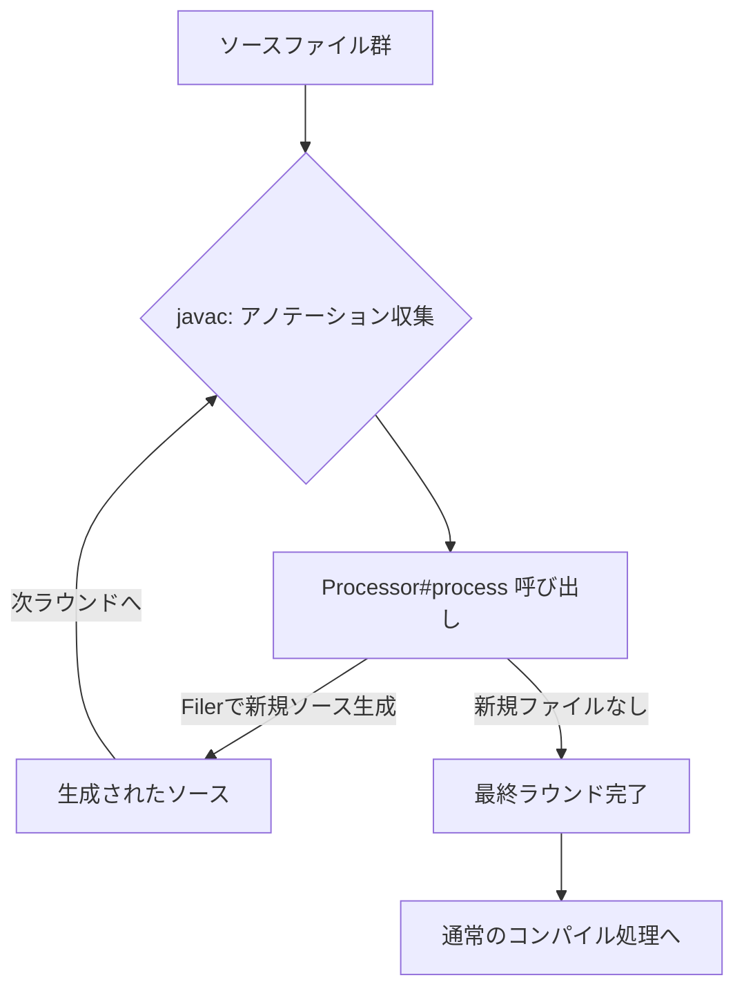

# アノテーションプロセッサ (Annotation Processing)

javac のコンパイル時プラグイン機構。ソースコード中のアノテーションを読み取り、新しいソースファイルやリソースを**生成**するために使う。`javax.annotation.processing` / `javax.lang.model` パッケージで定義されるAPI（JSR 269, Pluggable Annotation Processing API）。[[kapt]]・[[ksp]]はいずれもこの仕組みをKotlinで使えるようにするためのレイヤー。

## 歴史

JDK 5の時点では `apt` という別のコマンドラインツールが存在したが、Java 7で非推奨化、Java 8で完全に削除された。以後は `javac` 本体に統合されたPluggable Annotation Processing API（JSR 269）を使うのが標準。

## 仕組み

1. `Processor` インターフェース（通常は `AbstractProcessor` を継承）を実装する
2. `META-INF/services/javax.annotation.processing.Processor` に実装クラス名を書いておくと、`ServiceLoader` 機構でjavacが自動発見する
3. javacはコンパイル対象のソースからアノテーションを収集し、それぞれのアノテーションに対応するプロセッサを呼び出す
4. プロセッサの `process(Set<TypeElement> annotations, RoundEnvironment roundEnv)` が呼ばれる。`RoundEnvironment#getElementsAnnotatedWith()` で対象の宣言（`Element`）を取得できる
5. `Filer#createSourceFile()` で新しいソースファイルを生成する
6. 新しいファイルが生成された場合、それを含めて**次のラウンド**が走る。新規ファイルが生成されなくなるまでラウンドを繰り返す（多段ラウンド処理）。`RoundEnvironment#processingOver()` で最終ラウンドかどうか判定できる

プロセッサが扱う `Element`/`TypeMirror` はコンパイラ内部構造の読み取り専用ビューであり、**既存コードの書き換えはできない**。あくまで新規ファイルの追加が正規のユースケース。

## インクリメンタル処理

Gradleのインクリメンタルアノテーション処理では、プロセッサは自身の性質を次のいずれかとして宣言する。

- **isolating**: 1つの入力ファイルが1つの出力ファイルにのみ影響する。変更時の再処理範囲が最小
- **aggregating**: 複数の入力ファイルを集約して出力を作る。1ファイルの変更でも広い範囲の再処理が必要になりうる

生成ファイルには「どの要素に由来するか（originating element）」の情報が付与され、インクリメンタルコンパイラはこれを使って依存関係を追跡する。

## 例外的な存在: Lombok

標準的なアノテーションプロセッサは新規ファイルの生成に限定されるが、**Lombok**はこの原則を破っている。javacがプロセッサに渡す `Element` 等のオブジェクトは実際にはコンパイラ内部の実体（`com.sun.tools.javac.tree.JCTree` など）そのものであり、Lombokはこれを内部APIの型に無理やりキャストして直接書き換えることで、既存クラスにgetter/setter/builderなどを注入している。これは公開APIの想定用途の外にある非標準的な手法で、DaggerのようなAPT前提の別プロセッサとの組み合わせで順序問題が起きることがある。

## 代表的な使用例

- **Dagger/Hilt**: `@Inject`/`@Module` からDIの配線コードを生成
- **Room**: `@Entity`/`@Dao` からSQL実装を生成
- **MapStruct**: マッパークラスを生成
- **AutoValue/AutoService**: ボイラープレートの自動生成

これらの多くはJava向けに書かれた資産であり、Kotlinプロジェクトで使うには[[kapt]]というアダプタ層が必要だった。Kotlinネイティブな後継としては[[ksp]]がある。

## [[kotlin-annotation-processing]]の中での位置づけ

kapt・KSPがどちらも土台にしている、Java由来のコンパイル時コード生成の仕組み。

## 出典

- [Getting Started with the Annotation Processing Tool, apt (Oracle, Java SE 7)](https://docs.oracle.com/javase/7/docs/technotes/guides/apt/GettingStarted.html)
- [RoundEnvironment (Java SE 21 & JDK 21)](https://docs.oracle.com/en/java/javase/21/docs/api/java.compiler/javax/annotation/processing/RoundEnvironment.html)
- [Processing Code - OpenJDK](https://openjdk.org/groups/compiler/processing-code.html)
- [Java Annotation Processing and Creating a Builder | Baeldung](https://www.baeldung.com/java-annotation-processing-builder)
- [Lombok Execution Path - Project Lombok](https://projectlombok.org/contributing/lombok-execution-path)

#annotation-processor #java #javac #ビルド #jsr269
