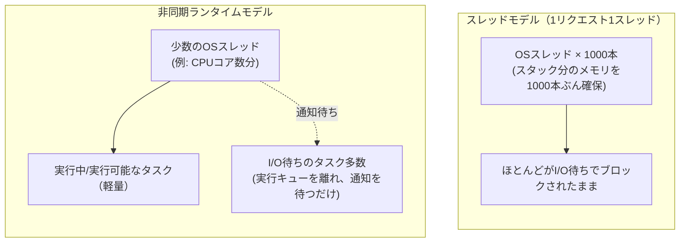

# 非同期ランタイム

「I/O待ちの間に他の作業を進めるための実行基盤」。ネットワーク応答待ち・ディスクI/O完了待ちなど、プログラムの処理時間の大半は「待ち」で占められることが多い。この待ち時間、OSスレッドを1本占有したまま突っ立っていると、そのスレッド分のメモリ(スタック領域が環境によって1〜8MB程度)が丸ごと無駄になる。非同期ランタイムは、この「待っている間」に他のタスクへCPUを譲り、少数のOSスレッドで大量の「待ちタスク」を同時に抱えられるようにする。

## 仕組み:協調的スケジューリング

OSのスレッドスケジューラは各スレッドの都合を無視して強制的に実行を切り替える(プリエンプティブ)。対して非同期ランタイムは、タスク自身が「ここで一旦手を離します」と自己申告した瞬間(多くの言語で`await`と書く箇所)にだけ制御を返す。これを協調的スケジューリングと呼ぶ。

待っているだけのタスクはCPUもOSスレッドも占有しない。数百〜数千の「待ち」を、数個のOSスレッドだけで同時に抱えられる。

## コストの違い(具体例)

OSスレッドはOSカーネルが管理する実体で、スタック用のメモリ領域(64bit環境で1〜8MB程度が一般的。実際に使った分だけ物理メモリが割り当てられるとはいえ予約自体は重い)やカーネル側の管理構造が伴う。対して非同期ランタイムが扱う「タスク」はランタイムがユーザー空間で管理する軽量なデータ構造で、数KB〜数百KB程度に収まることが多い。この差が「1万本のOSスレッド」は現実的でなくても「1万個の非同期タスク」は現実的、という違いを生む。

## 実装は言語・ランタイムごとに異なる

「非同期ランタイム」という概念は共通でも、それを誰がどう提供するかは言語ごとに違う。

- **[[tokio]]**(Rust): 言語本体はランタイムを持たず、利用者がライブラリ(crate)として選ぶ
- **libuv**(Node.js): ランタイムに内蔵。単一スレッドのイベントループ+ブロッキング処理用の別スレッドプール
- **asyncio**(Python): 標準ライブラリに内蔵。単一スレッドの協調的イベントループ
- **goroutine**(Go、[[go-basics]]・[[go-goroutine-scheduler]]参照): 言語ランタイムに内蔵、常時有効。ただし複数OSスレッドに自動で割り当てるM:Nスケジューラで、プリエンプションも一部導入されており、他の3つより「協調的」の度合いが弱い
- **[[kotlin-coroutines]]**(Kotlin): 言語本体は`suspend`というマーキングとコンパイラ変換だけを提供し、実行主体は`kotlinx.coroutines`というライブラリ。コルーチン自体はコンパイラが生成するスタックレスの状態機械で、Dispatcher経由でOSスレッドプールに載せる2段構成

## 出典

- [Why Async? - Asynchronous Programming in Rust(公式async-book)](https://rust-lang.github.io/async-book/01_getting_started/02_why_async.html)
- [Concurrent programming - Asynchronous Programming in Rust(公式async-book)](https://rust-lang.github.io/async-book/part-guide/concurrency.html)
- [Cooperative multitasking - Wikipedia](https://en.wikipedia.org/wiki/Cooperative_multitasking)
- [How Much Memory Do You Need to Run 1 Million Concurrent Tasks? - Piotr Kołaczkowski](https://pkolaczk.github.io/memory-consumption-of-async/)

#非同期ランタイム #並行処理 #イベントループ #スケジューリング
