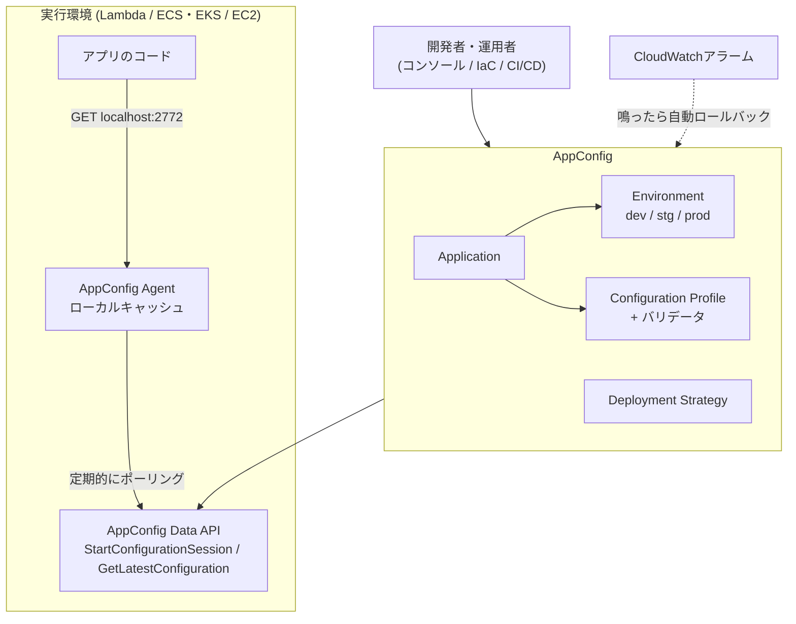

# AWS AppConfig

アプリの設定値やフィーチャーフラグを、コードを再デプロイせずに本番で安全に切り替えるためのAWSのマネージドサービス。AWS Systems Managerの機能の1つという位置づけ。設定変更をアプリのリリースとは別の「デプロイ」として扱い、バリデーションと段階的な反映・自動ロールバックで、設定ミスによる全台同時障害を防ぐのが主眼。

## 主な機能

- **設定とコードの分離**: 設定データを一元管理し、アプリ本体とは別に作成・変更・デプロイできる
- **フィーチャーフラグ / 自由形式の設定**: プロファイルの種類は2つ。フィーチャーフラグ用の `AWS.AppConfig.FeatureFlags` と、JSON・YAML・テキストなどの自由形式
- **マルチバリアントフラグ**: ユーザーID・地域・端末種別などのルールとアプリ側から渡すコンテキストで、返すフラグ値を変えられる。ユーザーの区分けやトラフィック分割向け
- **バリデータ**: JSON SchemaまたはLambdaで、デプロイ前に文法・意味をチェックする
- **デプロイ戦略**: 例えば「10分かけて20%ずつ反映、最後に5分のベイク時間」のように段階的に広げる。ベイク時間中にCloudWatchアラームが鳴ると自動でロールバックする
- **対応する実行環境**: EC2、Lambda、コンテナ（ECS/EKS）、モバイルアプリ、IoTデバイス

## 構成要素

- **Application**: 設定をまとめる単位（例: `my-service`）
- **Environment**: dev / stg / prod などのデプロイ先。同じプロファイルを環境ごとに順に昇格させる運用が多い
- **Configuration Profile**: 設定本体とその保存先・バリデータ。保存先はAppConfigのホスト型ストアのほか、S3、SSM Parameter Store、Secrets Managerなど
- **Deployment Strategy**: 反映の速さ・段階・ベイク時間の定義

## ユースケース

- フィーチャーフラグを使ったリリース（コードはOFFのままデプロイし、本番で段階的にONにする）
- 一部ユーザーへの先行公開、A/Bテスト（マルチバリアントフラグ）
- キルスイッチ（障害時に重い機能や外部連携を即座に止める）
- 運用パラメータの動的変更（レート制限、タイムアウト、リトライ回数、許可リスト、メンテナンスモードなど）
- 生成AIの使用モデル・プロンプト・パラメータの切り替え

## 組み込みのアーキテクチャ

アプリはAppConfigのAPIを毎回呼ぶのではなく、実行環境内で動く **AppConfig Agent** のローカルキャッシュから読む。



- **Agentの形態**: LambdaではLambda拡張、ECS/EKSではサイドカーコンテナ、EC2ではデーモンとして動かす
- **Lambda拡張の動き**: Initフェーズでセッションを張って設定を取得・キャッシュし、以降はバックグラウンドで更新を確認する。関数のコードは呼び出しごとに `http://localhost:2772/applications/<app>/environments/<env>/configurations/<profile>` にGETするだけでよく、実行環境の外に出ないため1ms未満で返る
- **Agentが代行すること**: `StartConfigurationSession` → `GetLatestConfiguration` の呼び出し、次の呼び出し用トークンの引き継ぎ、リトライ、キャッシュの管理
- **APIを直接呼ぶ場合**: 上のトークン管理を自前で実装する必要がある
- **必要なIAM権限**: `appconfig:StartConfigurationSession` と `appconfig:GetLatestConfiguration`

### Lambdaへの組み込み例

1. CDKなどでApplication / Environment / フィーチャーフラグのProfile / Deployment Strategyを定義する
2. LambdaにAppConfig AgentのLambda拡張レイヤーを追加し、上のIAM権限を付ける
3. コードでは `localhost:2772` から設定を読み、フラグで処理を分ける。取得に失敗したときのデフォルト値も決めておく
4. 運用時はフラグを変更してデプロイを開始し、段階的な反映とアラーム監視に任せる

## ブラウザ・モバイルから使う場合

本来はサーバーサイド向けで、ブラウザのJSやモバイルアプリからAppConfigを直接呼ぶ使い方は想定されていない。公式ドキュメントは、アプリとAppConfigの間に**プロキシ層**を置く構成を勧めている。

- プロキシはLambda関数＋AppConfig AgentのLambda拡張で作り、Lambda関数URLでインターネットに公開する
- 関数はリクエストから取得パラメータを受け取り、該当する設定をレスポンスで返す
- 狙いは、AppConfigへの呼び出し回数をユーザー数と切り離してコストを抑えること
- 端末側にIAMの認証情報を持たせずに済む

```
ブラウザ / スマホアプリ ──HTTPS──▶ Lambda関数URL（プロキシ）
                                       └ AppConfig Agent拡張がキャッシュ ──▶ AppConfig
```

## フィーチャーフラグ専用SaaSとの関係

フィーチャーフラグのツールとしては、LaunchDarkly・Flagsmith・Unleash・ConfigCatなどの専用サービスと並べて挙げられることが多い。

- **AppConfig**: AWSに組み込まれたサービスなので、IAM・CloudWatch・CDK/CloudFormationとそのまま連携でき、別途SaaSを契約する必要がない
- **専用SaaS**: ブラウザ・モバイル向けのSDK、細かいターゲティング、実験の分析機能が最初から揃っている
- AppConfigでも、ルールエンジンやSDKを自前で用意すれば同様のことはできる

利用シェアについての統計は見つけられていない。

## 出典

- [AWS Systems Manager AppConfig - Amazon Web Services](https://aws.amazon.com/systems-manager/features/appconfig/)
- [What is AWS AppConfig? - AWS AppConfig](https://docs.aws.amazon.com/appconfig/latest/userguide/what-is-appconfig.html)
- [Understanding how the AWS AppConfig Agent Lambda extension works - AWS AppConfig](https://docs.aws.amazon.com/appconfig/latest/userguide/appconfig-integration-lambda-extensions-how-it-works.html)
- [Retrieving feature flags and configuration data in AWS AppConfig - AWS AppConfig](https://docs.aws.amazon.com/appconfig/latest/userguide/retrieving-feature-flags.html)
- [AWS AppConfig browser and mobile use considerations - AWS AppConfig](https://docs.aws.amazon.com/appconfig/latest/userguide/appconfig-retrieving-mobile.html)
- [Deploying application configuration to serverless: Introducing the AWS AppConfig Lambda extension - AWS Blog](https://aws.amazon.com/blogs/mt/introducing-aws-appconfig-lambda-extension-deploying-application-configuration-serverless/)
- [Implementing dynamic feature flags with AWS AppConfig on AWS Lambda - AWS Blog](https://aws.amazon.com/blogs/compute/implementing-dynamic-feature-flags-with-aws-appconfig-on-aws-lambda/)
- [Implementing feature flags in container environments with AWS AppConfig - AWS Blog](https://aws.amazon.com/blogs/containers/implementing-feature-flags-in-container-environments-with-aws-appconfig/)
- [Best Practices for validating AWS AppConfig Feature Flags and Configuration Data - AWS Blog](https://aws.amazon.com/blogs/mt/best-practices-for-validating-aws-appconfig-feature-flags-and-configuration-data/)
- [Dynamic Model Routing and Configuration Management for Generative AI with AWS AppConfig](https://hidekazu-konishi.com/entry/dynamic_model_routing_with_aws_appconfig.html)
- [AWS Feature Flags for Developers - ConfigCat](https://configcat.com/aws-feature-flag/)
- [AWS Feature Flags Made Simpler and Smarter - CyberArk Engineering](https://medium.com/cyberark-engineering/aws-feature-flags-made-simpler-and-smarter-f78d4b4ca933)

#aws #feature-flag #configuration
