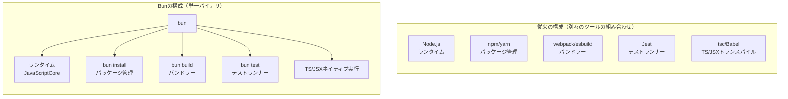

# Bun

JavaScript/TypeScript向けの統合ツールキット。ランタイム・パッケージマネージャー・バンドラー・テストランナーを単一バイナリにまとめて提供する。Node.jsの代替(drop-in replacement)を目指して作られている。

## 解決しようとした課題

従来のJS開発では、実行環境(Node.js)・パッケージ管理(npm/yarn)・バンドラー(webpack/esbuild)・テストランナー(Jest)・TS/JSXトランスパイラ(tsc/Babel)をそれぞれ別ツールとして組み合わせる必要があり、設定の複雑さ・ツール間の互換性・起動速度の遅さ・メモリ使用量の多さが課題になっていた。Bunはこれらを1つのツールに統合し、かつ実行速度自体を大幅に高速化することで対応する。



## 主な特徴

- **エンジン**: SafariのJSエンジンである[[javascript-core]]を採用（Node.js/[[deno]]が使うV8ではない）
- **実装言語**: 元々はZigで実装されている。起動時間の短さ・メモリ使用量の少なさに寄与している
- **オールインワン**: `bun install`（パッケージ管理）、`bun run`（実行）、`bun test`（Jest互換テストランナー）、`bun build`（バンドラー、単一実行ファイル生成）を1バイナリで提供
- **TypeScript/JSXをネイティブ実行**: 設定なしで`.ts`/`.tsx`を透過的にトランスパイルして実行できる
- **高速なインストール**: グローバルキャッシュを使い、npm比で大幅に高速。数百〜数千パッケージ規模のモノレポで差が特に顕著という報告がある
- **組み込みAPI**: SQLiteドライバ、Redisクライアント、`Bun.serve()`によるHTTPサーバー、WebSocket、S3クライアントなどが標準搭載されており、外部ライブラリなしで動かせる範囲が広い
- **Node.js互換**: 既存のnpmパッケージやNode.js APIの多くがそのまま動くことを目指している
- **単一実行ファイル化**: `bun build --compile`でランタイムごと1つの実行ファイルにコンパイルでき、Linux/macOS/Windows向けのクロスコンパイルも可能

## 基本的な使い方

```bash
# インストール
curl -fsSL https://bun.com/install | bash

# 依存パッケージインストール（package.jsonを読む。npm/yarnと同じ感覚）
bun install

# TS/JSXファイルをそのまま実行（トランスパイル不要）
bun run index.tsx

# テスト実行（Jest互換）
bun test

# 単一実行ファイルにビルド
bun build ./index.ts --compile --outfile myapp
```

普段npm/Node.jsでやっていたコマンドを`bun`に置き換えるだけで動く、という体験を意図して設計されている。

## RustへのRewrite（2026年時点）

Bunの内部実装をZigからRustに書き換えるプロジェクト（`Rewrite Bun in Rust`, PR `#30412`）が2026年5月にマージされた。`bun upgrade --canary`で試用できる状態になっているが、2026年8月時点ではLinux x64限定の実験的なもので、安定版(1.3.x系)は引き続きZig実装で提供されている。正式リリースの時期は公表されていない。

## 出典

- [GitHub - oven-sh/bun](https://github.com/oven-sh/bun)
- [Bun Docs - Welcome to Bun](https://bun.com/docs)
- [Bun Docs - Installation](https://bun.com/docs/installation)
- [Bun Docs - Test runner](https://bun.com/docs/test)
- [Rewrite Bun in Rust (PR `#30412`) · oven-sh/bun](https://github.com/oven-sh/bun/pull/30412)
- [Bun (software) - Wikipedia](https://en.wikipedia.org/wiki/Bun_(software))

#bun #javascript #typescript #ランタイム #ツール
