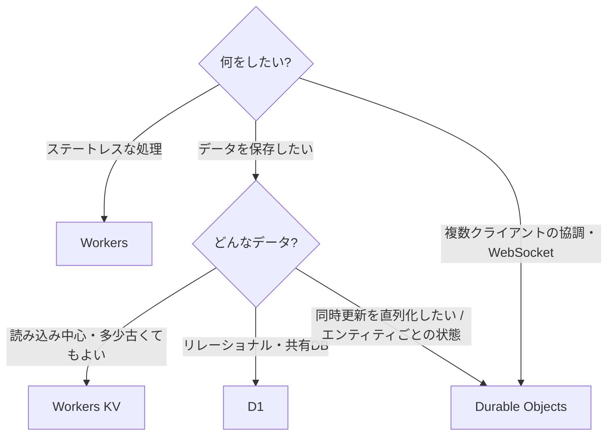

# Cloudflare Developer Platform

Cloudflareが[[cloudflare-workers]]を中心に提供している、コンピュートとストレージの製品群の見取り図。各製品はWorkerからbinding（`env.XXX`）経由で使う。

## コンピュート

- [[cloudflare-workers]] — 基盤。V8アイソレート上で動くステートレスなサーバーレス関数で、全PoPに事前デプロイされ、最寄りのエッジで実行される。
- [[cloudflare-durable-objects]] — 状態を持つWorker。IDごとに世界で1つだけのインスタンスがシングルスレッドで動き、専用のSQLiteストレージを持つ。協調・強整合・WebSocket・エンティティごとのタイマー向け。考え方は[[actor-model]]そのもの。

## ストレージ

- [[cloudflare-workers-kv]] — 結果整合のKVストア。中央に保存して各拠点でキャッシュする。読み込みが多いデータ（設定・セッション・フラグ）向けで、同じキーへの書き込みは1回/秒まで。
- [[cloudflare-d1]] — マネージドなサーバーレスSQLite。1つの共有リレーショナルDBとして使い、HTTP API・マイグレーション・Time Travel・リードレプリカが揃っている。

## 開発フロー

- [[cloudflare-worker-previews]] — `wrangler preview` で、ブランチごとにDurable ObjectsやContainersまで含めて隔離したプレビュー環境を作る。

## 選び方の早見表

## 製品同士の関係

- D1もQueuesも内部はDurable Objectsの上に作られている。Durable Objectsは、ほかの製品を組み立てるための低レベルな部品という位置づけ
- KVとDurable Objectsを組み合わせる使い方もある。書き込みを1つのDurable Objectに通して順序を保証し、読み込みはKVのキャッシュを使う
- このノートで扱っていない製品には、R2（オブジェクトストレージ）、Queues、Hyperdrive、Vectorize、Workflowsなどがある

## 出典

- [Choose a data or storage product · Cloudflare Workers docs](https://developers.cloudflare.com/workers/platform/storage-options/)

#cloudflare-workers #serverless #moc
