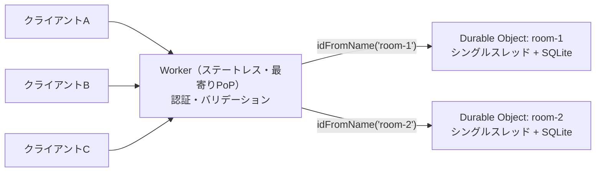

# Cloudflare Durable Objects

[[cloudflare-workers]]の一種で、計算処理と永続ストレージを1つにまとめた「状態を持つWorker」。オブジェクトごとに世界で一意なIDがあり、同じIDへのリクエストは世界中のどこから送っても、同じ1個のインスタンスに届く。

## 基本的な性質

- **グローバルに一意**: 同じIDのインスタンスは、世界中で同時に1つしか動かない。Workersのランタイムが、そのオブジェクトを持つデータセンターへリクエストをルーティングする
- **シングルスレッド**: ブラウザのJSと同じく、シングルスレッド + 協調的マルチタスク。1オブジェクトへの処理は逐次実行されるので、分散ロックなしで競合を避けられる
- **専用ストレージが同じ場所にある**: オブジェクトごとに、トランザクション付きで強整合なストレージを持つ。他のオブジェクトからはアクセスできない。バックエンドはSQLite（SQL API + KV API）と、旧来のKV専用の2種類で、新しく作るならSQLiteが推奨されている
- **暗黙的に生成される**: 初回アクセス時に自動で作られる。ライフサイクル管理は不要
- **インメモリ状態**: リクエストを処理している間と、アイドルになってから数秒の間は生きていて、メモリ上の状態をキャッシュとして使える。ハイバネートするとリセットされるので、後で必要なものはストレージに書く
- **置かれる場所**: 最初にリクエストした場所の近くに作られる。location hintで配置先を指定することもできる
- IDは `idFromName("room-123")` のように名前から決定的に作るか、ランダムに生成する
- Workers RPCで、JSのメソッドとしてWorkerから呼べる

### input gate / output gate

シングルスレッドとはいえ、`await` の間に別リクエストが割り込む可能性はある。これをランタイムの input gate / output gate で抑えている。ストレージ操作の `await` 中は新しいイベントが割り込まないので、`get` → `put` のread-modify-writeを素直に書いても安全。一方、`fetch()` など外部I/Oを `await` している間は割り込みが起こりうる。

### アクターモデル

公式ドキュメントも、[[actor-model]]（Erlang/Elixir、Akka、Microsoft Orleans）の文脈で説明している。1オブジェクトが1アクターにあたり、メッセージ（HTTP/RPCリクエスト）を受け取ると、自分の状態とストレージを使って逐次処理し、外にメッセージを送る。

## 主な機能

- **WebSocket**: 1オブジェクトが多数のクライアントとWebSocket接続を持ち、チャットルームやゲームの中継点になれる。Hibernatable WebSockets APIを使うと、接続を保ったままオブジェクトをスリープさせられ、アイドル時間は課金されない
- **Alarms API**: オブジェクトごとに将来のある時刻に起こすタイマーを設定できる。cronランナーを別に用意しなくても、エンティティごとの遅延実行・定期実行ができる。ハンドラは冪等に書くことが推奨されている
- **SQL**: オブジェクト内にSQLiteがあり、`this.ctx.storage.sql.exec(...)` で同期的に叩ける

## ユースケース

公式の「Rules of Durable Objects」では、使いどころを5つに分類している。

| 分類 | 何が嬉しいか | 例 |
|---|---|---|
| 協調（Coordination） | 複数のクライアントが1つの共有状態を触る | チャットルーム、マルチプレイヤーゲーム、共同編集ドキュメント |
| 強整合（Strong consistency） | 操作を直列化して、レースコンディションを防げる | 在庫管理、予約システム、ターン制ゲーム |
| エンティティごとのストレージ | ユーザー・テナント・リソースごとに独立したDBを持てる | マルチテナントSaaS、ユーザーごとのデータ |
| 持続的な接続 | リクエストをまたいで生き続けるWebSocket | リアルタイム通知、ライブ更新 |
| エンティティごとのスケジュール処理 | エンティティごとに専用のタイマーを持てる | サブスクリプション更新、ゲームのタイムアウト |

逆に、次のような処理は普通のWorkersで十分。

- ステートレスなリクエスト処理（APIエンドポイント、プロキシ、変換）
- 最寄りのエッジで処理したいもの（Durable Objectは1か所に置かれるので、遠いクライアントからはレイテンシが乗る）
- 独立したリクエストを並列に大量に捌くもの

典型的な構成では、Workerがステートレスな入口として認証・バリデーション・レスポンス整形を担当する。調整が必要な部分だけを、IDでDurable Objectへ振り分ける。

### Cloudflare自身の製品での利用

Cloudflareの製品の多くがDurable Objectsの上に作られている。公式ブログで事例として挙げられているのは次のもの。

- Queues（DO化で10倍高速化したという記事がある）
- D1
- Workflows（durable execution）
- AI Gateway（WebSocket対応、ログのスケール）
- Stream Live
- Workers Builds

## 設計のポイント

- **「協調の最小単位」をオブジェクトにする**: チャットルーム1つ、ゲームセッション1つ、ドキュメント1つ、ユーザー1人、テナント1つのように、調整が必要な論理単位ごとにオブジェクトを作る。共有DB + ロックの代わりに、単位ごとに単一スレッドの実行環境と専用ストレージを持たせる、という発想
- **スループットの上限**: 1オブジェクトあたり、ソフトリミットは約1,000 req/s。処理が重いと下がる（単純なパススルーで約1,000、JSONのパースや検証を挟むと約500〜750、変換やストレージ書き込みを伴うと約200〜500）。超えた分は内部でキューイングされ、それでも捌けないとoverloadedエラーになる
- **グローバルシングルトンにしない**: `idFromName("global")` のように全トラフィックを1オブジェクトに集める設計（グローバルなレートリミッタやグローバルカウンタなど）はアンチパターン。ユーザー単位・ルーム単位など自然な境界でシャーディングする。オブジェクトの数には上限がない
- 必要なオブジェクト数 = 総リクエスト/秒 ÷ 1オブジェクトの処理能力。例: 5万人が秒間10回更新するゲームなら50万 req/s なので、500〜1,000個のセッションオブジェクトに分ける

## 他サービスとの使い分け

公式の「Choose a data or storage product」を元に整理すると、次のとおり。

| 製品 | 性質 | 向いている用途 |
|---|---|---|
| [[cloudflare-workers-kv]] | 結果整合。グローバルにキャッシュされる | 読み込みが圧倒的に多いデータ（設定、セッション、APIキー、A/Bテスト）。同じキーへの書き込みは1 write/秒まで |
| R2 | S3互換のオブジェクトストレージ。egress無料。オブジェクト単位で強整合 | 画像・静的アセット、ログ、データセットなど大きなファイル |
| [[cloudflare-d1]] | マネージドなサーバーレスSQLite（1DBあたり最大10GB） | ユーザー・商品・注文などのリレーショナルデータ。読み込み中心の一般的なWebアプリ。リードレプリカあり |
| Hyperdrive | 既存のPostgres/MySQLへの接続プール + クエリキャッシュ | 既存DBをそのまま使いたい場合。TB級の単一DB |
| Queues | at-least-onceのメッセージキュー | バックグラウンドジョブ、非同期処理、Worker間のメッセージング、バッファリング |
| Durable Objects | 世界で一意 + シングルスレッド + 強整合なストレージ | リアルタイム協調、WebSocket、直列化が必要な操作、ユーザー・テナントごとの状態、分散システムの部品 |

### KV との違い

KVは「どこからでも速く読める」ことを優先した**結果整合**のストア。書き込みがすぐ全拠点に見える保証はなく、同じキーへの書き込み頻度にも制限がある。そのためカウンタや在庫のように「書いた直後の値を正しく読みたい」「同時更新がある」用途には向かない。そういう用途はDurable Objectsの担当。逆に、読み込みばかりの設定値やセッションなら、どこでも低レイテンシで読めるKVが向いている。

### D1 との違い

どちらも中身はSQLiteで、SQLクエリの料金と制限も揃えられている。違いは抽象度。

- **D1**: マネージドなDB製品。「アプリサーバー（Worker）がネットワーク越しにDBを叩く」というおなじみの構成で使える。HTTP APIによる外部からのアクセス、マイグレーション、import/export、クエリインサイトなどが最初から揃っている。アプリとDBは同じ場所にないので、気になるならSmart Placementで補う
- **SQLite in Durable Objects**: 分散システムを組むための、より低レベルな「計算 + ストレージ」の部品。アクセスはWorkersからに限られる。入口のWorkerとDurable Objectの2つを書く必要があり、ツール類も自前で揃える必要がある。そのかわり、ビジネスロジックをDBと同じマシンで動かせる（クエリはネットワークを通らない）
- 「1つの大きな共有DB」ならD1。「ユーザー・テナントごとに小さなDBを大量に持つ」「リアルタイム協調のロジックとデータを一緒に置きたい」ならDurable Objects、というのが使い分けの目安

### Queues との違い

Queuesは「後で処理する」ための非同期メッセージングで、配信保証は at-least-once。Durable ObjectsのAlarmsも遅延実行に使えるが、こちらは「エンティティごとのタイマー」という性格が強い。汎用的なジョブキューやバッファリングならQueuesを使う。なお、Queues自体の実装にDurable Objectsが使われている。

## 制限（SQLiteバックエンド、Workers Paid）

- オブジェクト数: 無制限
- ストレージ: 1オブジェクトあたり10GB（Freeプランは1GB、アカウント合計5GB）。上限に達すると書き込みが `SQLITE_FULL` で失敗する。読み込みと削除はできる
- キー + 値: 合計2MBまで
- CPU時間: 1リクエスト（WebSocketメッセージ・Alarmを含む）あたりデフォルト30秒。`limits.cpu_ms` で最大5分まで延ばせる
- 受信WebSocketメッセージ: 32MiBまで

## 出典

- [Overview · Cloudflare Durable Objects docs](https://developers.cloudflare.com/durable-objects/)
- [What are Durable Objects? · Cloudflare Durable Objects docs](https://developers.cloudflare.com/durable-objects/concepts/what-are-durable-objects/)
- [Rules of Durable Objects · Cloudflare Durable Objects docs](https://developers.cloudflare.com/durable-objects/best-practices/rules-of-durable-objects/)
- [Limits · Cloudflare Durable Objects docs](https://developers.cloudflare.com/durable-objects/platform/limits/)
- [Choose a data or storage product · Cloudflare Workers docs](https://developers.cloudflare.com/workers/platform/storage-options/)
- [Durable Objects: Easy, Fast, Correct — Choose three - Cloudflare Blog](https://blog.cloudflare.com/durable-objects-easy-fast-correct-choose-three/)

#cloudflare-workers #serverless #edge-computing #actor-model #database
