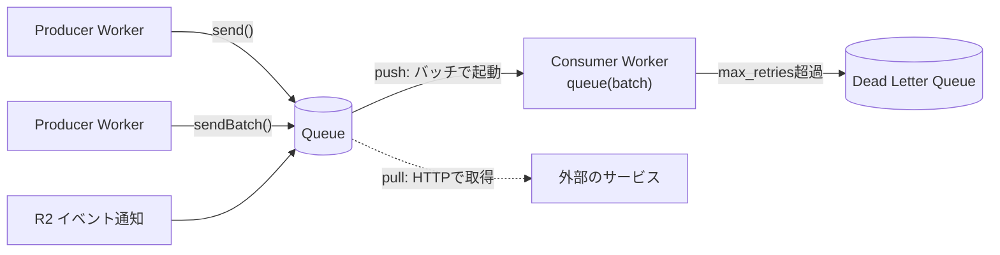

# Cloudflare Queues

[[cloudflare-workers]]と統合されたメッセージキュー。処理を非同期に後回しにしたり、サービス同士を疎結合にしたりするために使う（例: ECサイトの決済と注文処理を分ける）。配信保証は**at-least-once**で、egressは無料。

## 構成要素

- **Queue**: 書き込みに応じて自動でスケールするバッファ。書き込みが成功したメッセージは失われない。consumerが処理に成功するまで削除されない。**配信順序は保証されない**
- **Producer**: queueをbindingしたWorkerで、`env.MY_QUEUE.send(msg)` / `sendBatch(msgs)` で送る。1つのqueueにproducerはいくつでもつなげる。`ctx.waitUntil()` で送れば応答をブロックしないが、そのぶん `send()` のエラーは無視される
- **Consumer**: 1つのqueueにつき、アクティブなconsumerは1つだけ（重複配信を最小限にするため）。逆に、1つのconsumer Workerで複数のqueueを受けることはできる（`batch.queue` でqueue名を見て分岐する）
- **Message**: JSONにシリアライズできるもの（デフォルト）、またはtextなど。1メッセージは128KBまで

## consumerの2種類

- **push型（consumer Worker）**: メッセージがあるとWorkerの `queue` ハンドラがバッチで呼ばれる。自動でスケールし、同時実行は最大250。queueが空なら呼ばれない。最初はこちらから始めるのが簡単
- **pull型（HTTP pull consumer）**: 任意の環境・言語からHTTPで取得してackする。Cloudflare外の既存インフラで処理したい場合や、上流の制約・長時間タスクのせいで消費速度を細かく制御したい場合に使う。空でもpullすれば読み込み操作として課金される
- 1つのqueueに設定できるconsumerの種類は1つだけ。consumerは後から付け替えられる

## バッチとリトライ

- バッチは `max_batch_size`（デフォルト10、最大100）と `max_batch_timeout`（デフォルト5秒、最大60秒）のどちらか先に達したほうで配信される
- デフォルトではバッチ単位のall or nothingで、1件でも失敗するとバッチ全体がリトライされる。`msg.ack()` で個別に確定しておけば、そのメッセージは再配信されない。`msg.retry()` で個別に再配信を指示できる（negative ack）。外部APIやDBへの書き込みのように冪等でない処理では、個別ackが推奨されている
- `ack()` と `retry()` は最初に呼んだほうが勝つ。個別メッセージへの呼び出しは、バッチ単位の `ackAll()` / `retryAll()` より優先される
- リトライ回数は `max_retries`（デフォルト3、最大100）。超えたメッセージは削除される。**Dead Letter Queue**（DLQ）を設定しておけば、そちらに移される。DLQも普通のqueueなので、別途consumeできる

## 遅延

- 送信時に `delaySeconds` を指定すると、処理を最大24時間遅らせられる。queue単位でデフォルトの遅延も設定できる
- リトライ時にも `msg.retry({ delaySeconds })` で遅延できる。上流APIが429を返したときに消費ペースを落とすバックプレッシャー対策になる

## 冪等性

at-least-onceなので、まれに同じメッセージが2回以上届く。重複処理が困るなら、送信時にユニークIDを付けておき、DBのprimary keyや冪等キーにして重複を除く。

## 使いどころ

公式の選び方ガイドでは次の用途が挙げられている。

- リクエスト処理から重い仕事を切り離して後で実行する（メール・通知送信、外部API呼び出し）
- Worker間のメッセージング
- 外部サービスやR2に書く前に、バッファリング・バッチ化する

### Durable Objectsとの違い

[[cloudflare-durable-objects]]のAlarmsも遅延実行に使えるが、あちらは「エンティティごとのタイマー」という性格。順序が大事な処理や、状態と一緒に扱う処理はDurable Objects向き。汎用的なジョブキューやバッファリングならQueues。なお、Queues自体がDurable Objectsの上に実装されている。

## 制限（抜粋）

| 項目 | 制限 |
|---|---|
| queue数 | 10,000/アカウント |
| メッセージサイズ | 128KB |
| queueあたりのスループット | 5,000メッセージ/秒 |
| メッセージの保持期間 | 最大14日（Freeは24時間固定） |
| queueあたりのバックログ | 25GB |
| consumerの実行時間 | wall clockで15分。CPUは最大5分まで設定可 |
| `sendBatch` | 100件または合計256KBまで |

スループットが足りなければ、queueを複数に分けて水平に広げる。

## [[cloudflare-developer-platform]]の中での位置づけ

非同期処理・メッセージングの担当。ストレージではなく、Worker同士や[[cloudflare-r2]]のイベントと後段の処理をつなぐ役割。

## 出典

- [How Queues Works · Cloudflare Queues docs](https://developers.cloudflare.com/queues/reference/how-queues-works/)
- [Batching, Retries and Delays · Cloudflare Queues docs](https://developers.cloudflare.com/queues/configuration/batching-retries/)
- [Delivery guarantees · Cloudflare Queues docs](https://developers.cloudflare.com/queues/reference/delivery-guarantees/)
- [Dead Letter Queues · Cloudflare Queues docs](https://developers.cloudflare.com/queues/configuration/dead-letter-queues/)
- [Pull consumers · Cloudflare Queues docs](https://developers.cloudflare.com/queues/configuration/pull-consumers/)
- [Limits · Cloudflare Queues docs](https://developers.cloudflare.com/queues/platform/limits/)
- [Choose a data or storage product · Cloudflare Workers docs](https://developers.cloudflare.com/workers/platform/storage-options/)
- [Durable Objects aren't just durable, they're fast: a 10x speedup for Cloudflare Queues - Cloudflare Blog](https://blog.cloudflare.com/how-we-built-cloudflare-queues/)

#cloudflare-workers #serverless #message-queue
