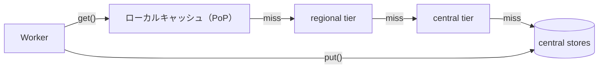

# Workers KV

[[cloudflare-workers]]から使える、グローバルで低レイテンシなキーバリューストア。**読み込みが圧倒的に多いワークロード向け**に最適化されていて、そのかわりに**結果整合**になっている。

## 仕組み

- データ本体は少数の中央データセンター（central stores）に保存される。書き込みは中央に行き、各拠点のキャッシュへ自動で配られるわけではない
- 読み込み時はまず最寄りのキャッシュを見て、無ければ regional tier → central tier → central stores の順にたどる。キャッシュに無い読み込み（cold read）は遅い
- 同じ拠点から頻繁に読まれるキー（hot key）はキャッシュから返るので速い。hot readのレイテンシはおおむね500µs〜10ms程度。有効期限が切れる前に、上位のキャッシュからバックグラウンドで更新される
- 複製方式はpush/pullのハイブリッド。人気のある値は読まれる拠点にキャッシュされ、あまり読まれない値は必要になったときに取りに行く

## 整合性

- 書き込んだ拠点では、たいていすぐに見える。ただし保証はないので、この挙動に頼らない
- 他の拠点では、キャッシュが期限切れになるまで古い値が返ることがある（60秒以上かかることもある）。`cacheTtl` のデフォルトは60秒、最小は30秒
- 「キーが存在しない」という結果もキャッシュされる。そのため、値を新しく作ったときにも同じくらい反映が遅れる
- アトミックな操作や、1トランザクション内での読み書きには向かない。強整合が必要なら[[cloudflare-durable-objects]]を使う
- 公式が紹介している組み合わせ方: あるキーへの書き込みを、必ず対応する1つのDurable Objectを通すようにする。こうすると書き込み同士の順序（write-after-write）が保証され、読み込み側はKVのキャッシュの速さをそのまま使える

## 向いている用途 / 向かない用途

向いている（読み込み中心で、キャッシュしやすいもの）:

- アプリケーションの設定、機能フラグ、A/Bテストの振り分け
- セッション、認証情報、APIキー（OpenAuthやCloudflare Access自体もKVを使っている）
- ユーザーごとの設定
- allow list / deny list
- APIレスポンスのキャッシュ、静的アセットの配信

向かない:

- 同じキーを毎秒数十〜数百回更新するような、Redis的な書き込みの多いワークロード（同じキーへの書き込みは1回/秒まで）。書き込みを複数のキーに分散できるならKVでも対応できるし、Durable ObjectsのKV APIのほうが同一キーへの書き込み上限が高い
- カウンタや在庫のように、直前の値をもとに更新するもの

## 制限（抜粋）

| 項目 | Free | Paid |
|---|---|---|
| 読み込み | 10万回/日 | 無制限 |
| 異なるキーへの書き込み | 1,000回/日 | 無制限 |
| 同じキーへの書き込み | 1回/秒 | 1回/秒 |
| キーサイズ | 512バイト | 512バイト |
| 値サイズ | 25MiB | 25MiB |
| ストレージ | 1GB | 無制限 |

Workersのバインディング（`env.KV.get/put/list/delete`）のほか、REST APIで外部からも読み書きできる。

## [[cloudflare-developer-platform]]の中での位置づけ

ストレージのうち、読み込み中心で結果整合でよいデータの担当。強整合や同時更新が必要なら[[cloudflare-durable-objects]]、リレーショナルなら[[cloudflare-d1]]。

## 出典

- [How KV works · Cloudflare Workers KV docs](https://developers.cloudflare.com/kv/concepts/how-kv-works/)
- [Limits · Cloudflare Workers KV docs](https://developers.cloudflare.com/kv/platform/limits/)
- [Cloudflare Workers KV · Overview](https://developers.cloudflare.com/kv/)
- [Choose a data or storage product · Cloudflare Workers docs](https://developers.cloudflare.com/workers/platform/storage-options/)

#cloudflare-workers #serverless #edge-computing #database #key-value-store
