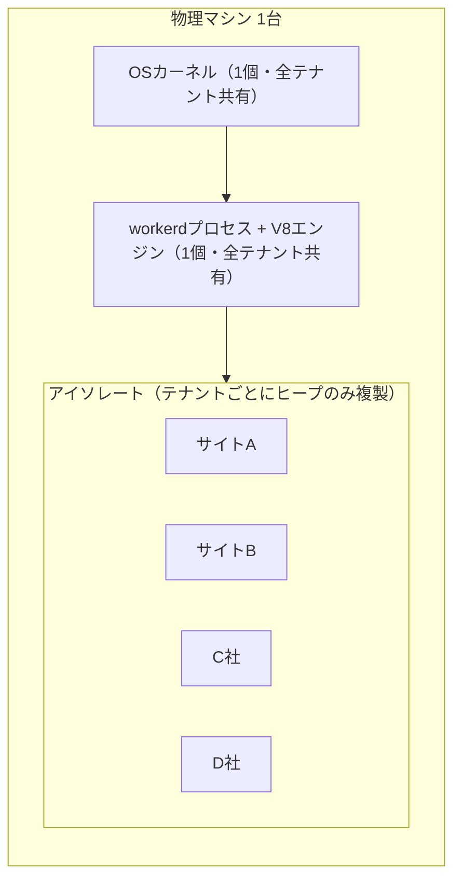
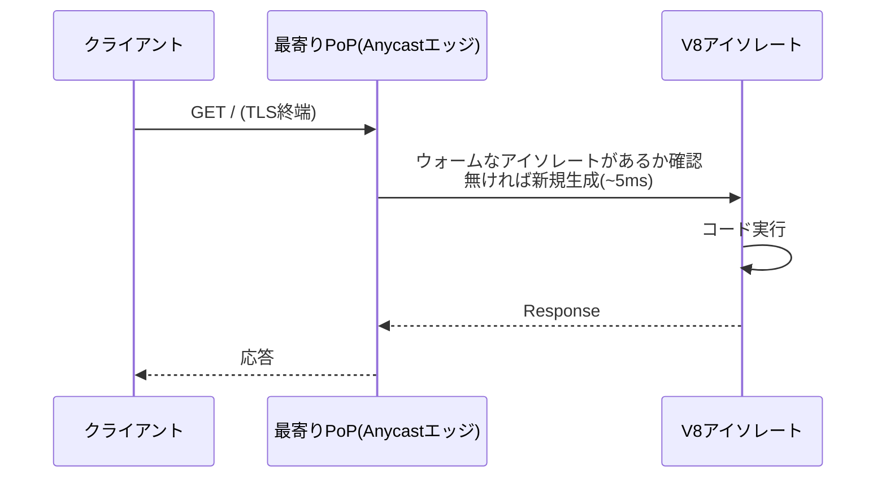
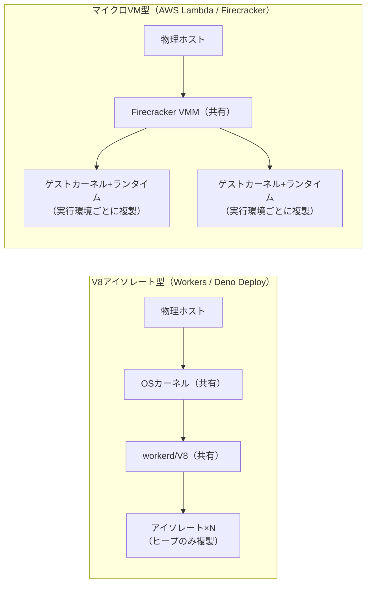

# Cloudflare Workers

Cloudflareのグローバルエッジネットワーク上でJavaScript/WebAssemblyを実行するサーバーレスコンピューティングプラットフォーム。AWS LambdaやVercel Functionsと同じ「サーバーレス関数」の範疇に入るが、コンテナやVMではなく**V8アイソレート**という単位で分離・実行される点が最大の特徴。

## V8アイソレートによる分離

- アイソレートは、Chrome/V8エンジンがブラウザのタブごとにJavaScriptを分離実行する仕組みと同じ技術。各アイソレートは独自のヒープとガベージコレクタを持つが、OSプロセスやV8エンジン本体は多数のアイソレートで共有される
- V8エンジンは[[javascript-core]]（SafariのJSエンジン）としばしば対比される、Node.jsやDenoでも使われているエンジン
- コンテナやVMのようにOSカーネルやランタイム全体を複製しないため、生成コストが極めて低い（起動が数百マイクロ秒〜とされる）。これにより、いわゆる「コールドスタート」がほぼ発生しない
- 1台の物理マシン上で数千のアイソレートを同時に保持し、ミリ秒単位で切り替えながら実行できる
- 制約として、メモリ上限は1アイソレートあたり128MB、マルチスレッド・共有メモリは禁止、ネイティブコードは実行不可（JavaScript/WebAssemblyのみ）、ファイルシステムアクセスもない

## workerdランタイム

Cloudflareは2022年、Workersのランタイム本体を**workerd**としてOSS公開した（[cloudflare/workerd](https://github.com/cloudflare/workerd)）。

- **Nanoservices**: マイクロサービスのように分離・独立デプロイ可能でありながら、ローカル関数呼び出しと同等のパフォーマンスで動く単位として設計されている
- **Capability bindings**: 設定（config）の時点でnanoservices同士や外部リソース（KV、R2、Durable Objectsなど）への接続を明示的に結線する
- fetch・crypto等の組み込みAPIはworkerd側のネイティブコードとして実装され、全アイソレートが同じコピーを共有する（Node.jsのようにアイソレートごとにAPI一式をロードし直さない）ため、メモリ効率が高い
- 同一のworkerdバイナリをローカル開発（`wrangler dev`）にも本番エッジにも使っており、ローカルと本番の実行環境の差異が小さい

## リクエストのライフサイクル

コードはCloudflareの300以上のPoP（拠点）全てに事前デプロイされる。オリジンサーバーへの複製転送ではなく、最初から現地に存在する。リクエストはAnycastネットワークによって物理的に最も近いPoPへルーティングされ、TLS終端もそこで行われる。

- アイソレートは実行後に必ず破棄されるわけではなく、次のリクエストのために温存されることがある（2回目以降のリクエストが速いのはこのため）
- ただし複数のリクエストが同じインスタンスにルーティングされる保証はないため、グローバル変数に可変状態を保存する設計は推奨されない

## セキュリティモデル（多層防御）

単一プロセス内に数千テナントを同居させる都合上、Spectre系のサイドチャネル攻撃対策が重要視されており、多層構造になっている。

1. **V8アイソレート**によるメモリ隔離（第一層）
2. **Linuxサンドボックス**（namespaces、`seccomp`）によるプロセスレベルの制限
3. 異常なパフォーマンスカウンタを検知した場合の**動的プロセス分離**
4. 攻撃を遅延させるための**定期的なメモリシャッフル**

また、タイミング攻撃対策として`Date.now()`は実行中は時間経過を反映せず、直近のI/O時点の値を返す。

## 他のサーバーレス基盤との違い

隔離の単位が異なる。AWS Lambdaは、Firecracker製の**マイクロVM**を実行環境ごとに1台ずつ起動し、ゲストカーネルからランタイムまで丸ごと複製する方式。V8のヒープだけを分離するWorkersに比べて、境界はOSレベルで強い一方、複製コストは重い（Lambdaのコールドスタートは、マイクロVMの起動だけで~125ms程度とされる）。

Deno DeployもWorkersと同じV8アイソレート型で、思想的には最も近い競合にあたる。

## 出典

- [How Workers works - Cloudflare Docs](https://developers.cloudflare.com/workers/reference/how-workers-works/)
- [Introducing workerd: the Open Source Workers runtime - Cloudflare Blog](https://blog.cloudflare.com/workerd-open-source-workers-runtime/)
- [cloudflare/workerd - GitHub](https://github.com/cloudflare/workerd)
- [Security model - Cloudflare Docs](https://github.com/cloudflare/cloudflare-docs/blob/production/src/content/docs/workers/reference/security-model.mdx)
- [Mitigating Spectre and Other Security Threats - Cloudflare Blog](https://blog.cloudflare.com/mitigating-spectre-and-other-security-threats-the-cloudflare-workers-security-model/)
- [AWS Lambda introduces MicroVMs - AWS Blog](https://aws.amazon.com/blogs/aws/run-isolated-sandboxes-with-full-lifecycle-control-aws-lambda-introduces-microvms/)

#cloudflare-workers #serverless #v8 #edge-computing #isolate
