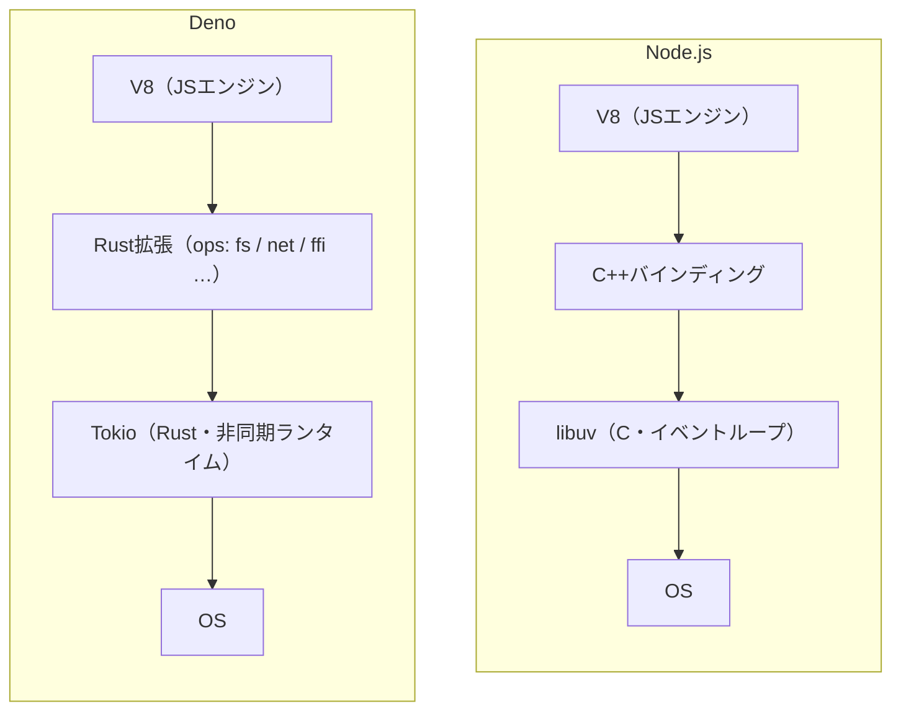
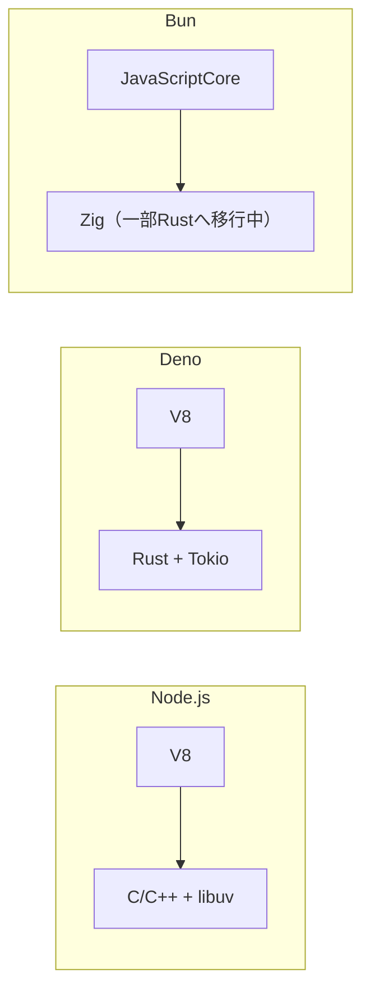

# Deno

JavaScript/TypeScript向けのランタイム。V8・Rust・[[tokio]]の上に構築されている。Node.jsの作者本人が自らの設計を反省した講演をきっかけに生まれ、「デフォルトで何もできない」パーミッションモデルを最大の特徴とする。

## 生まれた経緯

Node.jsの作者であるRyan Dahlが2018年のJSConf EUで「10 Things I Regret About Node.js」という講演を行い、自身が設計したNode.jsの反省点(セキュリティモデルの甘さ、Promiseを早期に採用しなかったこと、`package.json`やビルドシステムの複雑さ、`node_modules`によるモジュール解決の複雑化など)を10個列挙した。Denoの構想はこの講演で初めて発表され、それらの反省を踏まえて一から設計し直されたランタイムという位置づけを持つ。

## アーキテクチャ

Deno本体はRustで書かれた単一バイナリ。JS/TSコードの実行自体はNode.jsと同じV8エンジンが担うが、ファイルI/O・ネットワークなど「システムコールに相当する処理」はRustの拡張(`extensions`/`ops`)として実装され、非同期処理は[[tokio]](Rust製の非同期ランタイム)が担当する。Node.jsが同じ役割をC++バインディングと`libuv`(C言語製のイベントループライブラリ)でこなしているのと対比すると、系統の違う土台の上に同じV8を載せている構図になる。



V8という「JSを実行する部分」は共通だが、その下のシステム層をNode.jsはC/C++で、DenoはRustで書き直している。`deno_core::JsRuntime`というレイヤーがJSとRustの橋渡しを担う。

## パーミッションモデル(セキュリティ)

Denoはデフォルトで何もできない。ファイル・ネットワーク・環境変数へのアクセスは、実行時に明示したフラグの分だけ許可される。しかもリソースの種類ごと、さらにネットワークならホスト単位・環境変数なら変数単位まで絞って許可できる。

```ts
// server.ts
Deno.serve((req) => {
  const url = new URL(req.url)
  if (url.pathname === "/secret") {
    return new Response(Deno.env.get("SECRET"))
  }
  return new Response("Hello")
})
```

```bash
deno run --allow-net server.ts
curl localhost:8000/secret
# error: Uncaught (in promise) NotCapable: Requires env access to "SECRET", run again with the --allow-env flag
```

`--allow-net`は渡していても`--allow-env`を渡していないため、環境変数アクセスの瞬間に例外で止まる。`--allow-env=SECRET`のようにその変数だけを許可することもできる。CIやlint等サードパーティ製のツールに無制限のアクセス権を渡さずに済む、という発想がRyan Dahlの講演での反省点に対応する。

## 単一実行ファイル化

`deno compile`で、TS/JSコードとDenoランタイムごと1つのネイティブバイナリにまとめられる。生成されたバイナリはDenoがインストールされていない環境でもそのまま動く。

```bash
deno compile --allow-net --output server server.ts
./server
```

Deno 2以降はこのコンパイル機能がnpmパッケージ・Web Worker・クロスコンパイルにも対応した。

## 他ランタイムとの違い

Node.js・[[bun]]・Denoはいずれも「JavaScript/TypeScriptランタイム」だが、JSエンジンとシステム層の実装言語がそれぞれ異なる。

- **Node.js**: V8 + C/C++・`libuv`。デフォルトはフルアクセス。TypeScriptは標準では非対応(型を消すだけの実行はNode 22以降で一部可)
- **Deno**: V8 + Rust・Tokio。デフォルト拒否で`--allow-*`により個別許可。TypeScriptはネイティブ対応。npm互換はDeno 2で追加(独自レジストリJSRも持つ)
- **[[bun]]**: [[javascript-core]](Node.js/Denoが使うV8ではない) + Zig(一部Rustへ移行中)。デフォルトはフルアクセス。TypeScriptはネイティブ対応



BunのJSエンジンはV8ではなくSafari系のJavaScriptCoreである点に注意。エンジンが違うため、V8依存のネイティブアドオン等はBunでは動かないことがある。

## Deno Deploy

Deno公式が提供するエッジ実行環境。[[cloudflare-workers]]と同じV8アイソレート型のアーキテクチャを採用しており、思想的には最も近い競合にあたる。

## 出典

- [denoland/deno - GitHub](https://github.com/denoland/deno)
- [Security and permissions - Deno Docs](https://docs.deno.com/runtime/fundamentals/security/)
- [Permissions - Deno Docs](https://docs.deno.com/runtime/reference/permissions/)
- [Self-contained Executable Programs with Deno Compile - Deno Blog](https://deno.com/blog/deno-compile-executable-programs)
- [Announcing Deno 2 - Deno Blog](https://deno.com/blog/v2.0)
- [Ryan Dahl - JSConf EU 2018](https://2018.jsconf.eu/speakers/ryan-dahl-propel-a-machine-learning-framework-for-javascript.html)

#deno #javascript #typescript #ランタイム #v8 #セキュリティ
