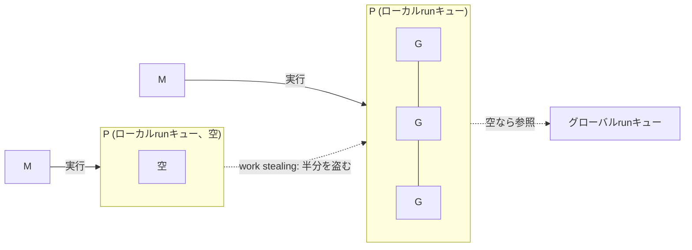

# Goのgoroutineスケジューラ（GMPモデル）

goroutineを数万〜数十万オーダーで起動しても現実的なコストで動く理由の中身。[[go-basics]]のgoroutine節から詳細を切り出した。

## G/M/Pの3要素

- **G (Goroutine)**: 実行単位そのもの。数KBという小さい可変長スタックを持ち、必要に応じて伸縮する。OSはその存在を知らず、Goランタイムがユーザー空間で管理する。
- **M (Machine)**: OSスレッドのラッパー。実際にCPU上で命令を実行するのはM。
- **P (Processor)**: 論理プロセッサ。ローカルrunキューなど実行に必要な資源をまとめて持つ「実行権」で、GとMを仲介する。

MがGを実行するには対応するPを保持している必要がある。**Pの数が同時に実行できるGoコードの上限**であり、`GOMAXPROCS`で決まる。デフォルトは論理CPU数から計算されるが、Go 1.25以降はcgroup制限などシステムリソースの変化を見て自動更新されるようになった。一方Mの数はブロッキングsyscallの状況に応じて動的に増減し、Pの数より多くなることがある。

## スケジューリングの流れ

- 各Pはローカルrunキューにスケジュール待ちのGを持ち、Mは自分が保持するPのローカルキューから次のGを取り出して実行する。
- ローカルキューが空になったMは、他のPのローカルキューから仕事を半分盗んでくる(**work stealing**)。特定のPだけ仕事が偏る状況を防ぐための仕組み。
- それでも見つからなければグローバルrunキューやネットワークポーラー(netpoller)を確認しにいく。

## syscallでMがブロックするとき

Gがブロッキングなsyscallを発行してMごとブロックすると、そのMに紐づいていたPは切り離され、別の（空いていればそれを、なければ新規作成した）Mに引き渡されて他のGの実行を続ける。syscallが完了すると元のMはPの再取得を試みるが、空いていなければそのGはグローバルrunキューに戻され、Mはスリープする。この仕組みにより、1つのGがブロッキングI/Oで止まっても、GOMAXPROCS分の並行実行能力は失われない。

## プリエンプション

- Go 1.14より前は、Goコード中の関数呼び出しの先頭でしかスケジューラに制御を返せなかった（協調的プリエンプション）。関数呼び出しを含まない長時間ループが他のGをブロックし、GCの遅延やデッドロックの原因になりうる問題があった。
- Go 1.14で**非同期プリエンプション**が導入され、この問題が解消された。監視スレッド`sysmon`が10ms以上動き続けているGoroutineを検知すると、そのGoroutineを実行しているOSスレッドへ`SIGURG`シグナルを送ってGを強制的に中断させる。`GODEBUG=asyncpreemptoff=1`で無効化できる。
- Windows/arm・darwin/arm・js/wasm・plan9系など一部プラットフォームは非対応。
- 明示的に実行を譲りたい場合は`runtime.Gosched()`を呼ぶ。

## sysmon

Pを持たない特別なM上で動く監視スレッド。ネットワークポーリング、長時間実行中Gへのプリエンプション要求、GCのトリガーなどを定期的に行う。

## 他言語の並行処理モデルとの対比

goroutineはこのM:Nスケジューラによって、`async`/`await`のような専用構文なしに`go`一つで並行実行に切り替えられる。この設計思想の違いは[[async-runtime]]・[[tokio]]・[[kotlin-coroutines]]で比較している。

## バージョンについて

本ノートの内容はGo 1.26系（2026年2月リリース）を前提にしている。GMPモデル自体の骨格はGo 1.1（2013年）のスケーラブルスケジューラ導入以来大きく変わっていない。非同期プリエンプションはGo 1.14（2020年）、`GOMAXPROCS`の自動更新はGo 1.25で導入された。

## 出典

- [runtime package - Go Packages](https://pkg.go.dev/runtime)
- [Go 1.14 Release Notes - The Go Programming Language](https://go.dev/doc/go1.14)

#go #goroutine #スケジューラ #並行処理
