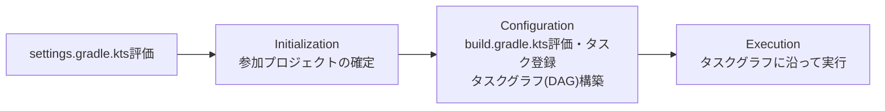

# Gradleの基礎（Project/Task/ビルドライフサイクル）

Gradleのビルドは「複数の`Project`」と、各`Project`が持つ「複数の`Task`」というモデルで構成される。1つのビルドは1つ以上のプロジェクトからなり（マルチプロジェクトビルド）、各プロジェクトはビルドの一部として実行される作業単位（コンパイル、テスト実行、JAR生成など）を`Task`として持つ。[[gradle-daemon]]・[[composite-builds]]・[[convention-plugins]]は、いずれもこの基本モデルの上に成り立つ発展的な仕組み。

## ビルドライフサイクルの3フェーズ

Gradleのビルド実行は常に次の3フェーズを順に通る。

1. **Initialization（初期化）フェーズ**: どのプロジェクトがビルドに参加するかを確定する。init scriptを実行した後、`settings.gradle.kts`を評価して`Settings`オブジェクトを作り、`include()`/`includeBuild()`で列挙されたプロジェクト・included build（[[composite-builds]]参照）それぞれについて`Project`インスタンスを生成する。
2. **Configuration（設定）フェーズ**: 参加が確定した各プロジェクトの`build.gradle.kts`を評価する。ここでタスクの登録や、`plugins {}`・`dependencies {}`ブロックなど「タスクのアクションそのものではない」ビルドスクリプトのコードが実行される。同時に各タスクの入出力の依存関係を解析してタスクグラフ（DAG）を構築する。
3. **Execution（実行）フェーズ**: Configurationフェーズで構築されたタスクグラフをもとに、実行が必要なタスクを依存順に実際に実行する。ビルドの実作業（コンパイル・テスト実行など）が行われるのはこのフェーズだけ。

`settings.gradle.kts`に書いたコードはInitializationフェーズで、`build.gradle.kts`のうちタスクのアクション（`doFirst`/`doLast`の中身）以外のトップレベルのコードはConfigurationフェーズで評価される、という区別が重要——例えば`build.gradle.kts`のトップレベルで重い処理を書くと、対象タスクを実行しない`gradle tasks`のような呼び出しでも毎回評価されてしまう。

## Taskの基本

`Task`はビルド作業の最小単位。代表的な要素:

- **`dependsOn`**: あるタスクの実行前に別のタスクの完了を要求する。タスク間の依存を宣言的に表現する
- **`doFirst {}` / `doLast {}`**: タスクに実行時アクションを追加する。1つのタスクは複数のアクションを持てるため、`do`が複数形の`First`/`Last`になっている
- **inputs/outputs**: タスクの入力・出力ファイル（プロパティ）を宣言する。これを宣言すると、ある1つのタスクの出力を別のタスクの入力に紐付けることでタスク間依存を自動生成させたり、後述のincremental buildを効かせたりできる

### Incremental build（up-to-date判定）

Gradleは前回ビルドの結果を再利用できる場合、タスクの実行自体をスキップする（`UP-TO-DATE`）。判定は inputs/outputs のチェックサムに基づいており、Makeのようなタイムスタンプ比較だけではない。さらに、入力の一部だけが変わった場合に全入力を再処理するのではなく変更のあった入力だけを処理する「タスクの内部でのインクリメンタル処理」も別途サポートされている。この前回ビルド結果の再利用の仕組みは、[[gradle-daemon]]がプロセスをまたいで保持するインメモリキャッシュ（[[jvm-class-loading]]や[[jit-compilation]]のコストの持ち越し）とは別レイヤーの話——こちらは「ファイルシステム上の入出力の変化を検知して再実行要否を判断する」仕組み。

## 依存関係の宣言（Configuration）

`dependencies {}`ブロックで使うキーワード（Configuration）は、依存先ライブラリをコンパイル時／実行時のどちらのクラスパスに乗せるか、かつ利用側（このライブラリに依存する側）にどこまで公開するかを制御する（[[java-classpath]]も参照）。Java Library Pluginが提供する主なConfiguration:

| Configuration | コンパイルクラスパス | 実行時クラスパス | 利用側への公開 |
|---|---|---|---|
| `implementation` | ○ | ○ | されない |
| `api` | ○ | ○ | される（利用側のコンパイル・実行時クラスパスにも伝播） |
| `compileOnly` | ○ | × | されない |
| `runtimeOnly` | × | ○ | されない（実行時クラスパスへの伝播のみ） |

`implementation`は依存先の実装詳細をライブラリのpublic APIとして漏らさない（コンパイル時に利用側へ伝播しない）ため、利用側のリビルド範囲を狭められる。`api`が必要になるのは、そのライブラリの公開する型（メソッドのシグネチャなど）が依存先の型を直接使っている場合のみ。迷ったらまず`implementation`を使い、コンパイルエラーが出た場合にのみ`api`への変更を検討するのが基本方針とされている。

## Gradle Wrapper（`gradlew`）

`gradlew`/`gradlew.bat`は、Gradle本体をローカルにインストールしなくてもビルドを実行できるようにするラッパースクリプト。`gradle-wrapper.properties`に指定されたバージョン・種類（`-bin`は実行に必要な最小構成、`-all`はソース・ドキュメント込み）のGradle配布物がローカルに存在しなければダウンロードし、以降はそのバージョンの`gradle`コマンドに処理を委譲する。Wrapper自体のファイル一式（`gradlew`、`gradlew.bat`、`gradle/wrapper/gradle-wrapper.jar`、`gradle-wrapper.properties`）はリポジトリにコミットしておくのが推奨で、これによりチームメンバー全員が同一バージョンのGradleでビルドできる。Gradleのバージョンを上げたいだけなら`wrapper`タスクを再実行する必要はなく、`gradle-wrapper.properties`の`distributionUrl`を書き換えるだけでよい。

## バージョンについて

本ノートの内容はGradle 9系（2026年8月時点の最新は9.7.1、2026年8月19日リリース）を前提にしている。Project/Task/ビルドライフサイクルという基本モデル自体は長期間安定しているが、`gradle.properties`のデフォルト値のような細部はバージョンごとに変わりうる。

## 出典

- [Gradle Releases](https://gradle.org/releases/)
- [Build Lifecycle | Gradle User Manual](https://docs.gradle.org/current/userguide/build_lifecycle.html)
- [Understanding Tasks | Gradle User Manual](https://docs.gradle.org/current/userguide/more_about_tasks.html)
- [Incremental build | Gradle User Manual](https://docs.gradle.org/current/userguide/incremental_build.html)
- [The Java Library Plugin | Gradle User Manual](https://docs.gradle.org/current/userguide/java_library_plugin.html)
- [Gradle Wrapper | Gradle User Manual](https://docs.gradle.org/current/userguide/gradle_wrapper.html)

#gradle #ビルド
