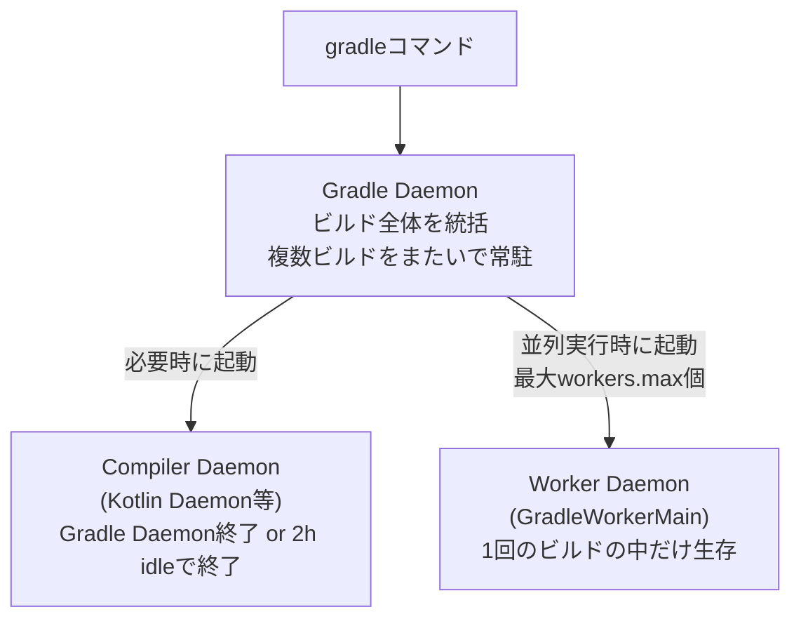

# Gradle Daemon

Gradleのビルドを高速化するために、ビルド終了後もプロセスを終了させず背景に残し続け、次回以降のビルドで再利用する長生きのバックグラウンドプロセス。高速化の要因は主に[[jvm-class-loading]]と[[jit-compilation]]のコストを次回ビルドまで持ち越せること（プロジェクト情報のインメモリキャッシュも効く）。

## 複数のデーモンが起動する理由

Gradleは「互換性のあるアイドルデーモン」がなければ新規にデーモンを起動する。互換性判定には以下が使われ、いずれかが不一致だと別デーモンが起動する。

- Gradleのバージョン（あるバージョンのGradleは同一バージョンのデーモンにしか接続できない）
- JVM起動オプション（`-Xmx`・`-Xms`・`-Xbootclasspath`・`-ea`が完全一致している必要がある）
- 使用するJavaランタイムのバージョン

`gradle --status`で複数のデーモンが並んでいるのは大抵このいずれか。

## 3種類のデーモン

「Gradleデーモン」とひとくくりに呼ばれがちだが、実際には生存期間の異なる3種類のプロセスが存在する。

- **Gradle Daemon本体**: ビルドスクリプトの実行、タスクグラフの構築・実行を統括。複数ビルドをまたいで常駐する
- **Compiler Daemon**（Kotlin Daemonなど）: 言語コンパイラ専用の常駐プロセス。コンパイルタスクが走ると起動し、Gradle Daemon終了時か2時間アイドルで自己終了する。Java/Kotlin混在プロジェクトでは両方の専用デーモンが別々に立つこともある
- **Worker Daemon**（`GradleWorkerMain`）: タスクの一部処理を子プロセスに切り出して並列・隔離実行するためのプロセス。テスト実行時のクラスパス汚染防止にも使われる。1回のビルドの中だけ生存し、ビルド終了かリソース逼迫時に停止する

## メモリとの関連

`org.gradle.jvmargs`（`gradle.properties`）でDaemonプロセスのJVM引数（ヒープサイズなど）を指定する。並列実行で生成されるスレッドは、いずれも同じDaemonプロセス内で`org.gradle.jvmargs`が定義するヒープを共有する。並列ワーカーの数を増やしてもヒープ自体は増えない点に注意。

Daemonは自身の健全性を監視しており（`LowMemoryDaemonExpirationStrategy`など）、OS/JVMのメモリ状況やGCの状態を定期的にチェックする。GCがスラッシングし始めた、あるいはMetaspaceが枯渇してGCでも回収できない（実質的なリークとみなせる）といった場合には自らを終了（expire）させ、次回ビルドで新しいクリーンなデーモンを起動させる。ただし急激なメモリリークの場合はこの監視が間に合わずOutOfMemoryErrorに至ることもある。

## CPUとの関連

`org.gradle.workers.max`（`--max-workers`）が並列実行時にフォークするワーカー数の上限を決める。**デフォルト値はビルドJVMから見えるCPUプロセッサ数**（`Runtime.availableProcessors()`）。`org.gradle.parallel=true`にすると、依存関係のないプロジェクト/タスクを並列実行できるようになる。

| 設定 | 既定値 | 効く場所 |
|---|---|---|
| `org.gradle.daemon` | `true` | デーモンを使うかどうか |
| `org.gradle.jvmargs` | `-Xmx512m -XX:MaxMetaspaceSize=384m` | Daemonプロセスのヒープ／Metaspaceサイズ |
| `org.gradle.parallel` | `false` | 依存関係のないプロジェクト/タスクを並列実行するか |
| `org.gradle.workers.max` | CPUコア数 | 並列ワーカー（スレッド／プロセス）の上限数 |

## Worker API（Worker）との違い

|  | Gradle Daemon | Worker（Worker API） |
|---|---|---|
| 目的 | ビルド起動コストの削減 | 1タスク内の処理を並列・隔離実行 |
| 生存期間 | 複数ビルドをまたいで常駐 | 1回のビルド内のみ |
| 隔離レベル | — | classloader isolation（同一JVM内で別クラスローダー）／process isolation（別JVMプロセス、個別に`-Xmx`指定可） |
| 終了条件 | アイドルタイムアウト／非互換な要求 | ビルド終了、またはリソース逼迫時 |

process isolationを選んだWorkerは、実体として上図の「Worker Daemon」プロセスとして立ち上がる。classloader isolationの場合は新規プロセスを起こさず、Gradle Daemonプロセスの中で別クラスローダーに分離するだけなので、Gradle Daemon自身のヒープをそのまま使う。

## 出典

- [The Gradle Daemon | Gradle User Manual](https://docs.gradle.org/current/userguide/gradle_daemon.html)
- [Build Environment Configuration | Gradle User Manual](https://docs.gradle.org/current/userguide/build_environment.html)
- [Developing Parallel Tasks (Worker API) | Gradle User Manual](https://docs.gradle.org/current/userguide/worker_api.html)
- [How Gradle Works Part 2 — Inside The Daemon](https://blog.gradle.org/how-gradle-works-2)
- [Kotlin daemon | Kotlin Documentation](https://kotlinlang.org/docs/kotlin-daemon.html)
- [Confusion about Gradle Daemon vs Workers and JVM settings | Gradle Forums](https://discuss.gradle.org/t/confusion-about-gradle-daemon-vs-workers-and-jvm-settings/30803)
- [Daemon eagerly expires with full metaspace | gradle/gradle](https://github.com/gradle/gradle/issues/15988)
- [Daemon should expire before a GC overhead limit exceeded error occurs | gradle/gradle](https://github.com/gradle/gradle/issues/3292)

#gradle #jvm #ビルド #kotlin
