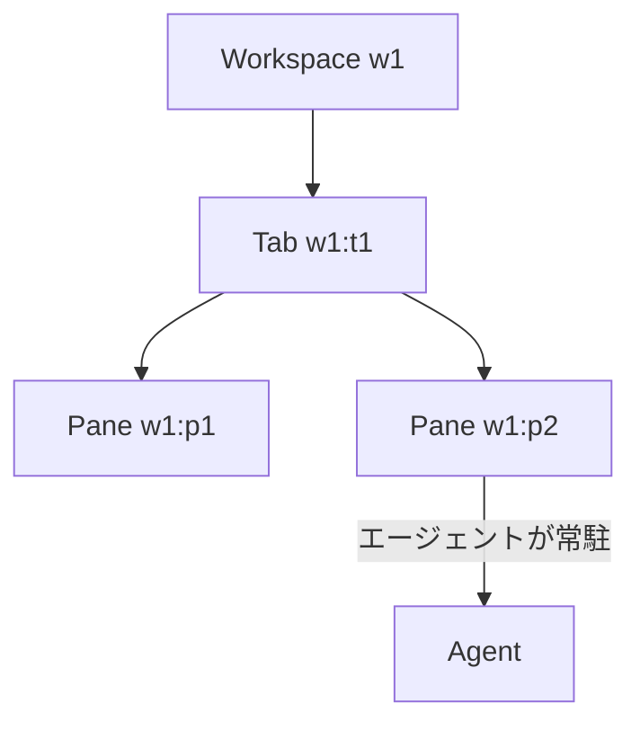
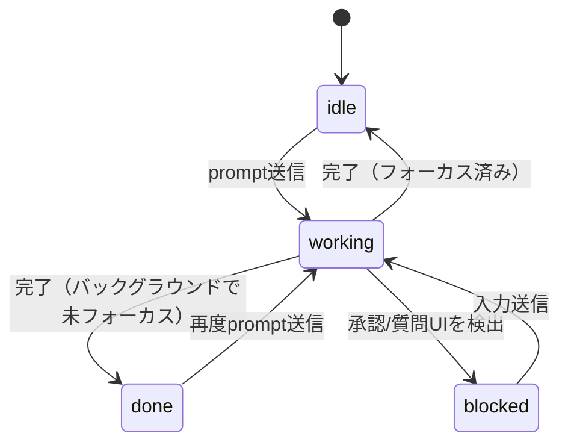

# Herdr

Herdr は、Rust/Ratatuiで実装されたターミナルマルチプレクサ。「AIエージェント時代向けに作り直したtmux」という位置づけの製品で、tmuxやscreenと同じくワークスペース／タブ／ペインという階層でターミナルセッションを永続化・分割・detach/attachできる。それに加えて、ペインの中で動いているプロセスがコーディングエージェント（Claude Code、Codex、Cursorなど）かどうかを自動認識し、`idle`/`working`/`blocked` といった状態をサイドバーにリアルタイム表示するのが最大の特徴。エージェントをCLIから操作できる機能もあるが、それはこの「マルチプレクサ本体 + エージェント状態認識」という土台の上に乗る一機能であり、Herdrの主機能そのものではない。

## tmux/screenとの違い

- ペイン・タブ・セッションの永続化モデルはtmux/screenの延長線上にある
- ゼロコンフィグでのエージェント検出: プロセス名と出力内容のヒューリスティックで、14種類以上のコーディングエージェントを設定なしに自動認識する
- 各エージェントは出力を横取りして表示するのではなく、本物の独立したターミナルペインの中で動く。そのためフルスクリーンのTUIも正しく描画される
- `--remote` モードでSSH越しにリモートホスト上の herdr サーバーへ薄いクライアントとして接続できる。ローカル側で作業を切り上げてもリモート側のセッションは残り、別のSSH接続から再度attachできる
- GUIアプリやElectronラッパー、クラウドアカウントは不要。ローカルで動く単体のRustバイナリだけで完結する

## 階層構造

ワークスペース(workspace) > タブ(tab) > ペイン(pane) という3階層で構成され、それぞれに `w1`、`w1:t1`、`w1:p1` のような不透明で安定したID(opaque stable ID)が振られる。閉じたタブ/ペインのIDは再利用されない。



## エージェントの状態認識

ペインの中身を監視して、コーディングエージェントのライフサイクルを次の状態に分類する。



- `idle`: 入力待ちで、かつそのタブがHerdrのUI上でフォーカスされたことがある状態
- `done`: 同じidle状態だが、フォーカスされていない裏側でのタスクが完了した場合
- `blocked`: 承認や質問のUIをHerdrが検出した状態
- `unknown`: エージェントは存在するが状態を確信を持って分類できない状態（完了の証拠にはならない）

## エージェントオーケストレーション（`herdr` CLI）

上記の状態認識を土台に、`herdr` というCLIから他のペインやエージェントをプログラムから操作できる。これにより、あるエージェントが別のエージェントをペインに起動し、進捗を監視して出力を読み取る、といった「エージェントによるエージェントの調整」がHerdrの外に出ることなく完結する（マルチプレクサとしての機能の上に乗るオーケストレーション機能、という位置づけ）。

```bash
# 現在の状態を確認する
herdr workspace list
herdr pane current --current
herdr agent list
```

エージェントを起動して指示を送る例:

```bash
herdr pane split --current --direction right --cwd "$PWD" --no-focus
herdr agent start reviewer --kind codex --pane <pane-id>
herdr agent prompt reviewer "現在のdiffをレビューして" --wait --timeout 120000
```

`agent prompt` はテキスト送信とEnterキー送信をアトミックに行う。`--wait` を付けると `idle`/`done`/`blocked` のいずれかに状態が落ち着くまで待機してくれる。

## 覚えておきたい安全上のルール

- 自分が作成していないワークスペース/タブ/ペイン/セッションを勝手に閉じない
- `herdr server stop` はメインのHerdrプロセスを落とすので、明示的に意図した場合以外は実行しない
- 別クライアントがフォーカスしているペインに依存せず、`--current`・明示的なペインID・ユニークなagent名のいずれかを使う
- IDはJSONレスポンスから読み取る。サイドバーの表示順や例から類推しない

## 出典

- [Herdr: Terminal Multiplexer with Built-in AI Agent State Awareness](https://betterstack.com/community/guides/ai/herdr-ai-agent/)
- [herdr - A tmux-like and agent-aware terminal multiplexer](https://terminaltrove.com/herdr/)

#herdr #cli #ツール #ターミナル
