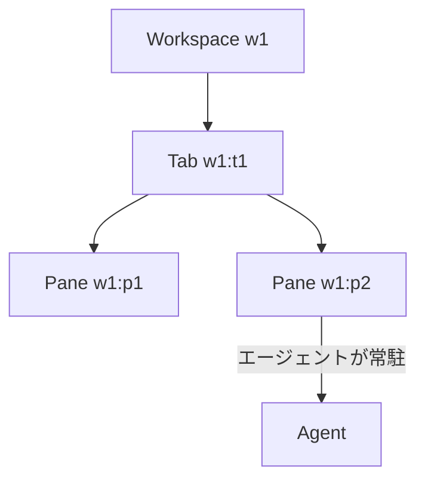
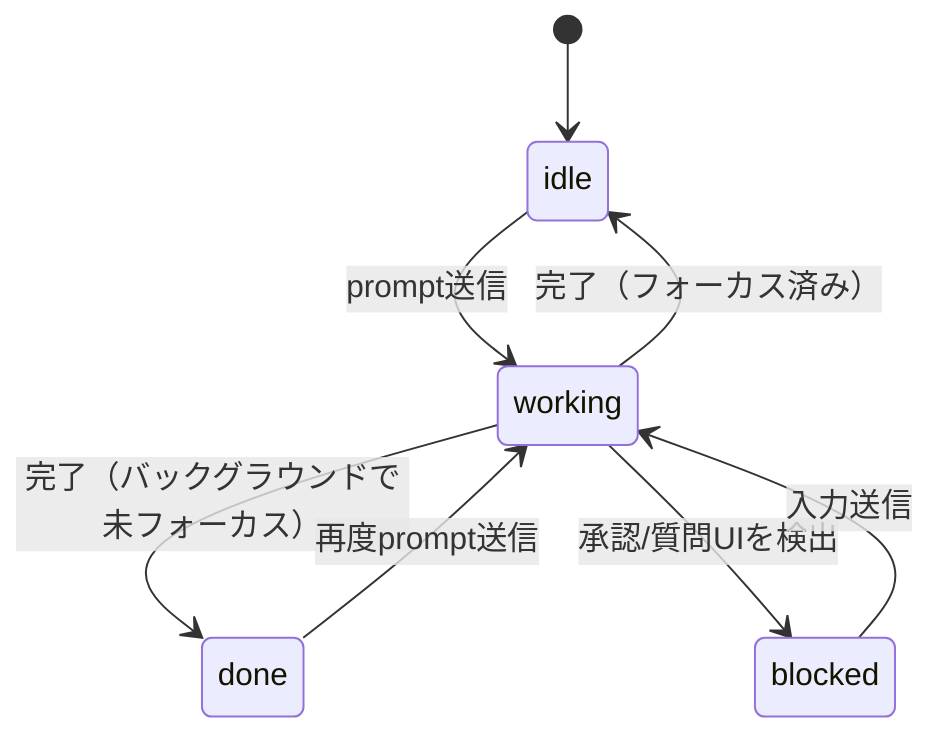

# Herdr

Herdr は、複数のターミナルを「ワークスペース / タブ / ペイン」という階層で整理し、ペインの中で動いているコーディングエージェント（Claude Code や Codex など）を自動認識して、`herdr` というCLIから操作できるようにするターミナルマルチプレクサ。

## 階層構造

ワークスペース(workspace) > タブ(tab) > ペイン(pane) という3階層で構成され、それぞれに `w1`、`w1:t1`、`w1:p1` のような不透明で安定したID(opaque stable ID)が振られる。閉じたタブ/ペインのIDは再利用されない。



## ペイン操作とエージェント操作の使い分け

- **ペインコマンド**: 生のターミナル・シェル・テスト・サーバーなど、通常のプロセスを制御する
- **エージェントコマンド**: Herdrが認識したコーディングエージェントを制御する。`idle`/`working`/`blocked`/`done`/`unknown` というライフサイクル状態を解釈できる

ペインはエージェントの有無に関わらず存在する。`agent start` は既存の空いているシェルペインを要求するだけで、レイアウトの作成・分割・移動は一切行わない。

## エージェントのライフサイクル状態



- `idle`: 入力待ちで、かつそのタブがHerdrのUI上でフォーカスされたことがある状態
- `done`: 同じidle状態だが、フォーカスされていない裏側でのタスクが完了した場合
- `blocked`: 承認や質問のUIをHerdrが検出した状態
- `unknown`: エージェントは存在するが状態を確信を持って分類できない状態（完了の証拠にはならない）

## 基本的なCLI操作の流れ

```bash
# 現在の状態を確認する
herdr workspace list
herdr pane current --current
herdr agent list

# サブコマンド一覧はグループ名だけ実行して確認する
# (引数なしの `herdr` はTUIを起動してしまうので使わない)
herdr agent
herdr pane
```

エージェントを起動して指示を送る例:

```bash
herdr pane split --current --direction right --cwd "$PWD" --no-focus
herdr agent start reviewer --kind codex --pane <pane-id>
herdr agent prompt reviewer "現在のdiffをレビューして" --wait --timeout 120000
```

`agent prompt` はテキスト送信とEnterキー送信をアトミックに行う。`--wait` を付けると `idle`/`done`/`blocked` のいずれかに状態が落ち着くまで待機してくれる。

## 覚えておきたい安全上のルール

- 自分が作成していないワークスペース/タブ/ペイン/セッションを勝手に閉じない
- `herdr server stop` はメインのHerdrプロセスを落とすので、明示的に意図した場合以外は実行しない
- 別クライアントがフォーカスしているペインに依存せず、`--current`・明示的なペインID・ユニークなagent名のいずれかを使う
- IDはJSONレスポンスから読み取る。サイドバーの表示順や例から類推しない

#herdr #cli #ツール
