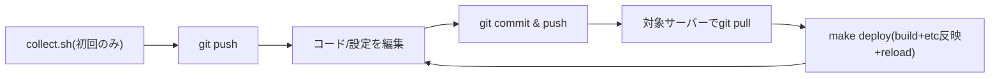

# ISUCONでのwebapp+設定ファイルの一元管理

[[isucon]] の複数台構成では、webappのコードに加えてnginx・MySQLなどの`/etc`配下の設定ファイルもチームで共有・追跡したい。設定ファイルはサーバーごとに内容が微妙に異なる（bind先IP、ポート番号、有効化しているモジュールなど）ため、webappとは別のリポジトリを用意したくなるが、**webappのリポジトリにサーバーごとのディレクトリを同居させる**方が実用上シンプルで、実際に定番になっているやり方でもある。ISUCON14優勝チーム(takonomura)のリポジトリは、`webapp/`と並んでサーバーごとのディレクトリ（IPアドレス名）をトップレベルに置く構成を取っている。

各サーバー上で`/etc`配下をローカルにgit管理する方法（`sudo git -C /etc/nginx init`）は[[isucon-go-runbook]]のフェーズ1で扱っている。あれは「変更を巻き戻せる安全網」としてリモートに上げず各サーバーだけで完結させる最低限の仕組みで、ここで書くのは「チーム全員が1つのリポジトリを見ながら、webappのコードと複数サーバーの設定差分を一緒に把握・共有する」ための構成。両者は矛盾しないので、ローカルの安全網は残したまま併用してよい。

## リポジトリ構成

設定ファイルはテンプレートエンジンで差分を吸収しようとせず、**ホスト名ごとにディレクトリを分けて、決め打ちの実ファイルをそのまま置く**方が短時間で事故なく回せる。`webapp/`と並列に置く。

```
repo/
  webapp/
    go/
      main.go
      ...
  hosts/
    isucon1/
      etc/nginx/nginx.conf
      etc/nginx/sites-available/app.conf
      etc/systemd/system/isucon-go.service
    isucon2/
      etc/mysql/mysql.conf.d/mysqld.cnf
    isucon3/
      etc/nginx/nginx.conf
  scripts/
    collect.sh
    deploy.sh
  Makefile
```

`hosts/<hostname>/`配下のパスは、そのサーバー上での絶対パスから先頭の`/`を取っただけの構造（`etc/nginx/nginx.conf` → 実体は`/etc/nginx/nginx.conf`）にしておくと、後述のスクリプトが単純になる。takonomuraのリポジトリはホスト名の代わりにIPアドレスをディレクトリ名にしているが、`hostname`コマンドの結果と一致させたいなら`isucon1`のようなホスト名にする方が、スクリプトから`$(hostname)`で機械的に参照できて扱いやすい。

## クローン・鍵まわりが1本化される

webappと設定ファイルが1つのリポジトリになることで、これまで別々に用意していたものが1つで済む。

- **サーバーがGitHubにアクセスするための鍵**: 1リポジトリ分のデプロイキー（またはSSHエージェント転送）だけ用意すればよい。具体的な鍵の用意の仕方は[[isucon-go-runbook]]のフェーズ1を参照。
- **`git pull`が1回で済む**: 各サーバーで`git fetch origin && git reset --hard origin/master`を叩けば、webappのコードとそのサーバー用の設定ファイルが同時に最新化される。「webappはpullした/しない」「etcはpullした/しない」がズレる事故がなくなる。
- **クローン先**: リポジトリ全体を`/home/isucon/repo`のような場所にcloneし、`webapp/`サブディレクトリでビルドする。すでにwebappだけを`/home/isucon/webapp`にcloneして運用していた場合は、そこにリポジトリ全体をcloneし直す形になる。

## 初回: 現状の設定を集約する

競技開始直後、各サーバーにSSHで入り、対象ファイルをリポジトリに吸い上げてコミットする。空のリポジトリを先に作ってから設定を書き始めると初期状態を失うので、必ず最初にこの手順を踏む。

```bash
#!/bin/bash
# scripts/collect.sh
# このサーバー上の対象設定ファイルをリポジトリの hosts/<hostname>/ に集約してコミットする
set -euo pipefail

REPO="$(cd "$(dirname "$0")/.." && pwd)"
HOST="$(hostname)"
DEST="$REPO/hosts/$HOST"

# 対象ファイル・ディレクトリ(/からの相対パス)。サーバーの役割に応じて増減させる
TARGETS=(
  etc/nginx/nginx.conf
  etc/nginx/sites-available
  etc/mysql/mysql.conf.d/mysqld.cnf
  etc/systemd/system/isucon-go.service
  etc/sysctl.conf
)

mkdir -p "$DEST"
cd /
for path in "${TARGETS[@]}"; do
  if sudo test -e "/$path"; then
    sudo cp -a --parents "$path" "$DEST"
  fi
done
sudo chown -R "$(id -u):$(id -g)" "$DEST"

cd "$REPO"
git add "hosts/$HOST"
git commit -m "etc(${HOST}): collect $(date +%Y-%m-%dT%H:%M:%S)" || echo "変更なし"
```

`cp --parents`はコピー元のディレクトリ構造を保ったままコピー先に展開してくれるため、対象を増やしても`mkdir -p`をパスごとに書く必要がない。`REPO`はスクリプト自身の場所から相対的に求めているので、webappと同居していても単体のinfraリポジトリでも変更なしで動く。

## 変更を反映する

リポジトリ側でファイルを編集したら、対象サーバーで`git pull`してからこのスクリプトで実パスへ反映し、必要なミドルウェアだけreload/restartする。

```bash
#!/bin/bash
# scripts/deploy.sh
# hosts/<hostname>/ 配下の内容をこのサーバーの実パスへコピーして反映する
set -euo pipefail

REPO="$(cd "$(dirname "$0")/.." && pwd)"
HOST="$(hostname)"
SRC="$REPO/hosts/$HOST"

if [ ! -d "$SRC" ]; then
  echo "hosts/$HOST が見つかりません" >&2
  exit 1
fi

find "$SRC" -type f | while read -r f; do
  rel="${f#"$SRC"/}"
  sudo install -D -m 0644 "$f" "/$rel"
done

if [ -f /etc/nginx/nginx.conf ]; then
  sudo nginx -t && sudo systemctl reload nginx
fi
if systemctl is-active --quiet mysql; then
  sudo systemctl restart mysql
fi
sudo systemctl daemon-reload
```

`rsync -a --delete`で`/etc`ごと丸ごと同期する方法もあるが、リポジトリで管理していないファイルまで巻き添えで消える事故と隣り合わせなので、対象ファイルを1つずつ`install`でコピーする方が安全。「動いているサービスだけreloadする」防御的な書き方は[[isucon-go-runbook]]の`restart.sh`と同じ考え方。

## Makefileへの統合

webappのビルド・デプロイと同じ`make deploy`に、設定ファイルの反映を1ステップ挟むだけで済む。[[isucon-go-runbook]]の`Makefile`をベースにするなら次のように拡張する。

```makefile
deploy: build deploy-etc restart-app restart-nginx restart-mysql rotate-logs

build:
	cd webapp/go && go build -o ../../app .

deploy-etc:
	./scripts/deploy.sh

restart-app:
	./scripts/restart.sh isucon-go.service

restart-nginx:
	./scripts/restart.sh nginx

restart-mysql:
	./scripts/restart.sh mysql
```

これで当日の1サイクルは「編集→commit→push→(各サーバーで)`git pull`→`make deploy`」に収まり、webapp用と設定ファイル用でコマンドを使い分ける必要がなくなる。

## 当日の運用フロー



- 誰が本番機で直接ファイルを編集してよいか、pushする前に必ずpullするか、といった役割分担を競技開始前に決めておく。複数人が同じファイルを別々に触ると簡単にコンフリクトする。
- webappのコード変更と設定変更が同じコミット履歴に混ざるが、ISUCONの短時間勝負では`git log`一本で全部の変更を追える方がむしろ実利がある。見返しやすくしたいなら、コミットメッセージに`app: N+1解消`、`etc(isucon2): my.cnfのinnodb_buffer_pool_size変更`のようにプレフィックスを付けておくとよい。
- サーバーごとに中身が異なる設定を1つのリポジトリにまとめて全員がpush/pullし合う運用でも、`hosts/<hostname>/`でディレクトリを分けておけば、`deploy.sh`が自分のホスト名のディレクトリしか見ないので誤って他サーバーの設定を適用してしまうことはない。

## symlink方式という選択肢

コピー配布の代わりに、`/etc/nginx/nginx.conf`など実ファイルの方を`hosts/<hostname>/etc/nginx/nginx.conf`へのシンボリックリンクにしてしまう方式もある。webappと同居させた場合も同じリポジトリ内で完結する。

```bash
sudo mv /etc/nginx/nginx.conf "$REPO/hosts/$HOST/etc/nginx/nginx.conf"
sudo ln -s "$REPO/hosts/$HOST/etc/nginx/nginx.conf" /etc/nginx/nginx.conf
```

こうしておけば`git pull`した時点でファイル内容自体は反映済みになり、`deploy.sh`のコピー処理は不要になる（reloadだけ実行すればよい）。一方で、リポジトリを別の場所に移動・削除するとリンク切れで即座にnginxが起動できなくなるなど、コピー方式より事故った時の影響が大きい。ISUCONの短時間勝負では、多少冗長でも壊れにくいコピー配布方式の方が扱いやすい。

## 別リポジトリに切り出す代替案

設定ファイルの量が多い、あるいはwebappと設定変更の担当者をはっきり分けたいといった事情がある場合は、`hosts/`以下を専用のinfraリポジトリとして切り出してもよい。その場合`collect.sh`/`deploy.sh`はそのまま動くが、サーバーがアクセスするGitリモート・デプロイキーがwebapp用と別にもう1つ必要になり、`git pull`もwebapp用とinfra用の2回に分かれる。

## 出典

- [takonomura/isucon14 - GitHub（ISUCON14優勝チームのリポジトリ）](https://github.com/takonomura/isucon14)
- [GitHub - matsuu/ansible-isucon: Ansible playbooks for ISUCON](https://github.com/matsuu/ansible-isucon)
- [ISUCON Cheat Sheet · GitHub (south37)](https://gist.github.com/south37/d4a5a8158f49e067237c17d13ecab12a)

#isucon #git #nginx #mysql #構成管理
