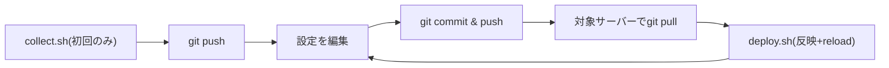

# ISUCONでの/etc設定ファイルのサーバー横断管理

[[isucon]] の複数台構成では、nginx・MySQLなどの`/etc`配下の設定ファイルがサーバーごとに微妙に異なる（bind先IP、ポート番号、有効化しているモジュールなど）。これをチームで共有・追跡できる形でリポジトリ管理するための構成と、実際に使えるスクリプト。[[isucon-go-runbook]]の「サーバーごとの設定差分を追跡する」を掘り下げたもの。

各サーバー上で`/etc`配下をローカルにgit管理する方法（`sudo git -C /etc/nginx init`）は[[isucon-go-runbook]]のフェーズ1で扱っている。あれは「変更を巻き戻せる安全網」としての最低限の仕組みで、ここで書くのは「チーム全員が1つのリポジトリを見ながら、複数サーバーの設定差分を把握・共有する」ための一段進んだ構成。両方を併用してよい。

## リポジトリ構成

サーバーごとに設定内容が違う点がポイントなので、テンプレートエンジンで差分を吸収しようとせず、**ホスト名ごとにディレクトリを分けて、決め打ちの実ファイルをそのまま置く**方が短時間で事故なく回せる。webappのリポジトリに同居させても、専用のinfraリポジトリを別に切ってもどちらでもよい。

```
infra/
  hosts/
    isucon1/
      etc/nginx/nginx.conf
      etc/nginx/sites-available/app.conf
      etc/systemd/system/isucon-go.service
    isucon2/
      etc/mysql/mysql.conf.d/mysqld.cnf
    isucon3/
      etc/nginx/nginx.conf
  scripts/
    collect.sh
    deploy.sh
```

`hosts/<hostname>/`配下のパスは、そのサーバー上での絶対パスから先頭の`/`を取っただけの構造（`etc/nginx/nginx.conf` → 実体は`/etc/nginx/nginx.conf`）にしておくと、後述のスクリプトが単純になる。

## 初回: 現状の設定を集約する

競技開始直後、各サーバーにSSHで入り、対象ファイルをリポジトリに吸い上げてコミットする。空のリポジトリを先に作ってから設定を書き始めると初期状態を失うので、必ず最初にこの手順を踏む。

```bash
#!/bin/bash
# scripts/collect.sh
# このサーバー上の対象設定ファイルをリポジトリの hosts/<hostname>/ に集約してコミットする
set -euo pipefail

REPO="$(cd "$(dirname "$0")/.." && pwd)"
HOST="$(hostname)"
DEST="$REPO/hosts/$HOST"

# 対象ファイル・ディレクトリ(/からの相対パス)。サーバーの役割に応じて増減させる
TARGETS=(
  etc/nginx/nginx.conf
  etc/nginx/sites-available
  etc/mysql/mysql.conf.d/mysqld.cnf
  etc/systemd/system/isucon-go.service
  etc/sysctl.conf
)

mkdir -p "$DEST"
cd /
for path in "${TARGETS[@]}"; do
  if sudo test -e "/$path"; then
    sudo cp -a --parents "$path" "$DEST"
  fi
done
sudo chown -R "$(id -u):$(id -g)" "$DEST"

cd "$REPO"
git add "hosts/$HOST"
git commit -m "collect: ${HOST} $(date +%Y-%m-%dT%H:%M:%S)" || echo "変更なし"
```

`cp --parents`はコピー元のディレクトリ構造を保ったままコピー先に展開してくれるため、対象を増やしても`mkdir -p`をパスごとに書く必要がない。

## 変更を反映する

リポジトリ側でファイルを編集したら、対象サーバーで`git pull`してからこのスクリプトで実パスへ反映し、必要なミドルウェアだけreload/restartする。

```bash
#!/bin/bash
# scripts/deploy.sh
# hosts/<hostname>/ 配下の内容をこのサーバーの実パスへコピーして反映する
set -euo pipefail

REPO="$(cd "$(dirname "$0")/.." && pwd)"
HOST="$(hostname)"
SRC="$REPO/hosts/$HOST"

if [ ! -d "$SRC" ]; then
  echo "hosts/$HOST が見つかりません" >&2
  exit 1
fi

find "$SRC" -type f | while read -r f; do
  rel="${f#"$SRC"/}"
  sudo install -D -m 0644 "$f" "/$rel"
done

if [ -f /etc/nginx/nginx.conf ]; then
  sudo nginx -t && sudo systemctl reload nginx
fi
if systemctl is-active --quiet mysql; then
  sudo systemctl restart mysql
fi
sudo systemctl daemon-reload
```

`rsync -a --delete`で`/etc`ごと丸ごと同期する方法もあるが、リポジトリで管理していないファイルまで巻き添えで消える事故と隣り合わせなので、対象ファイルを1つずつ`install`でコピーする方が安全。「動いているサービスだけreloadする」防御的な書き方は[[isucon-go-runbook]]の`restart.sh`と同じ考え方。

## 当日の運用フロー



- 誰が本番機で直接ファイルを編集してよいか、pushする前に必ずpullするか、といった役割分担を競技開始前に決めておく。複数人が同じファイルを別々に触ると簡単にコンフリクトする。
- サーバーごとに中身が異なる設定（`bind-address`など）を1つのリポジトリにまとめて全員がpush/pullし合う運用は、上書き事故が起きやすい。`hosts/<hostname>/`でディレクトリを分けておけば、pull自体は毎回全ホスト分を取得しても、`deploy.sh`が自分のホスト名のディレクトリしか見ないので誤って他サーバーの設定を適用してしまうことはない。

## symlink方式という選択肢

コピー配布の代わりに、`/etc/nginx/nginx.conf`など実ファイルの方を`hosts/<hostname>/etc/nginx/nginx.conf`へのシンボリックリンクにしてしまう方式もある。

```bash
sudo mv /etc/nginx/nginx.conf "$REPO/hosts/$HOST/etc/nginx/nginx.conf"
sudo ln -s "$REPO/hosts/$HOST/etc/nginx/nginx.conf" /etc/nginx/nginx.conf
```

こうしておけば`git pull`した時点でファイル内容自体は反映済みになり、`deploy.sh`のコピー処理は不要になる（reloadだけ実行すればよい）。一方で、リポジトリを別の場所に移動・削除するとリンク切れで即座にnginxが起動できなくなるなど、コピー方式より事故った時の影響が大きい。ISUCONの短時間勝負では、多少冗長でも壊れにくいコピー配布方式の方が扱いやすい。

## 出典

- [GitHub - matsuu/ansible-isucon: Ansible playbooks for ISUCON](https://github.com/matsuu/ansible-isucon)
- [takonomura/isucon14 - GitHub（ISUCON14優勝チームのリポジトリ）](https://github.com/takonomura/isucon14)
- [ISUCON Cheat Sheet · GitHub (south37)](https://gist.github.com/south37/d4a5a8158f49e067237c17d13ecab12a)

#isucon #git #nginx #mysql #構成管理
