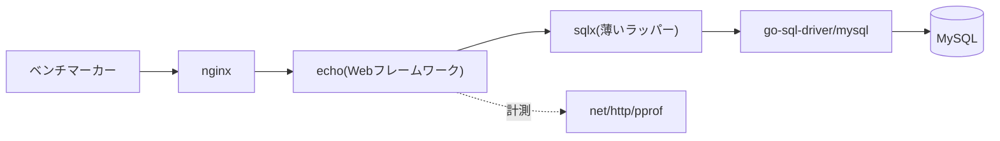

# ISUCONにおけるGo実装

[[isucon]] を戦う際、言語にGoを選んだ場合に定番となる技術スタックと改善手法。

## 定番の技術スタック

- **Webフレームワーク**: 近年の初期実装では [echo](https://echo.labstack.com/) が使われることが多い。最小限のコードで動き、シンプルなルーティングとミドルウェア機構を持つ。
- **DBアクセス**: `database/sql` を素で使わず、`jmoiron/sqlx` で薄くラップして使うのが定番。構造体への自動マッピングなどが書きやすくなる。
- **DBドライバ**: MySQLなら `go-sql-driver/mysql`。

## Go特有の計測・最適化ツール

- **pprof**: `net/http/pprof` を組み込み、CPU/メモリプロファイルを取得する。CPUがボトルネックになるレベルまでN+1解消やキャッシュ導入が進んでから真価を発揮する。`github.com/pkg/profile` でラップして使う例もある。
- **goccy/go-json**: 標準の`encoding/json`と互換のドロップイン高速JSONエンコーダ/デコーダ。
- **golang.org/x/sync/singleflight**: 同一キーへの同時リクエストを1つの実行にまとめる。キャッシュのthundering herd対策に使える。
- **mazrean/isucon-go-tools**: ISUCON向けにprofiler・cache・DB・HTTP・コネクションプールまわりの計装やコード書き換えを提供するユーティリティ集。

## 過去のボトルネックと解消事例

定石を機械的に当てはめるのではなく、alp/pprof/pt-query-digestの実測結果に基づいて手を入れる箇所を決める必要がある。あるISUCON13参加チームは、N+1クエリを解消してもスコアが伸びず、pt-query-digestで見ると実は別のクエリが支配的ボトルネックだったと報告している。

| 観点 | 症状 | 解消方法 |
|---|---|---|
| N+1クエリ | ループ内で1件ずつSELECTしている | JOINへの書き換え、`IN`句でのバルクフェッチ、インメモリキャッシュ化 |
| キャッシュ更新時のThundering Herd | キャッシュミス時に大量リクエストが同時にDBへ殺到する | `golang.org/x/sync/singleflight`で同一キーへの同時実行を1本化。ISUCON12優勝チームはこれで20万〜27万点の間で不安定だったスコアを安定化させた |
| CPU重い処理（bcryptなど） | パスワードハッシュ計算のようなCPUバウンドな処理が支配的になる。pprofのCPUプロファイルで発覚するのが定番パターン | コストパラメータの見直し、検証結果のキャッシュ |
| 静的ファイル配信 | 画像・JS・CSS等をアプリケーションサーバー経由で返している | nginxに配信を委譲してAPサーバーの負荷を下げる |
| 画像/アイコン配信 | `/api/user/.../icon`のような画像配信エンドポイントがボトルネック化 | ハッシュ値をインメモリキャッシュしつつ画像本体はローカルファイルシステムに配置。`/initialize`実行時にキャッシュをパージする |
| セッションストア | セッションをMySQL等のRDBに保存し、大量I/Oでボトルネック化 | Redis/Memcachedなどのin-memory KVSに移行してDBの負荷を分離する |
| 外部HTTPリクエスト | `http.Client`を毎回生成、または`http.DefaultClient`をそのまま使い、`Transport`の`MaxIdleConnsPerHost`のデフォルト値(2)が並列リクエストのボトルネックになる | `http.Client`/`Transport`をグローバルで使い回し、`MaxIdleConnsPerHost`を大きめ（1000など）に設定する。レスポンスボディを確実に読み切ってCloseし、コネクション再利用を成立させる |
| DNS解決 | DNSレコードのTTL・cache-ttl設定が0でキャッシュが効かず、毎回名前解決が走る | TTL/cache-ttl設定を見直してキャッシュを有効化する |
| CPU以外のリソース | 全ホストでCPU使用率に余裕があるのにスコアが伸びない | ネットワーク帯域やファイルディスクリプタ数など、CPU以外のリソースも多面的に監視する |

## ハマりどころ・注意点

- Goの`slice`や`map`はthread safeではないため、インメモリキャッシュを実装する際は`sync.Mutex`/`sync.RWMutex`（あるいは`sync.Map`）での保護が必須。
- HTMLテンプレートはリクエストごとに`.ParseFiles`せず、起動時に一度パースしてグローバル変数に保持する。
- DBのコネクションプールは`SetMaxOpenConns`/`SetMaxIdleConns`で明示的に上限を設定する（Goのデフォルトは無制限）。`SetMaxIdleConns`は`SetMaxOpenConns`以上の値にし、`SetConnMaxLifetime`は概ね「最大接続数×1秒」程度を目安にする。

## Go・ISUCON未経験者の準備

- Goの基本文法は [A Tour of Go](https://go.dev/tour/) でひととおり触っておく。
- `sqlx`の使い方（`Select`/`Get`/`NamedExec`など）を事前に触っておく。
- 過去問の練習環境として配布されている `private-isu` を実際に手を動かして一通り改善してみる。
- チーム内でGoのバージョンと`goimports`のルールを事前に統一しておく（当日のコード衝突・フォーマット崩れを防ぐ）。
- デプロイ手順を決めておく（手元でLinux向けバイナリをビルドして`scp`で転送する方式が定番）。

## 出典

- [Go の pprof で ボトルネックを探して ISUCON で優勝する - Zenn](https://zenn.dev/team_soda/articles/d4701665e8a3a7)
- [GitHub - mazrean/isucon-go-tools](https://github.com/mazrean/isucon-go-tools)
- [GitHub - goccy/go-json](https://github.com/goccy/go-json)
- [sql.DBのチューニング方法 - Qiita](https://qiita.com/go_sagawa/items/11929cd0883608a6888d)
- [mercari_go_isucon.md (catatsuy)](https://gist.github.com/catatsuy/e627aaf118fbe001f2e7c665fda48146)
- [GitHub - catatsuy/memo_isucon](https://github.com/catatsuy/memo_isucon)
- [ISUCON12で優勝しました(チーム NaruseJun) - Zenn](https://zenn.dev/tohutohu/articles/8c34d1187e1b21)
- [ISUCON11予選惨敗してきました - Zenn (catatsuy)](https://zenn.dev/catatsuy/articles/6265ca623545ed)
- [ISUCON13に参加した話 - くっきーの備忘録](https://blog.ck9.jp/post/240/)
- [GoのキャッシュライブラリRapidashをISUCON問題で試す - Qiita](https://qiita.com/kanataxa/items/981e16e1db97e7187b64)

#isucon #go #パフォーマンスチューニング #pprof
