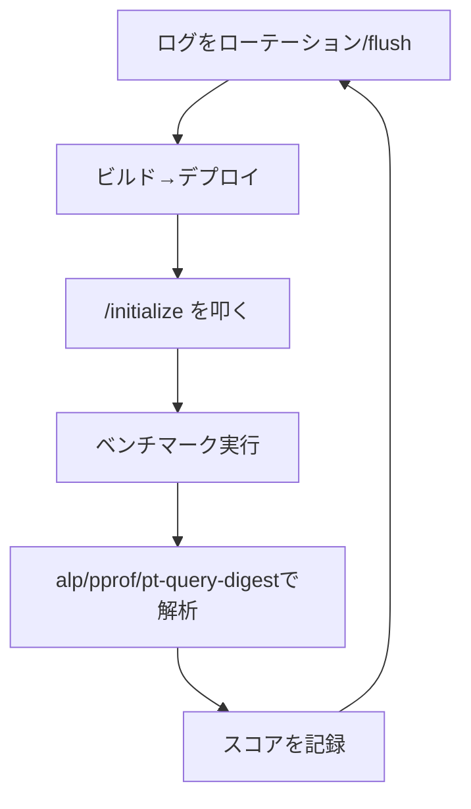

# ISUCON初動ランブック（Go実装）

[[isucon]] のGo実装で、競技開始直後にやることを実行順に並べたランブック。背景や定石は[[isucon]]と[[isucon-go-implementation]]にまとめてあるので、ここでは実際に打つコマンドと書くコード断片だけを追えるようにする。

## フェーズ0: 何も変更せずに把握する

- レギュレーション・当日マニュアルを読み、スコア算出方法と失格条件を確認する
- 何も変更せずに初回ベンチマークを実行し、基準スコアを記録する
- サーバー構成（台数、どこに何が乗っているか）を確認する

## フェーズ1: Git化する

```bash
cd /home/isucon/webapp
git init && git add -A && git commit -m "initial state"

# nginx/MySQLの設定もバージョン管理下に置く
sudo git -C /etc/nginx init && sudo git -C /etc/nginx add -A && sudo git -C /etc/nginx commit -m "initial nginx conf"
sudo git -C /etc/mysql init && sudo git -C /etc/mysql add -A && sudo git -C /etc/mysql commit -m "initial mysql conf"
```

### GitHubに上げるか

上げるのが定番。ISUCON14優勝チーム(takonomura)や複数の参加チームが、webappと`/etc`配下のリポジトリを**GitHubのプライベートリポジトリ**にpushして運用している。理由は3つ:

1. チームメンバー間でコードを同期するため（1台の作業端末だけで完結しない）
2. 複数台構成のサーバー間で設定ファイルを揃えるため
3. 変更を巻き戻せるバックアップにするため

```bash
# ローカル/各サーバーで作ったリポジトリにリモートを追加してpush
git remote add origin git@github.com:yourteam/isucon-webapp.git
git push -u origin master
```

プライベートリポジトリなので、各サーバーがGitHubにSSHで認証できる状態を作る必要がある。これは「チームメンバーが競技サーバーにSSHでログインする」ための鍵（isucon.mdの「SSH接続を全員分整備する」）とは別物で、「競技サーバー自身がGitHubにアクセスする」ための鍵。やり方は2通り。

**方法A: サーバーごとにデプロイキーを作る（確実）**

```bash
# 各サーバー上で鍵ペアを作成（パスフレーズなし）
ssh-keygen -t ed25519 -C "isucon-server1" -f ~/.ssh/id_ed25519 -N ""
cat ~/.ssh/id_ed25519.pub
```

表示された公開鍵を、GitHubリポジトリの Settings → Deploy keys → Add deploy key に登録する（push もさせるなら Allow write access にチェック）。サーバーごとに別の鍵になるので、3台構成なら3つ登録することになる。

```bash
# 疎通確認とcommitに使うユーザー情報の設定
ssh -T git@github.com
git config --global user.email "isucon@example.com"
git config --global user.name "isucon"
```

**方法B: SSHエージェント転送で手元の鍵を使い回す（鍵を増やしたくない場合）**

サーバーに新しく鍵を作らず、手元のマシンの鍵をそのままサーバー上のgit操作に使う。手元の鍵がGitHubに登録済みで、チームメンバーそれぞれが自分の権限でpushしたい場合に向く。

```bash
# 手元から -A 付きでSSHログインする（サーバー側の~/.ssh/configにForwardAgent yesでも可）
ssh -A isucon@server1
```

サーバー側で最新化するときは、`git pull`だと現地でのちょっとした変更（ベンチマーカーが書き換えたファイルなど）とマージが必要になることがあるので、`fetch`してから強制的にリモートの状態に合わせる方が事故りにくい。

```bash
git fetch origin
git reset --hard origin/master
```

## フェーズ2: 計測ツールを入れる

| ツール | 目的 | 導入方法 |
|---|---|---|
| pt-query-digest / mysqldumpslow | どのクエリが遅いか | Percona Toolkitをインストール、または`mysqldumpslow`はMySQL同梱 |
| alp | どのエンドポイントが遅いか | バイナリ配布から`/usr/local/bin`に配置 |
| pprof | Goコード内のどこが遅いか | `net/http/pprof`をimportするだけ |
| netdata | CPU/メモリ/ディスクI/Oのリアルタイム監視 | `bash <(curl -Ss https://my-netdata.io/kickstart.sh)` |

### MySQLのスロークエリログ

`my.cnf`に追記して再起動する。

```ini
[mysqld]
slow_query_log = 1
slow_query_log_file = /var/log/mysql/mysql-slow.log
long_query_time = 0
log-queries-not-using-indexes = 1
```

```bash
sudo systemctl restart mysql
pt-query-digest /var/log/mysql/mysql-slow.log | less
# または
mysqldumpslow -s t /var/log/mysql/mysql-slow.log
```

`long_query_time = 0`にすると実行された全クエリがログに出る。

**別解: performance_schemaから直接集計する**。ISUCON14優勝チームは、スロークエリログを介さずMySQLの`performance_schema.events_statements_summary_by_digest`テーブルから直接クエリ統計を取る手法を使っていた。ログファイルのローテーションを気にせず、P95/P99/P999のレイテンシまで見られるのが利点。

```sql
SELECT
    schema_name,
    digest_text,
    count_star AS calls,
    sum_timer_wait / 1000000000000 AS total_sec,
    avg_timer_wait / 1000000000000 AS avg_sec
FROM performance_schema.events_statements_summary_by_digest
WHERE schema_name IS NOT NULL AND schema_name != 'performance_schema'
ORDER BY sum_timer_wait DESC
LIMIT 20\G
```

### nginxのアクセスログ（alp向けLTSV化）

```nginx
log_format ltsv "time:$time_local"
                "\thost:$remote_addr"
                "\treq:$request"
                "\tstatus:$status"
                "\tmethod:$request_method"
                "\turi:$request_uri"
                "\tsize:$body_bytes_sent"
                "\treqtime:$request_time"
                "\tapptime:$upstream_response_time";
access_log /var/log/nginx/access.log ltsv;
```

```bash
sudo nginx -t && sudo systemctl reload nginx
cat /var/log/nginx/access.log | alp ltsv
```

### Goアプリのプロファイリング（pprof）

`net/http/pprof`を組み込み、別ポートで待ち受けさせる。

```go
import (
    "net/http"
    _ "net/http/pprof"
)

func main() {
    go func() {
        log.Println(http.ListenAndServe("0.0.0.0:6060", nil))
    }()
    // ...
}
```

```bash
go tool pprof -http=0.0.0.0:8081 "http://localhost:6060/debug/pprof/profile?seconds=60"
```

常時プロファイリングはオーバーヘッドが乗るので、`/startprof`・`/endprof`のような自前のHTTPハンドラで`pprof.StartCPUProfile`/`pprof.StopCPUProfile`の開始・終了を制御し、ベンチマーク実行中だけ計測する実装例もある。

## フェーズ3: Go特有の下準備

**オフラインビルド対策**: 競技サーバーがインターネットに繋がらない前提で、依存パッケージを`vendor`ディレクトリに固定しておくと安全。

```bash
go mod vendor
GOFLAGS=-mod=vendor go build -o app .
```

**MySQLドライバのDSNオプション**: `go-sql-driver/mysql`は`interpolateParams`のデフォルトが`false`で、プレースホルダ(`?`)はサーバーサイドのprepared statementとして送られる。`interpolateParams=true`にするとクライアント側で単一のクエリ文字列に統合されるため往復回数が減る。ただしBIG5・CP932・GB2312・GBK・SJISのマルチバイト文字コードと組み合わせるとSQLインジェクションの危険があるため使えない。

```
user:password@tcp(localhost:3306)/dbname?interpolateParams=true
```

## フェーズ4: コード・設定を変更したら反映する手順

最小構成は「手元でビルド→scp→再起動」。

```bash
GOOS=linux GOARCH=amd64 go build -o app .
scp app isucon@server1:/home/isucon/webapp/
ssh isucon@server1 'sudo systemctl restart isucon.golang'
```

複数台構成の場合、各サーバーへの転送・再起動を直列で行うとデプロイ1回が遅くなるので並列化する。デプロイ後は`/initialize`を叩いて動作確認してからベンチマークを実行する。

### `make deploy`にまとめる

手作業のコマンド列を毎回打つと事故る（再起動を忘れる、順番を間違える等）ので、早い段階で「変更を反映する」を1コマンドに集約しておくと後半が楽になる。ISUCON14優勝チームのリポジトリは、これを`Makefile`のターゲットとして持っていた。

```makefile
deploy: build restart-app restart-nginx restart-mysql rotate-logs

build:
	cd webapp/go && go build -o ../../app .

restart-app:
	./scripts/restart.sh isucon-go.service

restart-nginx:
	./scripts/restart.sh nginx

restart-mysql:
	./scripts/restart.sh mysql

rotate-logs:
	./scripts/rotate-logs.sh
```

`restart.sh`は「動いているサービスだけ再起動する」だけの薄いラッパー。3台構成だとDB専用サーバーにはアプリのサービスが存在しないので、こう防御的に書いておくと1本のスクリプトを全サーバーで共通に使い回せる。

```bash
#!/bin/bash
set -e

if [ $# -ne 1 ]; then
	echo "Usage: $0 service" >&2
	exit 1
fi

if sudo systemctl is-active "$1" >/dev/null; then
	set -x
	sudo systemctl restart "$1"
fi
```

`rotate-logs`は、デプロイ前に前回分のnginx/MySQLログをタイムスタンプ付きでどかしてgzip圧縮しておく処理（ベンチマーク結果の解析が前回分と混ざらないようにするため）。

### さらに発展的なプラクティス（余裕があれば）

- **構成管理ツールでの環境構築**: [mitamae](https://github.com/itamae-kitchen/mitamae)（Itamaeのmruby実装、単一バイナリで依存なし）でOS・ミドルウェアのセットアップをRubyのレシピとして書いておくと、`sudo mitamae local recipe.rb`一発で環境を再現できる。ISUCON12以降、複数の参加チームがItamae/mitamaeを使っている。
- **サーバーごとの設定差分を追跡する**: 3台構成だと各サーバーで微妙にnginx/my.cnfの内容が異なる（bind先IPなど）ので、変更したファイルをホスト名ごとのディレクトリにコピーしてコミットするスクリプトを用意しておくと、「どのサーバーで何を変えたか」が追いやすい。
- **ループの結果を自動で共有する**: alp・スロークエリ解析・スコアの結果を毎回手動でチームに共有するのは手間なので、`make deploy && make report`のような形でSlack等に自動投稿するチームもある。

## ベンチマーク1回ごとのルーチン



ベンチマーク前にログを退避しないと前回分と混ざって解析結果が汚れる。

```bash
sudo mv /var/log/nginx/access.log /var/log/nginx/access.log.$(date +%s)
sudo systemctl reload nginx
sudo mysqladmin -uisucon -pisucon flush-logs
```

このループの考え方自体は[[isucon]]の「基本サイクル」を、実際にどこを直すかの定石・過去事例は[[isucon-go-implementation]]を参照。

## フェーズ5: 終盤（競技終了30〜60分前）

- アクセスログ・スロークエリログの出力を止める（ディスクI/O節約）
- OSを再起動してもベンチマークが通るか確認する
- ディスク容量に余裕があるか確認する

## 出典

- [alp README (tkuchiki/alp) - GitHub](https://github.com/tkuchiki/alp)
- [go-sql-driver/mysql README - GitHub](https://github.com/go-sql-driver/mysql)
- [isucon/pprof.go (inada-s) - GitHub](https://github.com/inada-s/isucon/blob/master/pprof.go)
- [pprof package - net/http/pprof - Go Packages](https://pkg.go.dev/net/http/pprof)
- [ISUCON秘伝のタレ · GitHub (asflash8)](https://gist.github.com/asflash8/0cbb743fd23385f32b412c908959a032)
- [Yasuo Team's Isucon Best Practices · GitHub (minhquang4334)](https://gist.github.com/minhquang4334/26e86a84731164581ed25d3fc7fe5211)
- [ISUCON Memo · GitHub (taiseiKMC)](https://gist.github.com/taiseiKMC/00f0a472016d99cae7f1dddfbcdd9e74)
- [Go Modulesだけでは不安？`go mod vendor`で叶えるGoプロジェクトの安定性とビルド再現性](https://openillumi.com/go-mod-vendor-go-modules-robust-management/)
- [takonomura/isucon14 - GitHub（ISUCON14優勝チームのリポジトリ）](https://github.com/takonomura/isucon14)
- [isucon.md · GitHub (kyfk)](https://gist.github.com/kyfk/b7d47ac8f8a1cfcce619862d94599201)
- [GitHubを活用する - ISUCON初心者向け講習会](https://isucon-workshop.trap.show/text/chapter-3/0-Github.html)
- [GitHub - sue445/isucon12-itamae](https://github.com/sue445/isucon12-itamae)
- [ISUCON14 受賞チームおよび全チームスコア : ISUCON公式Blog](https://isucon.net/archives/58837992.html)

#isucon #go #runbook #パフォーマンスチューニング
