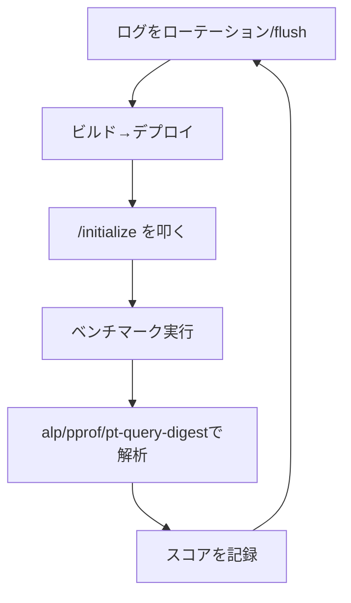

# ISUCON初動ランブック（Go実装）

[[isucon]] のGo実装で、競技開始直後にやることを実行順に並べたランブック。背景や定石は[[isucon]]と[[isucon-go-implementation]]にまとめてあるので、ここでは実際に打つコマンドと書くコード断片だけを追えるようにする。

## フェーズ0: 何も変更せずに把握する

- レギュレーション・当日マニュアルを読み、スコア算出方法と失格条件を確認する
- 何も変更せずに初回ベンチマークを実行し、基準スコアを記録する
- サーバー構成（台数、どこに何が乗っているか）を確認する

## フェーズ1: Git化する

```bash
cd /home/isucon/webapp
git init && git add -A && git commit -m "initial state"

# nginx/MySQLの設定もバージョン管理下に置く
sudo git -C /etc/nginx init && sudo git -C /etc/nginx add -A && sudo git -C /etc/nginx commit -m "initial nginx conf"
sudo git -C /etc/mysql init && sudo git -C /etc/mysql add -A && sudo git -C /etc/mysql commit -m "initial mysql conf"
```

## フェーズ2: 計測ツールを入れる

| ツール | 目的 | 導入方法 |
|---|---|---|
| pt-query-digest / mysqldumpslow | どのクエリが遅いか | Percona Toolkitをインストール、または`mysqldumpslow`はMySQL同梱 |
| alp | どのエンドポイントが遅いか | バイナリ配布から`/usr/local/bin`に配置 |
| pprof | Goコード内のどこが遅いか | `net/http/pprof`をimportするだけ |
| netdata | CPU/メモリ/ディスクI/Oのリアルタイム監視 | `bash <(curl -Ss https://my-netdata.io/kickstart.sh)` |

### MySQLのスロークエリログ

`my.cnf`に追記して再起動する。

```ini
[mysqld]
slow_query_log = 1
slow_query_log_file = /var/log/mysql/mysql-slow.log
long_query_time = 0
log-queries-not-using-indexes = 1
```

```bash
sudo systemctl restart mysql
pt-query-digest /var/log/mysql/mysql-slow.log | less
# または
mysqldumpslow -s t /var/log/mysql/mysql-slow.log
```

`long_query_time = 0`にすると実行された全クエリがログに出る。

### nginxのアクセスログ（alp向けLTSV化）

```nginx
log_format ltsv "time:$time_local"
                "\thost:$remote_addr"
                "\treq:$request"
                "\tstatus:$status"
                "\tmethod:$request_method"
                "\turi:$request_uri"
                "\tsize:$body_bytes_sent"
                "\treqtime:$request_time"
                "\tapptime:$upstream_response_time";
access_log /var/log/nginx/access.log ltsv;
```

```bash
sudo nginx -t && sudo systemctl reload nginx
cat /var/log/nginx/access.log | alp ltsv
```

### Goアプリのプロファイリング（pprof）

`net/http/pprof`を組み込み、別ポートで待ち受けさせる。

```go
import (
    "net/http"
    _ "net/http/pprof"
)

func main() {
    go func() {
        log.Println(http.ListenAndServe("0.0.0.0:6060", nil))
    }()
    // ...
}
```

```bash
go tool pprof -http=0.0.0.0:8081 "http://localhost:6060/debug/pprof/profile?seconds=60"
```

常時プロファイリングはオーバーヘッドが乗るので、`/startprof`・`/endprof`のような自前のHTTPハンドラで`pprof.StartCPUProfile`/`pprof.StopCPUProfile`の開始・終了を制御し、ベンチマーク実行中だけ計測する実装例もある。

## フェーズ3: Go特有の下準備

**オフラインビルド対策**: 競技サーバーがインターネットに繋がらない前提で、依存パッケージを`vendor`ディレクトリに固定しておくと安全。

```bash
go mod vendor
GOFLAGS=-mod=vendor go build -o app .
```

**MySQLドライバのDSNオプション**: `go-sql-driver/mysql`は`interpolateParams`のデフォルトが`false`で、プレースホルダ(`?`)はサーバーサイドのprepared statementとして送られる。`interpolateParams=true`にするとクライアント側で単一のクエリ文字列に統合されるため往復回数が減る。ただしBIG5・CP932・GB2312・GBK・SJISのマルチバイト文字コードと組み合わせるとSQLインジェクションの危険があるため使えない。

```
user:password@tcp(localhost:3306)/dbname?interpolateParams=true
```

## フェーズ4: デプロイフローを確立する

```bash
# 手元でLinux向けバイナリをビルドしてscpで転送する
GOOS=linux GOARCH=amd64 go build -o app .
scp app isucon@server1:/home/isucon/webapp/
ssh isucon@server1 'sudo systemctl restart isucon.golang'
```

複数台構成の場合、各サーバーへの転送・再起動を直列で行うとデプロイ1回が遅くなるので並列化する。デプロイ後は`/initialize`を叩いて動作確認してからベンチマークを実行する。

## ベンチマーク1回ごとのルーチン



ベンチマーク前にログを退避しないと前回分と混ざって解析結果が汚れる。

```bash
sudo mv /var/log/nginx/access.log /var/log/nginx/access.log.$(date +%s)
sudo systemctl reload nginx
sudo mysqladmin -uisucon -pisucon flush-logs
```

このループの考え方自体は[[isucon]]の「基本サイクル」を、実際にどこを直すかの定石・過去事例は[[isucon-go-implementation]]を参照。

## フェーズ5: 終盤（競技終了30〜60分前）

- アクセスログ・スロークエリログの出力を止める（ディスクI/O節約）
- OSを再起動してもベンチマークが通るか確認する
- ディスク容量に余裕があるか確認する

## 出典

- [alp README (tkuchiki/alp) - GitHub](https://github.com/tkuchiki/alp)
- [go-sql-driver/mysql README - GitHub](https://github.com/go-sql-driver/mysql)
- [isucon/pprof.go (inada-s) - GitHub](https://github.com/inada-s/isucon/blob/master/pprof.go)
- [pprof package - net/http/pprof - Go Packages](https://pkg.go.dev/net/http/pprof)
- [ISUCON秘伝のタレ · GitHub (asflash8)](https://gist.github.com/asflash8/0cbb743fd23385f32b412c908959a032)
- [Yasuo Team's Isucon Best Practices · GitHub (minhquang4334)](https://gist.github.com/minhquang4334/26e86a84731164581ed25d3fc7fe5211)
- [ISUCON Memo · GitHub (taiseiKMC)](https://gist.github.com/taiseiKMC/00f0a472016d99cae7f1dddfbcdd9e74)
- [Go Modulesだけでは不安？`go mod vendor`で叶えるGoプロジェクトの安定性とビルド再現性](https://openillumi.com/go-mod-vendor-go-modules-robust-management/)

#isucon #go #runbook #パフォーマンスチューニング
