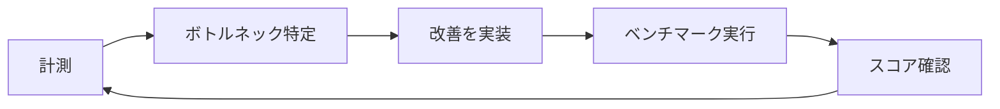

# ISUCON

「いいかんじにスピードアップコンテスト」の略。与えられたWebアプリケーション（言語は毎回複数用意される）を、機能や整合性を壊さずにチューニングし、専用ベンチマーカーが計測するスコアを制限時間内にどれだけ伸ばせるかを競う。予選・本選の2段階構成で行われる。

## 初動でやるべきこと

競技開始直後の30分〜1時間は、スコアを伸ばすことより「その後の作業を安全・効率的に進められる状態を作る」ことを優先する。

**状況把握**

- レギュレーション・当日マニュアルを熟読し、スコア算出方法と失格条件を正確に把握する
- 対象サイトを実際に操作してどんなアプリか把握する
- 何も変更せずに初回ベンチマークを実行し、基準スコアとエラー内容を記録する
- サーバー構成（台数、ミドルウェアの配置）を確認する

**環境構築**

- SSH接続を全員分整備する
- アプリケーションコード・MySQL/nginxの設定ファイル・OS設定（`/etc/sysctl.conf`等）をすべてGit管理下に置く
- デプロイ手順を自動化・スクリプト化しておく
- チーム内でブランチ運用・マージ頻度の方針を決めておく。各自が別ブランチで最適化を進めすぎると、今どこがボトルネックかの把握や改善内容の整理に支障が出る

**ツール導入**

- alp（またはkataribe）でnginxアクセスログを解析できるようにする（事前にログフォーマットの調整が必要）
- `pt-query-digest` / `mysqldumpslow` を使えるようにし、スロークエリログを有効化する
- プロファイラ（Goなら`net/http/pprof`）を仕込み、別ポートで待ち受けさせる
- `dstat`/`htop`/`netdata`等でCPU・メモリ・ディスクI/O・ネットワークをリアルタイム監視できるようにする

ここまで終えたら、実際にベンチマークを回しながら次の「基本サイクル」に入る。

**終盤（競技終了30〜60分前）**

- アクセスログ・スロークエリログの出力を止める（ディスクI/O節約）
- OSを再起動してもベンチマークが通るか確認する
- ディスク容量に余裕があるか確認する

## 基本サイクル

ISUCONの改善作業はこのループを高速に回すことに尽きる。勘に頼って闇雲に手を入れるのではなく、必ず計測結果に基づいて手を入れる箇所を決める。

計測フェーズで何を見るかは観点ごとに使うツールが変わる。

| 観点 | 何が分かるか | 主なツール |
|---|---|---|
| アクセスログ解析 | どのエンドポイントが遅い・呼ばれる回数が多いか | [alp](https://github.com/tkuchiki/alp), kataribe |
| スロークエリ解析 | どのクエリが遅いか | `mysqldumpslow`, `pt-query-digest` |
| プロファイリング | アプリケーションコード内のどこに時間がかかっているか | 各言語のプロファイラ（Goなら`pprof`） |
| リソース監視 | CPU・メモリ・ディスクI/O・ネットワークに余裕があるか | `dstat`, `htop`, `netdata` |

## 定番の改善ポイント

- N+1クエリの解消（JOINへの書き換え、事前フェッチ、インメモリキャッシュ）
- 適切なインデックスの追加
- 静的ファイル配信をアプリケーションサーバーからnginx（またはnginxの`X-Accel-Redirect`）に委譲する
- インメモリキャッシュの導入（DBアクセス自体を減らす）
- コネクションプール数など各種ミドルウェアの上限設定の見直し
- 複数台構成の場合、DB・アプリケーション・リバースプロキシをサーバー間で適切に分散配置する

## 出典

- [ISUCON初心者のためのISUCON7予選対策 : ISUCON公式Blog](https://isucon.net/archives/50697356.html)
- [ISUCONで学ぶGo private-isu環境構築編 alp,pprof,pt-query-digestの導入方法 - Qiita](https://qiita.com/yusuke_hrsm/items/75555f4254529c315de3)
- [GitHub - catatsuy/memo_isucon](https://github.com/catatsuy/memo_isucon)
- [ISUCON当日の進め方 · GitHub (matsukaz)](https://gist.github.com/matsukaz/6af9dd76d62e2cddb65fafa5b0636e9a)
- [ISUCON12本選に向けてやることまとめてみた - Zenn](https://zenn.dev/bubusu/articles/50fced1300046a)
- [ISUCON予選突破を支えたオペレーション技術 - ゆううきブログ](https://blog.yuuk.io/entry/web-operations-isucon)

#isucon #パフォーマンスチューニング #webアプリケーション #mysql #nginx
