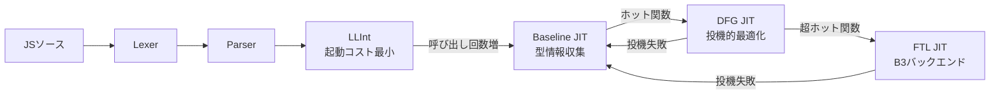

# JavaScriptCore

WebKitに組み込まれているJavaScriptエンジン。Safariおよび他のWebKitベースアプリで使われている。[[bun]]がNode.js(V8採用)の代替として作られた際、あえてV8ではなくこちらを採用したことでも知られる。

## 歴史

2001年、AppleがSafariの元になるブラウザエンジンを必要とした際、ゼロから作る代わりにKDEのKonqueror由来のKHTML(レイアウトエンジン)とKJS(JSエンジン)をフォークした。KJSはmacOS向けに手が入れられ、名称もJavaScriptCoreに変わった。その後SquirrelFish、Nitroという名で呼ばれた時期もあるが、プロジェクト名としては一貫してJavaScriptCore。当初は単純なツリーウォーキング型インタープリタ(ASTを直接辿って実行)だったが、その後段階的コンパイル方式へと進化した。

## アーキテクチャ（段階的コンパイル / Tiered Compilation）

公式のWebKitドキュメントによると、以下の6段階で構成される。

1. **Lexer**: ソースをトークン列に分解（手書き実装）
2. **Parser**: トークンから構文木を構築（再帰下降パーサー）
3. **LLInt (Low Level Interpreter)**: バイトコードを実行する基本インタープリタ。字句・構文解析以外の起動コストをほぼゼロにすることを狙う設計。インラインキャッシングでプロパティアクセスを高速化する
4. **Baseline JIT**: 関数呼び出しが一定回数(目安6回)、ループが一定回数(目安100回)を超えると起動。コンパイル速度優先で、多相インラインキャッシングにより型情報を収集する
5. **DFG (Data Flow Graph) JIT**: さらに実行回数が増える(目安60回/ループ1000回)と起動。下位層が集めたプロファイル情報を元に積極的な型推測(speculative optimization)を行う。推測が外れるとOSR exitでBaseline JITに戻り、繰り返し外れる場合は再プロファイリングする
6. **FTL (Faster Than Light) JIT**: 数千回呼び出し/数万回ループ実行されるような「本当にホットな」関数向けの最上位最適化層。当初はLLVMをバックエンドに使っていたが、後にWebKit独自の低レベルオプティマイザ「B3(Bare Bones Backend)」に置き換えられた

重要な設計原則として、これら4つの実行エンジン(LLInt/Baseline/DFG/FTL)は実行セマンティクスを完全に保持しており、複数の層が混在して動作しても(再帰関数などで層が混在するケースもある)結果に影響するのは性能だけ、という点が挙げられている。

## V8との違い

- **メモリ使用量**: JSCはモバイル(Safari)を主戦場にしているため比較的メモリ効率重視。V8は持続的スループット重視で、その分メモリ使用量は増えやすい傾向にあるという指摘がある
- **設計思想**: JSCは起動の速さ・省電力・ピーク性能を重視、V8は高いスループットの持続を重視、という対比で語られることが多い

## 出典

- [JavaScriptCore - WebKit Documentation (GitHub)](https://github.com/webkit/Documentation/blob/main/docs/Deep%20Dive/JSC/JavaScriptCore.md)
- [Introducing the WebKit FTL JIT | WebKit](https://webkit.org/blog/3362/introducing-the-webkit-ftl-jit/)
- [Comparison of JavaScript execution modes of the WebKit browser engine - Arm Community](https://developer.arm.com/community/arm-community-blogs/b/tools-software-ides-blog/posts/comparison-of-javascript-execution-modes-of-the-webkit-browser-engine)
- [From Squirrels to Nitro: The Untold Story of JavaScriptCore](https://thamizhelango.medium.com/from-squirrels-to-nitro-the-untold-story-of-javascriptcore-4dd34e2022a4)
- [JavaScript Core and V8: A Deep Dive into Engine Architecture and Performance - Leapcell](https://leapcell.io/blog/javascript-core-and-v8-a-deep-dive-into-engine-architecture-and-performance)

#javascriptcore #webkit #safari #jit #ランタイム
