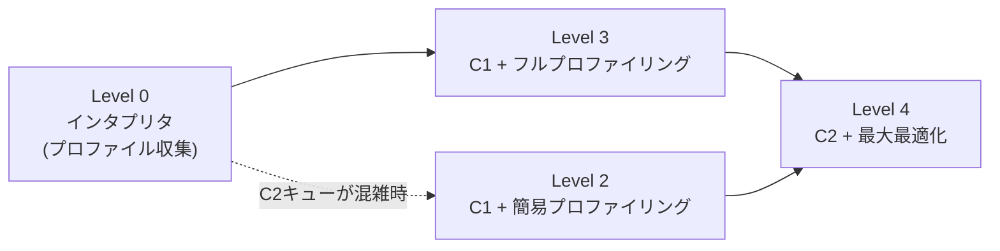

# JITコンパイルとウォームアップ

HotSpot VMは起動直後、バイトコードを**すべてインタプリタで逐次解釈実行**する。ネイティブマシンコードにコンパイルされていないため遅い。インタプリタは実行しながら「このメソッドは何回呼ばれたか」「どの分岐が多いか」といったプロファイリング情報を収集し、呼び出し回数が閾値を超えて「ホット」と判定されたメソッドだけをJITコンパイラがネイティブコードに置き換える。

**ウォームアップタイム**とは、この過程を経てコードが十分最適化され、JVMがピークのスループットに達するまでの時間。それまでは同じコードでも実行のたびに徐々に速くなる。

## Tiered Compilation

HotSpotはC1（client compiler、軽量・低最適化・高速コンパイル）とC2（server compiler、重量級・高最適化）の2つのJITコンパイラを持ち、Java 7以降デフォルトで両者を段階的に使い分ける「Tiered Compilation」を行う。

| レベル | 内容 |
|---|---|
| 0 | インタプリタ実行（コンパイルなし、プロファイル収集） |
| 1 | C1でプロファイリングなしの最大速度コンパイル |
| 2 | C1で簡易プロファイリング（呼び出し回数・バックエッジカウントのみ） |
| 3 | C1でフルプロファイリング |
| 4 | C2で最大限の最適化（最もCPUを消費する） |

典型的な経路は `0 → 3 → 4`。C2のコンパイルキューが混雑している場合は`0 → 2 → 4`を通ることもあり、プロファイリングの深さとコンパイラの競合負荷のトレードオフになる。C1が「起動を素早く」、C2が「長時間動かしたときのピーク性能」を狙うという役割分担で、両者を組み合わせることで速い起動と高いピーク性能を両立させている。

## 関連

プロセスを使い回す仕組み（例: [[gradle-daemon]]）は、一度ホットになってネイティブコンパイル済みのコードをそのまま次回の実行に持ち越せるため、ウォームアップのやり直しを避けられる。

同じウォームアップ問題に対して、プロセスを使い回すのではなく事前計算の結果を持ち越す方向で取り組んでいるのが[[project-leyden]]。

## バージョンについて

Tiered CompilationはJava 7以降デフォルトで、C1/C2の役割分担も含めて長らく安定している基本挙動。2026年9月時点の最新LTSは[[jdk-25]]（2025年9月GA）、最新の非LTSは[[jdk-27]]（2026年9月GA）。ウォームアップ短縮の方向では、[[jdk-25]]のJEP 515（Ahead-of-Time Method Profiling）が過去の実行時プロファイルを再利用する仕組みを入れている。

## 出典

- [JDK 25](https://openjdk.org/projects/jdk/25/)
- [Tiered Compilation in JVM | Baeldung](https://www.baeldung.com/jvm-tiered-compilation)
- [How Tiered Compilation works in OpenJDK | Microsoft for Java Developers](https://devblogs.microsoft.com/java/how-tiered-compilation-works-in-openjdk/)
- [How we solved a HotSpot performance puzzle | Red Hat Developer](https://developers.redhat.com/articles/2023/09/29/how-we-solved-hotspot-performance-puzzle)

#jvm #jit #hotspot #パフォーマンス
