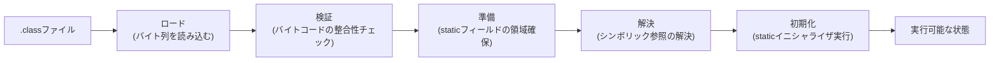

# JVMのクラスロード (Class Loading)

`.class`ファイル（バイトコード）をディスクから読み込み、JVMが実行できる状態にするまでの一連の処理。JVMは全クラスを起動時に一括ロードするのではなく、必要になった時点で動的にロードする。

## 3段階: ロード→リンク→初期化

検証・準備・解決の3つをまとめて「リンク」と呼ぶ。

## クラスローダーの階層と委譲モデル

クラスローダーは親子の階層を持つ。

- **Bootstrap ClassLoader**: 最上位。JDKのコアAPI（`java.lang.Object`など）をロードする
- **Platform/Extension ClassLoader**: Bootstrapの子
- **Application ClassLoader**: クラスパス上のアプリ本体・依存ライブラリをロードする

あるクラスのロード要求が来ると、クラスローダーはまず自分でロードせず**親に処理を委譲**する（parent-first）。親（さらにその親…とBootstrapまで遡る）が見つけられなかった場合にだけ、自分自身でロードを試みる。この「委譲モデル」により、同じクラスが複数箇所で重複ロードされることを防ぎ、`java.lang.Object`のようなコアクラスをアプリ側のクラスローダーが勝手に上書きできないようにしている。

## なぜ起動コストになるか

1つのJavaアプリが動き出すには、JDKのコアクラス・使っているフレームワークのクラス・アプリ自身のクラスまで、実行に必要な分だけ大量のクラスを次々にロード・検証しなければならない。ロードするクラス数が多いツールほど、起動のたびにこのコストを払い直すことになる。[[gradle-daemon]]のようにプロセスをビルド間で使い回す仕組みは、このロード済みの状態を次回まで持ち越すことでこのコストを省略している。

## バージョンについて

ロード→リンク→初期化の3段階、親委譲モデルはJVM仕様（JVMS）で定義された基本挙動でありバージョンを跨いで安定している。2026年8月時点の最新LTSはJDK 25（2025年9月GA）、最新の非LTSはJDK 26（2026年3月GA）。

## 出典

- [JDK 25](https://openjdk.org/projects/jdk/25/)
- [Class Loaders in Java | Baeldung](https://www.baeldung.com/java-classloaders)
- [ClassLoader (Java Platform SE 8) | Oracle](https://docs.oracle.com/javase/8/docs/api/java/lang/ClassLoader.html)

#jvm #java #classloader #ビルド
