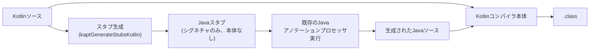

# kapt (Kotlin Annotation Processing Tool)

Kotlinのソースコードに対して、Java向けに書かれた既存の[[annotation-processor]]をそのまま使うためのKotlinコンパイラプラグイン。JetBrainsが2015年に導入した。

## 何のためにあるのか

Java標準の[[annotation-processor]]（javac Processor API）はJavaのソースしか扱えない。一方でDagger2・Data Binding・（当初の）Room・ButterKnifeなど、実用的なコード生成ツールの多くはJava向けに書かれたプロセッサ資産として既に存在していた。KotlinプロジェクトからこれらをそのままDIやORMの実装として使えるようにする橋渡し役がkapt。

## 仕組み: スタブ生成

kaptは以下の3段階で動く。

1. **スタブ生成**（`kaptGenerateStubsKotlin` タスク）: Kotlinソースを解析し、同じクラス構造・メソッドシグネチャを持つが本体を持たない（または例外をthrowするだけの）**Javaスタブファイル**を生成する
2. **アノテーション処理**: このスタブをjavac相当のAPTフレームワークに渡し、既存のJavaアノテーションプロセッサをそのまま実行する。プロセッサから見るとKotlinコードは「メソッド本体のないただのJavaコード」にしか見えない
3. **本コンパイル**: プロセッサが生成したJavaソースを、元のKotlinソースと一緒にKotlinコンパイラが本コンパイルする

各段階は `aptMode` オプションで制御できる（`stubsAndApt`=デフォルト、`stubs`=スタブ生成のみ、`apt`=処理のみ）。

## 既知の制限

- **Kotlin固有情報の欠落**: スタブ生成の過程でシールドクラス・プロパティ・拡張関数・デフォルト引数といったKotlin特有の構文情報が失われ、プロセッサからは素のJavaにしか見えない
- **ビルド速度**: スタブ生成というJavaのAPT単体にはない余分な工程が挟まるため、ビルドが遅くなる
- **複数ラウンドの制約**: kaptが生成したKotlinファイルに対する複数ラウンドのアノテーション処理は非対応
- **IDEビルドシステム非対応**: IntelliJ IDEAのビルドシステム上では動かず、Maven/Gradle経由でのビルドが必要

## Kotlin 2系での状況

Kotlin 2.0（2024年）でのK2コンパイラへの移行に伴い、kaptが依存していたK1コンパイラの内部API（`AnalysisHandlerExtension`）がK2には存在しなくなったため、kapt自体をK2ベースで再実装する必要が生じた（通称KAPT4 / "K2 kapt"）。

- Kotlin 2.1.20で、K2実装のkaptが全プロジェクトに対しデフォルトで有効化された
- Kotlin 2.2.20で `kapt.use.k2` フラグ自体が非推奨になった（常にK2実装が使われる。`false` に設定するとGradleが警告を出す）

つまりKotlin 2系でも現役で使われ続けており、内部実装もK2ベースに更新されている。ただしJetBrains自身は新規プロジェクトに対して、次項の[[ksp]]への移行を推奨している。

## [[kotlin-annotation-processing]]の中での位置づけ

Java資産をそのまま使い回すためのアダプタ層。歴史的経緯から広く使われているが、スタブ生成のオーバーヘッドがあるぶんKSPより遅い。

## 出典

- [kapt compiler plugin | Kotlin Documentation](https://kotlinlang.org/docs/kapt.html)
- [Migrate from kapt to KSP | Android Developers](https://developer.android.com/build/migrate-to-ksp)
- [What's new in Kotlin 2.0.0 | Kotlin Documentation](https://kotlinlang.org/docs/whatsnew20.html)
- [Preparing for K2 - zacsweers.dev](https://www.zacsweers.dev/preparing-for-k2/)

#kapt #kotlin #annotation-processor #ビルド #android
