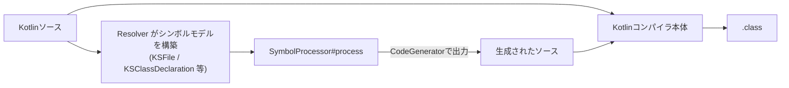

# KSP (Kotlin Symbol Processing)

Googleが開発した、Kotlinネイティブなコンパイル時コード生成・解析API。[[kapt]]の後継として設計されており、Javaの[[annotation-processor]]を経由せずKotlinコンパイラのシンボルモデルを直接処理する。

## 何のためにあるのか

kaptはJavaのAPTを再利用するためにKotlinソースをいったんJavaスタブへ変換する必要があり、そのスタブ生成コストがビルド速度のボトルネックになっていた。KSPはスタブ生成を丸ごと不要にすることで、公称最大2倍程度の高速化を狙う。ただしkaptと違い、プロセッサ実装側がKSP用のAPIに対応している必要がある（既存のJavaプロセッサ資産をそのまま使い回すことはできない）。

## アーキテクチャ

- **`SymbolProcessorProvider`**: エントリーポイント。ビルド時に呼ばれ `SymbolProcessor` のインスタンスを生成する
- **`SymbolProcessor#process(resolver: Resolver)`**: 各処理ラウンドで呼ばれるメイン処理
- **`Resolver`**: コンパイラの意味解析結果への窓口。`getAllFiles()`、`getSymbolsWithAnnotation()` などでプログラム全体のシンボルにアクセスする
- **`KSFile`/`KSClassDeclaration`/`KSFunctionDeclaration`/`KSPropertyDeclaration`など**: Kotlinの文法に基づいてシンボル（宣言）レベルでプログラムをモデル化した読み取り専用の型。クラス・関数・プロパティといった「宣言」は扱えるが、関数本体の中身（`if`ブロックや`for`ループなどの式・文）は解析対象外
- **`KSVisitorVoid`**: Visitorパターンでシンボルツリーを走査するための基底クラス
- **`CodeGenerator`**: プロセッサが生成したファイルを実際に書き出す

kaptの図と比べると、Javaスタブへの変換ステップが存在しない点が構造上の違い。

## インクリメンタル処理

kaptと同様、プロセッサは自身を **isolating**（1入力→1出力に限定）か **aggregating**（複数入力を集約）かに分類して宣言でき、Gradleはこれをもとに変更ファイルに対する再処理範囲を絞る。

## KSP1からKSP2への刷新

KSP1はKotlinコンパイラプラグインとして実装されていたが、K2移行に伴いコンパイラプラグインAPI自体が変わったため、これに対応する形で2023年末にKSP2がプレビューされ、Kotlin 2.0でリリースされた。

- KSP2はコンパイラプラグインという形をやめ、IntelliJのK2 IDEプラグインやAndroid Lintとも共有される **Analysis API** の上に構築されたスタンドアロンのツールとして再設計されている
- この設計変更により、プログラムのライフサイクルをより細かく制御できるようになり、実装自体もシンプルになったとされる

## kaptとの違い

| 項目 | kapt | KSP |
|---|---|---|
| ベース | Java標準のアノテーション処理（javac APT） | Kotlin専用のAPI |
| スタブ生成 | 必要（Javaスタブを生成してから処理） | 不要（シンボルモデルを直接処理） |
| 処理対象の粒度 | Javaに変換された全コード要素 | 宣言（シンボル）単位。式・文は非対応 |
| 既存資産の再利用 | 既存のJavaアノテーションプロセッサをそのまま使える | プロセッサ側にKSP対応実装が必要 |
| 速度 | 遅い（スタブ生成のオーバーヘッド） | 速い（公称最大2倍） |

## [[kotlin-annotation-processing]]の中での位置づけ

kaptのスタブ生成コストを解消する、Kotlinネイティブな後継。ただしJavaプロセッサ資産をそのまま使い回せない点はトレードオフ。

## バージョンについて

本ノートの内容はKSP 2.3系（2026年8月時点の最新は2.3.11、2026年8月3日リリース）を前提にしている。KSP2は2.0以降デフォルトのエンジンで、KSP1は非推奨。

## 出典

- [google/ksp - Releases](https://github.com/google/ksp/releases)
- [Kotlin Symbol Processing API | Kotlin Documentation](https://kotlinlang.org/docs/ksp-overview.html)
- [KSP2 Preview: Kotlin K2 and Standalone Source Generator - Android Developers Blog](https://android-developers.googleblog.com/2023/12/ksp2-preview-kotlin-k2-standalone.html)
- [ksp/docs/ksp2.md at main · google/ksp](https://github.com/google/ksp/blob/main/docs/ksp2.md)
- [Migrate from kapt to KSP | Android Developers](https://developer.android.com/build/migrate-to-ksp)

#ksp #kotlin #annotation-processor #ビルド #android
