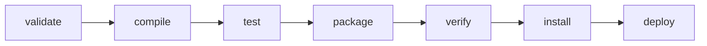

# Maven

Java生態系のビルドツール・依存関係管理ツール。宣言的なXML設定ファイル（`pom.xml`、Project Object Model）でプロジェクトを記述し、共通のビルドライフサイクルに沿ってビルド・テスト・パッケージング・デプロイを行う。[[gradle-basics]]と同じ「Javaプロジェクトのビルドツール」領域だが、Mavenは規約に基づく宣言的な設定を中心に据えており、Gradleのような命令的なビルドスクリプト（Groovy/Kotlin DSL）は持たない。

## POM（Project Object Model）とプロジェクト座標

`pom.xml`はプロジェクトの構成をXMLで表現したもの。`groupId`・`artifactId`・`version`の3つの値（頭文字を取ってGAVと呼ばれる）が`<groupId>:<artifactId>:<version>`という形でプロジェクトを一意に識別する「座標」になる。

- **groupId**: 組織・製品群を表す分類。逆順ドメイン名の慣習に従う（例: `com.example.app`）
- **artifactId**: 個々の成果物の名前。複数単語はハイフン区切りにするのが慣習
- **packaging**: ビルド成果物の種類。省略時は`jar`。`war`/`ear`/`pom`なども指定できる

`pom`パッケージングは実際の成果物を持たず、後述するマルチモジュールプロジェクトの集約POMや、依存関係バージョンの一覧だけを持つBOM（Bill of Materials）に使われる。

### 親POMと継承

プロジェクトのPOMは`<parent>`要素で1つの親POMを指定でき、`groupId`・`version`などの設定を継承できる（1子1親の単一継承）。子POM側で同じ要素を明示すれば親の値を上書きできる。

## ビルドライフサイクル

Mavenのビルドは3つの独立したライフサイクル（`clean`・`default`・`site`）を持ち、それぞれが順序付けられた「フェーズ」のリストで構成される。あるフェーズを実行すると、それより手前の全フェーズも順に実行される（例: `mvn install`を実行すると`validate`〜`verify`までが先に実行される）。

`default`ライフサイクルの主なフェーズ（抜粋。実際は`generate-sources`や`process-resources`なども含め23フェーズある）:

- **validate**: プロジェクト構成が正しいか検証する
- **compile**: `src/main/java`のソースをコンパイルする
- **test**: `src/test/java`のテストを実行する
- **package**: コンパイル済みコードをJARなど配布形式にまとめる
- **verify**: 統合テストなどの結果が品質基準を満たすか検証する
- **install**: 生成した成果物をローカルリポジトリ（`~/.m2/repository`）にインストールし、ローカルの他プロジェクトから依存関係として参照できるようにする
- **deploy**: 統合・共有環境で、成果物をリモートリポジトリにコピーしチームに共有する

### フェーズとゴールの結びつき

フェーズ自体は「何をするか」を定義しない空の器で、実際の作業はプラグインが提供する「ゴール」がフェーズに紐付けられることで行われる（例: `compile`フェーズには`maven-compiler-plugin`の`compile`ゴールがデフォルトでバインドされている）。1つのフェーズに複数のゴールを紐付けられるほか、`packaging`の種類ごとにデフォルトでバインドされるゴールの組み合わせが変わる。

## 依存関係管理

### スコープ

依存関係の`<scope>`は、その依存関係をどのクラスパス（コンパイル時／実行時／テスト時）に含めるか、そして推移的依存関係として利用側に伝播するかを制御する（[[java-classpath]]も参照）。

| scope | コンパイル | 実行時 | テスト | 伝播 |
|---|---|---|---|---|
| `compile`（デフォルト） | ○ | ○ | ○ | される |
| `provided` | ○ | × | ○ | されない |
| `runtime` | × | ○ | ○ | されない |
| `test` | × | × | ○ | されない |
| `system` | ○ | × | ○ | されない |
| `import` | - | - | - | `<dependencyManagement>`専用 |

`provided`はJDKやサーブレットコンテナなど、実行環境が実行時に提供してくれることを期待する依存関係に使う（例: `servlet-api`）。`system`は`provided`に似るが、リポジトリからではなく明示的に指定したローカルのJARパスを使う。`import`は`<dependencyManagement>`内でPOMタイプの依存関係にのみ使え、指定したPOMの`<dependencyManagement>`をそのまま取り込む（BOMの利用）。

### 推移的依存関係と調停（mediation）

依存先のライブラリがさらに依存する「推移的依存関係」は自動的に解決される。異なるバージョンが依存関係グラフの複数箇所に現れた場合、Mavenは依存関係ツリー上で自プロジェクトから最も近い（深さが浅い）バージョンを採用する「nearest definition」方式で調停する。同じ深さで競合した場合はPOM内で先に宣言された方が勝つ。特定バージョンを強制したい場合は、自プロジェクトのPOMで直接そのバージョンを宣言するか、`<dependencyManagement>`で一元管理する。

`<dependencyManagement>`はそれ自体では依存関係を追加せず、配下のモジュールや自プロジェクトが同じ`groupId:artifactId`を`<dependencies>`で宣言したときに使われるバージョン・スコープのデフォルト値を定義する場所。マルチモジュールプロジェクトの親POMで各モジュール共通のバージョンを一元管理するのに使われる。

## リポジトリ

- **ローカルリポジトリ**: 各マシン上のキャッシュ。デフォルトは`~/.m2/repository`
- **中央リポジトリ（Central Repository）**: Mavenがデフォルトで参照するパブリックなリモートリポジトリ（`repo.maven.apache.org/maven2/`、通称Maven Central）
- **設定ファイル**: `${maven.home}/conf/settings.xml`（グローバル）と`~/.m2/settings.xml`（ユーザー）の2箇所を読む。ミラーは`settings.xml`の`<mirror>`で設定し、`<mirrorOf>`に対象リポジトリのIDを指定する（`central`を指定すればMaven Centralの参照先を差し替えられる、`*`で全リポジトリを対象にする、など）

## マルチモジュールプロジェクト（Reactor）

複数のサブモジュールをまとめてビルドする際、ルートに`packaging`が`pom`の集約POM（aggregator POM）を置き、`<modules>`で配下のモジュールを列挙する。このときMavenは各モジュール間の依存関係（プロジェクト依存・プラグイン依存・ビルド拡張の依存関係）を解析してビルド順序を自動的に決定してから実行する——この仕組みをReactorと呼ぶ。集約（aggregation、`<modules>`によるまとめ役）と継承（inheritance、`<parent>`による設定の共有）は独立した概念で、1つのPOMが両方の役割を兼ねることも多い（ルートPOMが配下モジュールの親であり集約役でもある、というのが典型的な構成）。

## バージョンについて

本ノートの内容はMaven 3.9.16（2026年5月17日リリース）の安定版を前提にしている。次期メジャーバージョンのMaven 4.0.0は2026年9月時点でrc-6のリリース候補段階にあり、まだGA（正式版）はリリースされていない。

## 出典

- [POM Reference | Apache Maven](https://maven.apache.org/pom.html)
- [Introduction to the POM | Apache Maven](https://maven.apache.org/guides/introduction/introduction-to-the-pom.html)
- [Introduction to the Build Lifecycle | Apache Maven](https://maven.apache.org/guides/introduction/introduction-to-the-lifecycle.html)
- [Introduction to the Dependency Mechanism | Apache Maven](https://maven.apache.org/guides/introduction/introduction-to-dependency-mechanism.html)
- [Introduction to Repositories | Apache Maven](https://maven.apache.org/guides/introduction/introduction-to-repositories.html)
- [Using Mirrors for Repositories | Apache Maven](https://maven.apache.org/guides/mini/guide-mirror-settings.html)
- [Settings Reference | Apache Maven](https://maven.apache.org/settings.html)
- [Guide to Working with Multiple Modules | Apache Maven](https://maven.apache.org/guides/mini/guide-multiple-modules.html)
- [Maven Releases History | Apache Maven](https://maven.apache.org/docs/history.html)
- [Apache Maven 4.0.0-rc-6 Release Notes | Apache Maven](https://maven.apache.org/docs/4.0.0-rc-6/release-notes.html)

#maven #ビルド #java
