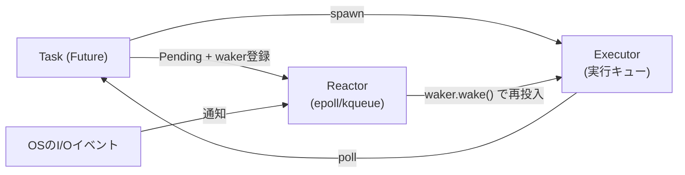
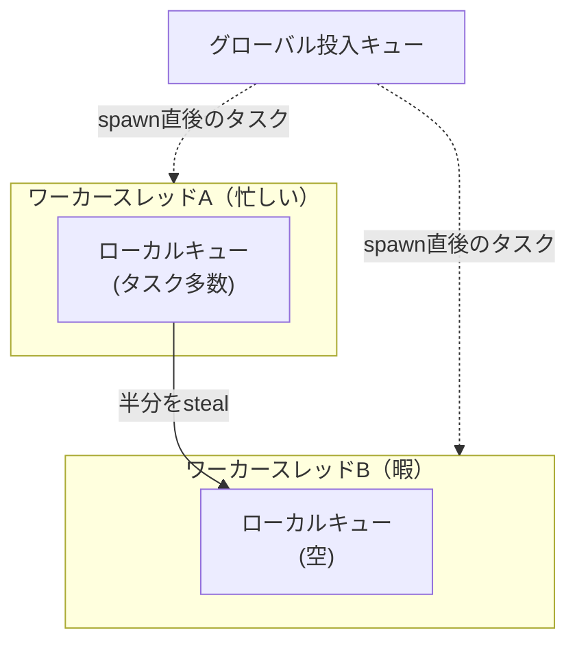

# Tokio

Rust向けの非同期ランタイム。Rust言語自体は非同期ランタイムを標準搭載しておらず、`async fn`は「実行するとFutureという状態機械の値を返すだけ」の構文糖衣で、それを実際にポーリングして進める仕組みは別途用意する必要がある。複数の実装が並立しうる設計だが、実質的にTokioがデファクトスタンダードになっている([[deno]]の内部実装も実際にTokioを採用している)。

## Rustの非同期がライブラリ任せである理由

Node.jsや[[deno]]は言語処理系自身がイベントループを内蔵しているのに対し、Rustは同期コードと非同期コードを明確に分け、非同期を使うかどうか・どのランタイムを使うかを利用者が選択する設計になっている。Tokioはその選択肢の一つであり、事実上の標準という位置づけ。

## アーキテクチャ全体像

大きく3つの要素で構成される。

- **Executor**: タスクをポーリングして進めるスケジューラ
- **Reactor**: OSのI/Oイベント通知機構(`epoll`/`kqueue`/`IOCP`)を仲介するドライバ
- **Timer**: 一定時間後に起こす処理を管理



タスクはI/O待ちで進められない状態になると`Pending`を返してExecutorの手を離れ、その間Executorは他の準備済みタスクを処理する。OS側でイベントが起きるとReactorがそれを検知し、wakerを介してタスクを実行キューに戻す。1つのOSスレッドが同時に多数のタスクを扱えるのはこの仕組みによる。

## 具体例:2つの待ち時間を同時に消化する

1秒待つ処理を2つ、順番に実行すれば2秒かかる。`join!`で同時に走らせると、約1秒で両方終わる。

```rust
use tokio::time::{sleep, Duration};

#[tokio::main]
async fn main() {
    let a = async {
        sleep(Duration::from_secs(1)).await;
        println!("A done");
    };
    let b = async {
        sleep(Duration::from_secs(1)).await;
        println!("B done");
    };
    tokio::join!(a, b); // 直列なら2秒、並行なので約1秒で両方完了
}
```

`sleep().await`の瞬間、そのタスクはTimerに「1秒後に起こして」と登録してExecutorの手を離れる。Executorは空いた時間でもう一方のタスクを進められるので、2つの待ち時間が重なって消化される。OSスレッドを2本立てて2秒間ブロックさせる必要がない。

## スケジューラ:work-stealing

デフォルトのマルチスレッドExecutorは、CPUコア数と同じ本数のワーカースレッドを起動する。各ワーカーは自分専用の実行キューを持ち、それとは別に全ワーカー共通の「投入キュー」もある。あるワーカーが自分のキューを空にすると、他の忙しいワーカーのキューから半分のタスクを奪い取って埋める。



実装の詳細(ローカルキューの容量やI/Oイベントの確認頻度など)はバージョンによって変わりうるが、「ローカルキュー優先・空いたら他から奪う」という設計方針そのものは、Go言語ランタイムのGMPスケジューラとも共通する考え方。

## 他の非同期モデルとの違い

「1つの処理待ちで全体を止めない」という目的は共通でも、それを実現する主体と粒度が異なる。

- **Tokio(Rust)**: 言語の外の1ライブラリ(crate)。ランタイムは複数存在しうる。並行の単位はFuture(`async fn`)。デフォルトはCPUコア数分のOSスレッドでwork-stealing
- **libuv(Node.js/旧Deno基盤)**: ランタイムに内蔵。並行の単位はコールバック/Promise。JS実行は単一スレッドのイベントループで、ブロッキング処理だけ別スレッドプールに逃がす
- **GMPスケジューラ(Go)**: 言語ランタイムに内蔵、常時有効。並行の単位はgoroutine。`GOMAXPROCS`個の論理プロセッサ(P)にOSスレッド(M)を割り当ててwork-stealing

NodeやGoは「非同期であること」が言語・ランタイムの前提になっているのに対し、Rustは非同期を使うかどうか・どのランタイムを使うかを利用者が選択する設計になっている。

## 出典

- [tokio-rs/tokio - GitHub](https://github.com/tokio-rs/tokio)
- [tokio::runtime - docs.rs](https://docs.rs/tokio/latest/tokio/runtime/index.html)
- [Async in depth - Tokio公式チュートリアル](https://tokio.rs/tokio/tutorial/async)
- [Scalable Go Scheduler Design Doc(Dmitry Vyukov, Go開発チーム)](https://docs.google.com/document/d/1TTj4T2JO42uD5ID9e89oa0sLKhJYD0Y_kqxDv3I3XMw/edit)

#tokio #rust #async #ランタイム #並行処理
